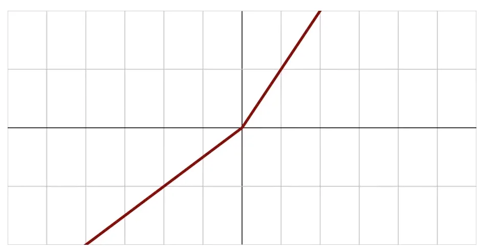

# Model Training, Tuning, and Evaluation

## 1. Activation Functions

### 1.1 Introducción a las Activation Functions

Las funciones de activación son un componente crítico en las redes neuronales. Están presentes en cada neurona o nodo y determinan la salida que se enviará a la siguiente capa basándose en las entradas recibidas. Esencialmente, una función de activación decide "qué salida debe producir la neurona dadas sus entradas".

### 1.2 Funciones de activación lineales y binarias

#### 1.2.1 Linear Activation Function


- Es la función de activación más simple
- Produce como salida exactamente lo que recibe como entrada (f(x) = x)
- Limitaciones:
  - No permite aprendizaje interesante ni backpropagation efectivo
  - Hace innecesarias las múltiples capas (una red con capas lineales es equivalente a una sola capa)
  - Rara vez se utiliza en la práctica

#### 1.2.2 Binary Step Function


- Produce una salida binaria: 0 cuando la entrada es negativa, 1 cuando es positiva
- Limitaciones:
  - No permite clasificación múltiple (solo puede representar una categoría)
  - Presenta problemas matemáticos debido a su pendiente vertical (derivada infinita)
  - No es estable para el entrenamiento de redes neuronales

### 1.3 Funciones de activación no lineales

Las funciones no lineales son preferibles porque:
- Permiten crear mapeos complejos entre entradas y salidas
- Tienen derivadas utilizables para el aprendizaje mediante backpropagation
- Aprovechan el poder de las arquitecturas multicapa

#### 1.3.1 Sigmoid y TanH


- **Sigmoid (logistic)**:
  - Escala las salidas entre 0 y 1
  - Se usa para clasificación múltiple donde un elemento puede pertenecer a varias categorías

- **TanH (hyperbolic tangent)**:
  - Escala las salidas entre -1 y 1
  - Preferida sobre sigmoid por tener una media cercana a cero
  - Adecuada para redes neuronales recurrentes (RNN)

- Limitaciones de ambas:
  - Problema del gradiente que se desvanece (vanishing gradient) en valores extremos
  - Computacionalmente costosas (operaciones trigonométricas)

#### 1.3.2 ReLU (Rectified Linear Unit)


- Función de activación más popular actualmente
- Definición: f(x) = max(0, x)
- Ventajas:
  - Computacionalmente eficiente (simple de calcular)
  - Permite que los modelos converjan rápidamente
  - No tiene problemas de gradiente infinito
- Limitación:
  - "Dying ReLU problem": Cuando las entradas son negativas, la función produce cero y la neurona puede "morir"

#### 1.3.3 Leaky ReLU y variantes


- **Leaky ReLU**:
  - Solución al "dying ReLU problem"
  - Introduce una pequeña pendiente negativa para valores negativos
  - La pendiente es un hiperparámetro fijo

- **Parametric ReLU (PReLU)**:
  - Similar a Leaky ReLU pero la pendiente negativa se aprende durante el entrenamiento
  - Más flexible pero computacionalmente más intensivo

- **Otras variantes**:


  - **ELU (Exponential Linear Unit)**:
    - Usa una función exponencial para valores negativos
    - Favorece cálculos de derivadas más suaves

  - **Swish**:
    - Desarrollada por Google
    - Beneficiosa para redes muy profundas (40+ capas)
    - Probablemente no aparezca en exámenes de AWS

  - **Maxout**:
    - Produce el máximo de todas las entradas
    - ReLU es un caso especial de Maxout
    - Duplica el número de parámetros, haciéndola poco práctica

### 1.4 Softmax


- Se utiliza principalmente en la capa de salida para problemas de clasificación múltiple
- Convierte las salidas en probabilidades para cada clase
- Características:
  - La suma de todas las probabilidades es 1
  - La clase con mayor probabilidad se selecciona como la predicción
  - No puede asignar múltiples etiquetas a un único elemento (para eso se usa sigmoid)

### 1.5 Selección de funciones de activación

Guía práctica para elegir la función de activación adecuada:

| Escenario | Función recomendada |
|-----------|---------------------|
| Capa de salida para clasificación (una sola clase) | Softmax |
| Redes neuronales recurrentes (RNN) | TanH |
| Casos generales | ReLU (primera opción) |
| Si ReLU presenta problemas | Leaky ReLU |
| Si Leaky ReLU no es suficiente | PReLU o Maxout |
| Redes muy profundas (40+ capas) | Swish |
| Asignación de múltiples etiquetas | Sigmoid |

---

## Resumen para el Examen

### Activation Functions - Conceptos Clave
- Las funciones de activación determinan la salida de cada neurona basada en sus entradas
- Son esenciales para introducir no-linealidad en los modelos de redes neuronales
- Tipos principales:
  - **Funciones Lineales**: No permiten aprendizaje complejo
  - **Funciones No Lineales**: Sigmoid, TanH, ReLU y sus variantes
  - **Funciones Especiales**: Softmax (para clasificación multicategoría)
  
### Características de Cada Función
- **Linear**: f(x) = x, simple pero limitada para redes profundas
- **Binary Step**: Salida binaria (0 o 1), no útil para entrenamiento
- **Sigmoid**: Salida entre 0-1, útil para clasificación múltiple
- **TanH**: Salida entre -1 y 1, preferida para RNNs
- **ReLU**: max(0, x), eficiente y estándar en muchas aplicaciones
- **Leaky ReLU**: Soluciona el problema de "dying ReLU"
- **Softmax**: Convierte salidas en probabilidades que suman 1

### Guía de Selección
- Para capas ocultas en general: ReLU es la opción predeterminada
- Para RNNs: TanH ofrece mejor rendimiento
- Para clasificación de una sola clase: Softmax en la capa de salida
- Para múltiples etiquetas por elemento: Sigmoid en la capa de salida

### Consejo para el Examen
Para el examen AWS Certified Machine Learning - Associate, es importante memorizar las características principales de cada función de activación y sus casos de uso ideales. Presta especial atención a ReLU (la más utilizada), Sigmoid (para múltiples etiquetas), TanH (para RNNs) y Softmax (para clasificación). El examen suele preguntar cuál es la función de activación más adecuada para un escenario específico, como "¿Qué función de activación deberías usar en la capa de salida para un problema de clasificación con 10 categorías mutuamente excluyentes?" (respuesta: Softmax).

## 2. Convolutional Neural Networks (CNN)

### 2.1 Introducción a las Convolutional Neural Networks

Las Convolutional Neural Networks (CNN) son un tipo especializado de redes neuronales diseñadas principalmente para procesar datos con estructura de cuadrícula, como imágenes. Su característica fundamental es la capacidad de encontrar patrones independientemente de dónde se encuentren en los datos, lo que se conoce como "feature location invariant".

### 2.2 Fundamentos y funcionamiento

#### 2.2.1 Inspiración biológica
- Las CNN están inspiradas en el funcionamiento del córtex visual humano
- El cerebro procesa imágenes mediante grupos de neuronas especializadas (campos receptivos locales)
- Cada grupo de neuronas responde a una parte específica del campo visual
- Los campos receptivos se superponen para cubrir todo el campo visual

#### 2.2.2 El proceso de convolución
La convolución es el proceso de dividir los datos en pequeños fragmentos superpuestos y procesarlos individualmente. Este enfoque permite:

- Detectar características independientemente de su ubicación
- Construir una jerarquía de características de complejidad creciente:
  - Capa baja: detecta líneas y bordes
  - Capa media: reconoce formas a partir de líneas
  - Capa alta: identifica objetos a partir de formas

#### 2.2.3 Ejemplo práctico
Cuando una CNN procesa una imagen de una señal de STOP:
1. Las primeras capas detectan bordes y contrastes
2. Las capas intermedias reconocen la forma octagonal y las letras
3. Las capas superiores combinan esta información con el color rojo
4. La red clasifica el objeto como una señal de STOP

### 2.3 Aplicaciones de las CNN

Las CNN no están limitadas al análisis de imágenes. Se utilizan en diversos campos:

- **Análisis de imágenes**: Reconocimiento de objetos, clasificación de imágenes, detección facial
- **Procesamiento de lenguaje natural**: Traducción automática, donde no se sabe exactamente dónde estará una frase o palabra clave
- **Análisis de sentimiento**: Identificación de frases que indican emociones específicas en textos
- **Datos volumétricos**: Análisis de datos médicos 3D como tomografías y resonancias

### 2.4 Implementación de CNN con Keras y TensorFlow

#### 2.4.1 Preparación de datos
- Es necesario preservar la estructura dimensional de los datos
- Para imágenes: formato ancho × alto × canales de color
  - Imágenes en blanco y negro: 1 canal
  - Imágenes a color: 3 canales (rojo, verde, azul)

#### 2.4.2 Capas especializadas para CNN
Keras proporciona capas específicas para implementar CNN:

- **Conv2D**: Realiza la convolución en datos 2D (imágenes)
  - También existen Conv1D (para texto) y Conv3D (para datos volumétricos)
- **MaxPooling2D**: Reduce el tamaño de los datos para disminuir la carga computacional
  - Toma el valor máximo en cada bloque de la imagen
  - También existen MaxPooling1D y MaxPooling3D
- **Flatten**: Convierte los datos multidimensionales en un vector unidimensional
  - Necesario para conectar con capas densas tradicionales

#### 2.4.3 Arquitectura típica de una CNN
```
Input → Conv2D → MaxPooling2D → Dropout → Flatten → Dense → Dropout → Softmax → Output
```

- **Conv2D**: Procesa la imagen mediante convolución
- **MaxPooling2D**: Reduce dimensiones para optimizar procesamiento
- **Dropout**: Previene el sobreajuste
- **Flatten**: Prepara los datos para las capas densas
- **Dense**: Capa tradicional de perceptrón multicapa
- **Softmax**: Capa de salida para clasificación

### 2.5 Desafíos y optimizaciones

#### 2.5.1 Desafíos computacionales
- Las CNN son muy intensivas en términos de CPU, GPU y memoria
- Requieren grandes volúmenes de datos de entrenamiento
- La obtención y procesamiento de datos es a menudo el mayor desafío
  - Ejemplo: Tesla recopila imágenes de cámaras de sus vehículos para entrenar sus sistemas

#### 2.5.2 Hiperparámetros
Las CNN tienen numerosos hiperparámetros ajustables:
- Tamaño del kernel (área de convolución)
- Número de capas
- Número de unidades (filtros)
- Cantidad de pooling
- Funciones de activación
- Optimizadores
- Funciones de pérdida

#### 2.5.3 Arquitecturas pre-diseñadas
Para facilitar la implementación, existen arquitecturas de CNN ya optimizadas:

| Arquitectura | Aplicación principal | Características |
|--------------|----------------------|-----------------|
| LeNet-5 | Reconocimiento de escritura | Primera CNN exitosa, relativamente simple |
| AlexNet | Clasificación de imágenes | Red más profunda que LeNet |
| GoogLeNet | Clasificación de imágenes | Introduce módulos "inception" que agrupan capas de convolución |
| ResNet | Clasificación de imágenes avanzada | Red muy profunda con "skip connections" para mantener rendimiento |

ResNet (especialmente ResNet-50) es particularmente relevante en el contexto de AWS, ya que se utiliza frecuentemente en algoritmos de clasificación de imágenes dentro de SageMaker.

### 2.6 Consideraciones para AWS

En el contexto de AWS, las CNN son utilizadas principalmente en SageMaker para tareas como:
- Clasificación de imágenes
- Detección de objetos
- Segmentación de imágenes
- Análisis de documentos

AWS proporciona infraestructura optimizada para entrenar y desplegar CNN, incluyendo instancias con GPU para acelerar el entrenamiento y la inferencia.

---

## Resumen para el Examen

### Convolutional Neural Networks - Conceptos Clave
- Las CNN son redes especializadas en procesar datos estructurados en forma de cuadrícula (principalmente imágenes)
- Su característica principal es la "invarianza a la ubicación" - pueden detectar patrones independientemente de dónde aparezcan
- Procesan información de forma jerárquica: desde bordes y líneas hasta formas y objetos completos

### Componentes Principales
- **Capas de Convolución**: Aplican filtros a fragmentos de la entrada para detectar características
- **Capas de Pooling**: Reducen dimensiones para optimizar el procesamiento
- **Flatten**: Transforma datos multidimensionales en vectores para las capas densas
- **Capas Densas**: Procesan información para la clasificación final

### Aplicaciones de CNN
- **Principales**: Clasificación de imágenes, detección de objetos, segmentación
- **Otras**: Procesamiento de lenguaje natural, análisis de sentimiento, datos médicos 3D

### Arquitecturas Populares
- **LeNet-5**: Primera CNN exitosa, para reconocimiento de dígitos
- **AlexNet**: Más profunda, popularizó las CNN
- **GoogLeNet**: Introduce módulos "inception"
- **ResNet**: Muy profunda con "skip connections", usada frecuentemente en SageMaker

### Consejo para el Examen
Para el examen AWS Certified Machine Learning - Associate, concéntrate en entender cómo SageMaker utiliza las CNN. Es importante reconocer que ResNet-50 es una arquitectura frecuentemente mencionada en el contexto de AWS para clasificación de imágenes. También debes recordar la secuencia típica de capas en una CNN (Convolución → Pooling → Flatten → Dense) y saber que las CNN necesitan preservar la estructura dimensional de los datos de entrada. El examen puede incluir preguntas sobre qué tipo de red neuronal es más adecuada para un caso específico (p. ej., "¿Qué arquitectura recomendarías para clasificar imágenes de productos en un sitio de e-commerce?").

## 3. Recurrent Neural Networks (RNN)

### 3.1 Introducción a las Recurrent Neural Networks

Las Recurrent Neural Networks (RNN) son redes neuronales especializadas en procesar datos secuenciales. A diferencia de las redes neuronales tradicionales, las RNN mantienen un "estado" que les permite recordar información previa y aplicarla al procesamiento actual.

### 3.2 Aplicaciones de las RNN

#### 3.2.1 Procesamiento de secuencias temporales
- **Time series data**: Predicción de comportamientos futuros basados en patrones temporales
  - Web logs: Análisis de patrones de visitas a sitios web
  - Sensor logs: Procesamiento de datos del Internet of Things (IoT)
  - Predicción de mercados financieros: Análisis de comportamiento histórico de acciones
- **Sistemas autónomos**: Predicción de trayectorias en vehículos autónomos basándose en movimientos previos

#### 3.2.2 Procesamiento de secuencias no temporales
- **Procesamiento de lenguaje natural**: Traducción automática y análisis de textos
- **Generación de contenido**: Creación de subtítulos para imágenes o videos
- **Música generada por máquina**: Composición de música basada en patrones aprendidos

### 3.3 Funcionamiento de las RNN

#### 3.3.1 Estructura básica
- Una neurona recurrente recibe inputs normales y también la salida de su estado anterior
- Este "bucle" permite que la información persista a través del tiempo
- La función de activación suele ser una tangente hiperbólica (tanh) para preservar información temporalmente

#### 3.3.2 Representación desplegada en el tiempo
- Una RNN puede visualizarse como la misma neurona repetida en diferentes pasos temporales
- En cada paso temporal:
  1. La neurona recibe un nuevo input
  2. También recibe el output del paso temporal anterior
  3. Combina ambos inputs, aplica la función de activación y genera un output
  4. Este output se utiliza en el siguiente paso temporal

#### 3.3.3 Celda de memoria
- Las neuronas recurrentes funcionan como "celdas de memoria" que mantienen información del pasado
- Característica: Los eventos recientes tienen mayor influencia que los antiguos (pueden diluirse con el tiempo)
- Una capa recurrente consiste en múltiples neuronas recurrentes trabajando en paralelo

### 3.4 Topologías de RNN

Las RNN pueden configurarse en diferentes topologías según los requisitos:

| Topología | Input | Output | Ejemplo de aplicación |
|-----------|-------|--------|------------------------|
| Sequence-to-Sequence | Secuencia | Secuencia | Predicción de precios de acciones |
| Sequence-to-Vector | Secuencia | Vector | Análisis de sentimiento de un texto |
| Vector-to-Sequence | Vector | Secuencia | Generación de subtítulos para imágenes |
| Encoders-Decoders | Secuencia | Secuencia | Traducción automática entre idiomas |

### 3.5 Entrenamiento de RNN

#### 3.5.1 Backpropagation Through Time (BPTT)
- Las RNN se entrenan mediante backpropagation a través del tiempo
- Cada paso temporal actúa como una capa adicional durante el entrenamiento
- Desafío: Los pasos temporales pueden acumularse rápidamente, aumentando la complejidad

#### 3.5.2 Truncated BPTT
- Para limitar el costo computacional, se limita el backpropagation a un número determinado de pasos temporales
- Permite entrenar RNN en secuencias largas sin recursos excesivos

### 3.6 Variantes avanzadas de RNN

#### 3.6.1 LSTM (Long Short-Term Memory)
- Soluciona el problema de la "dilución" de información antigua
- Mantiene estados separados de memoria a corto y largo plazo
- Permite que información importante del pasado distante influya en el presente
- Ideal para secuencias donde la importancia no está relacionada con la posición temporal

#### 3.6.2 GRU (Gated Recurrent Unit)
- Simplificación de LSTM que ofrece rendimiento similar
- Requiere menos recursos computacionales
- Popular en la práctica por su equilibrio entre calidad y eficiencia

### 3.7 Desafíos en la implementación de RNN

- Extremadamente sensibles a la elección de topología e hiperparámetros
- Requieren importantes recursos computacionales debido a la simulación temporal
- Pueden no converger si los parámetros no están bien ajustados
- Es recomendable basarse en investigaciones previas para elegir topologías y parámetros

### 3.8 RNN en el contexto de AWS

- SageMaker incluye soporte para modelos basados en RNN
- Útil para:
  - Forecasting de series temporales
  - Análisis de comportamiento de usuarios
  - Procesamiento de lenguaje natural
  - Detección de anomalías en secuencias de datos
- AWS proporciona instancias optimizadas para el entrenamiento de RNN con alta demanda computacional
- Recomendable usar implementaciones preconfiguradas cuando sea posible debido a la complejidad del ajuste

---

## Resumen para el Examen

### Recurrent Neural Networks - Conceptos Clave
- Las RNN son redes especializadas en procesar datos secuenciales
- Se caracterizan por mantener un "estado" o "memoria" que les permite recordar información previa
- Utilizan principalmente la función de activación tanh para preservar información temporal
- Son ideales para datos donde el orden o la secuencia es importante

### Aplicaciones Principales
- **Series temporales**: Predicción de mercados financieros, análisis de logs, datos de sensores
- **Lenguaje natural**: Traducción, análisis de textos, generación de contenido
- **Secuencias no temporales**: Generación de subtítulos para imágenes, composición musical

### Variantes Importantes
- **RNN básica**: Útil para secuencias cortas, sufre el problema de "vanishing gradient"
- **LSTM**: Mantiene memoria a largo plazo, ideal para secuencias largas
- **GRU**: Simplificación de LSTM, más eficiente computacionalmente

### Topologías
- **Sequence-to-Sequence**: Para predicción de series temporales
- **Sequence-to-Vector**: Para clasificación de secuencias (análisis de sentimiento)
- **Vector-to-Sequence**: Para generación de contenido basado en entrada fija
- **Encoders-Decoders**: Para traducción y tareas complejas

### Consejo para el Examen
Para el examen AWS Certified Machine Learning - Associate, es importante entender cuándo usar RNN en lugar de otras arquitecturas de redes neuronales. Recuerda que las RNN son la elección óptima para datos secuenciales donde el orden importa, como series temporales o texto. También debes conocer las diferencias entre RNN básicas, LSTM y GRU. El examen podría preguntarte sobre qué arquitectura es más adecuada para casos específicos como "predecir el próximo valor en una serie temporal financiera" o "traducir texto entre idiomas". Adicionalmente, debes saber que SageMaker ofrece soporte nativo para RNN en tareas de forecasting y procesamiento de lenguaje natural, permitiendo implementaciones eficientes en la nube de AWS.


## 4. Tuning Neural Networks

### 4.1 Introducción al ajuste de redes neuronales

El ajuste (tuning) de redes neuronales es un proceso esencial que permite optimizar el rendimiento de los modelos. Este proceso implica ajustar diversos hiperparámetros que afectan directamente la calidad del aprendizaje y los resultados finales. A diferencia de los parámetros del modelo (pesos y sesgos) que se aprenden durante el entrenamiento, los hiperparámetros deben ser establecidos antes del proceso de entrenamiento.

### 4.2 Optimización mediante Gradient Descent

#### 4.2.1 Fundamentos del Gradient Descent
- Es la técnica principal para entrenar redes neuronales
- Funciona mediante el muestreo de diferentes soluciones (conjuntos de pesos)
- Objetivo: minimizar una función de costo durante múltiples épocas
- En cada época, se prueban diferentes pesos intentando reducir el costo
- La optimización busca el punto más bajo en la curva de la función de costo

#### 4.2.2 Componentes del proceso
- **Épocas**: Iteraciones completas a través del conjunto de datos
- **Función de costo**: Medida del error que se intenta minimizar
- **Conjunto de validación**: Datos usados para evaluar el rendimiento durante el entrenamiento
- **Muestra de soluciones**: Diferentes configuraciones de pesos probadas durante el proceso

### 4.3 Hiperparámetros críticos

Los hiperparámetros son "perillas y diales" que ajustamos antes y durante el entrenamiento, y pueden tener tanto impacto en la calidad final del modelo como la arquitectura misma de la red o la ingeniería de características.

#### 4.3.1 Learning Rate (Tasa de aprendizaje)
- Define el tamaño de los pasos que toma el algoritmo durante la optimización
- **Efecto de una tasa alta**:
  - Puede sobrepasar la solución óptima
  - Riesgo de nunca converger al punto mínimo
- **Efecto de una tasa baja**:
  - Entrenamiento más lento de lo necesario
  - Mayor tiempo para encontrar la solución óptima
  - Puede quedar atrapado en mínimos locales

#### 4.3.2 Batch Size (Tamaño del lote)
- Define cuántas muestras de entrenamiento se utilizan en cada paso dentro de una época
- **Contraintuitivamente, un batch size más pequeño suele ser mejor**
- **Efecto de un batch size grande**:
  - Mayor riesgo de quedar atrapado en mínimos locales
  - Puede converger a soluciones subóptimas
  - Resultados inconsistentes entre diferentes ejecuciones del entrenamiento
- **Efecto de un batch size pequeño**:
  - Mayor capacidad para escapar de mínimos locales
  - Mejor exploración del espacio de soluciones
  - Resultados más consistentes entre ejecuciones

### 4.4 Problema de los mínimos locales

- **Mínimo local**: Punto donde la función de costo es menor que en los puntos cercanos, pero no es el mínimo absoluto
- Durante el gradient descent, existe el riesgo de quedar atrapado en estos mínimos locales
- Un batch size pequeño proporciona la "agitación" necesaria para escapar de estos puntos
- Un batch size grande puede "anclar" el algoritmo a un mínimo local subóptimo

### 4.5 Inconsistencia entre ejecuciones

- Los datos se suelen mezclar aleatoriamente al inicio de cada época de entrenamiento
- Con batch sizes grandes, esto puede causar resultados inconsistentes entre diferentes ejecuciones
- El mismo modelo puede converger a diferentes soluciones en distintas ejecuciones
- Esta variabilidad es un indicador de que el batch size podría ser demasiado grande

### 4.6 Balance entre hiperparámetros

El éxito del entrenamiento depende del balance adecuado entre estos hiperparámetros:

| Hiperparámetro | Si es muy alto | Si es muy bajo |
|----------------|---------------|---------------|
| Learning Rate | Sobrepasa la solución óptima | Entrenamiento más lento |
| Batch Size | Se queda en mínimos locales, resultados inconsistentes | Entrenamiento más lento, pero mejor exploración |

---

## Resumen para el Examen

### Tuning Neural Networks - Conceptos Clave
- El ajuste de hiperparámetros es crucial para el rendimiento de redes neuronales
- Los hiperparámetros se establecen antes del entrenamiento, a diferencia de los pesos que se aprenden
- Gradient descent es el método principal para encontrar los pesos óptimos minimizando una función de costo
- El proceso busca encontrar el punto más bajo en la curva de la función de costo (mínimo global)

### Hiperparámetros Fundamentales
- **Learning Rate**: Determina el tamaño de los pasos durante la optimización
  - Rate alto: Riesgo de sobrepasar la solución óptima
  - Rate bajo: Entrenamiento más lento, pero posiblemente más preciso
- **Batch Size**: Número de muestras procesadas en cada paso
  - Size grande: Mayor riesgo de quedar atrapado en mínimos locales
  - Size pequeño: Mejor capacidad para escapar de mínimos locales

### Mínimos Locales y Globales
- Los mínimos locales son puntos de baja función de costo, pero no son la mejor solución posible
- El mínimo global es la mejor solución posible, con el valor más bajo de la función de costo
- Batch sizes pequeños proporcionan la "agitación" necesaria para escapar de mínimos locales
- Batch sizes grandes pueden resultar en convergencia a soluciones subóptimas

### Consejos Prácticos
- Batch sizes pequeños suelen dar resultados más consistentes entre ejecuciones
- Si los resultados varían mucho entre ejecuciones, considerar reducir el batch size
- Encontrar el learning rate óptimo suele requerir experimentación
- La aleatoriedad en la mezcla de datos entre épocas puede afectar la consistencia de los resultados

### Consejo para el Examen
Para el examen AWS Certified Machine Learning - Associate, es fundamental entender la relación contraintuitiva entre el batch size y la calidad del modelo. Recuerda que un batch size más pequeño generalmente ayuda a evitar quedar atrapado en mínimos locales, mientras que los batch sizes grandes pueden converger a soluciones subóptimas y producir resultados inconsistentes entre ejecuciones. 

También debes comprender claramente los efectos del learning rate: una tasa demasiado alta puede sobrepasar la solución óptima, mientras que una tasa demasiado baja prolongará innecesariamente el tiempo de entrenamiento. Estos conceptos suelen aparecer en el examen como preguntas de resolución de problemas, por ejemplo: "Si estás obteniendo resultados inconsistentes entre diferentes ejecuciones de tu modelo, ¿qué hiperparámetro deberías ajustar primero?" (respuesta: reducir el batch size).


## 5. Regularization Techniques for Neural Networks

### 5.1 Introducción a la regularización

La regularización es un conjunto de técnicas diseñadas específicamente para prevenir el overfitting (sobreajuste) en modelos de machine learning. Estas técnicas son particularmente importantes en redes neuronales profundas, que tienen una alta capacidad para aprender patrones complejos, incluso aquellos que solo existen en los datos de entrenamiento pero no en el mundo real.

### 5.2 Comprendiendo el overfitting

#### 5.2.1 Definición del problema
- **Overfitting**: Ocurre cuando un modelo aprende demasiado bien los datos de entrenamiento, incluyendo el ruido y las particularidades que no se generalizan a nuevos datos
- Un modelo con overfitting muestra alta precisión en datos de entrenamiento pero baja precisión en datos de validación o prueba
- El modelo memoriza los datos de entrenamiento en lugar de aprender patrones generalizables

#### 5.2.2 Visualización del overfitting
En un problema de clasificación, el overfitting se puede visualizar como:
- Una **curva simple** (línea negra) que representa la separación real entre clases
- Una **curva compleja** (línea verde) que serpentea para ajustarse perfectamente a cada punto de datos de entrenamiento
- La curva compleja captura el ruido, no el patrón real, lo que lleva a un mal rendimiento con nuevos datos

### 5.3 Conjuntos de datos en deep learning

Para evaluar correctamente el desempeño de un modelo, se utilizan tres conjuntos de datos distintos:

1. **Training dataset (Conjunto de entrenamiento)**:
   - Datos utilizados para entrenar el modelo
   - El modelo aprende directamente de estos datos
   - La precisión en este conjunto suele mejorar constantemente durante el entrenamiento

2. **Evaluation/Validation dataset (Conjunto de validación)**:
   - Datos utilizados para evaluar el modelo durante el entrenamiento
   - No participan en el ajuste de pesos
   - Permiten monitorear si el modelo está generalizando correctamente

3. **Testing dataset (Conjunto de prueba)**:
   - Datos completamente separados del proceso de entrenamiento
   - Utilizados solo para evaluar el modelo final
   - Proporcionan una medida imparcial del rendimiento real del modelo

La diferencia significativa entre la precisión del conjunto de entrenamiento y los conjuntos de validación/prueba es un indicador claro de overfitting.

### 5.4 Técnicas de regularización para redes neuronales

#### 5.4.1 Simplificación del modelo
- **Descripción**: Reducir la complejidad del modelo utilizando menos capas o menos neuronas por capa
- **Ventajas**:
  - Técnica simple y directa
  - Reduce la capacidad del modelo para aprender patrones complejos de ruido
  - Mejora la generalización
- **Implementación**:
  - Experimentar con arquitecturas más pequeñas
  - Mantener solo las capas y neuronas necesarias para alcanzar un buen rendimiento
  - Buscar el equilibrio entre precisión y generalización

#### 5.4.2 Dropout
- **Descripción**: Técnica que "apaga" aleatoriamente un porcentaje de neuronas durante cada paso del entrenamiento
- **Funcionamiento**:
  - En cada época, algunas neuronas son desactivadas temporalmente
  - Las neuronas seleccionadas cambian aleatoriamente en cada paso
  - Obliga a la red a distribuir el aprendizaje entre todas las neuronas
- **Ventajas**:
  - Previene que neuronas específicas se especialicen demasiado en ciertos patrones
  - Actúa como si se entrenaran múltiples redes diferentes
  - Muy efectivo en redes convolucionales (CNN)
- **Implementación típica**:
  - Porcentajes comunes: 20-50% de neuronas desactivadas
  - Se aplica generalmente después de capas de activación
  - No se utiliza durante la inferencia (evaluación del modelo)

#### 5.4.3 Early Stopping
- **Descripción**: Detener el entrenamiento cuando el rendimiento en el conjunto de validación deja de mejorar
- **Funcionamiento**:
  - Monitorea la precisión (o pérdida) en el conjunto de validación durante el entrenamiento
  - Detecta cuando la precisión en validación se estanca o empieza a deteriorarse
  - Finaliza el entrenamiento en el punto óptimo
- **Ventajas**:
  - Previene que el modelo continúe ajustándose al ruido en los datos de entrenamiento
  - Ahorra tiempo y recursos computacionales
  - Técnica simple y efectiva
- **Implementación**:
  - Definir una "paciencia" (número de épocas sin mejora antes de detener)
  - Guardar el modelo con mejor rendimiento en validación
  - Restaurar los mejores pesos al finalizar el entrenamiento

### 5.5 Indicadores de overfitting

Para detectar si un modelo está sufriendo de overfitting, se pueden observar los siguientes patrones:

- La **precisión en entrenamiento** continúa mejorando mientras que la **precisión en validación** se estanca o empeora
- Existe una **gran diferencia** entre la precisión en entrenamiento y validación
- El modelo muestra un **comportamiento oscilatorio** en la precisión de validación tras cierto número de épocas
- El modelo tiene un **excelente rendimiento** con datos conocidos pero **falla** con datos nuevos

---

## Resumen para el Examen

### Regularization Techniques - Conceptos Clave
- La regularización engloba técnicas para prevenir el overfitting en modelos de machine learning
- El overfitting ocurre cuando un modelo aprende patrones específicos del conjunto de entrenamiento que no son generalizables
- Se detecta cuando hay una diferencia significativa entre la precisión en datos de entrenamiento y datos de validación

### Conjuntos de Datos
- **Training dataset**: Para entrenar el modelo
- **Validation dataset**: Para evaluar el modelo durante el entrenamiento
- **Testing dataset**: Para evaluar el modelo final de forma imparcial

### Técnicas de Regularización
- **Simplificación del modelo**: Usar menos capas o neuronas
- **Dropout**: Desactivar aleatoriamente neuronas durante el entrenamiento (típicamente 20-50%)
- **Early Stopping**: Detener el entrenamiento cuando el rendimiento en validación deja de mejorar

### Indicadores de Overfitting
- Precisión en entrenamiento que sigue mejorando mientras la precisión en validación se estanca
- Gran diferencia entre precisión en entrenamiento y validación
- Comportamiento oscilatorio en la precisión de validación

### Consejo para el Examen
Para el examen AWS Certified Machine Learning - Associate, es esencial comprender las técnicas de regularización y cuándo aplicarlas. Recuerda que el Dropout es especialmente efectivo en redes convolucionales, mientras que el Early Stopping es una técnica simple pero potente para cualquier tipo de red neuronal. 

El examen probablemente incluirá escenarios donde debes identificar signos de overfitting y recomendar la técnica de regularización más apropiada. Por ejemplo, si ves que la precisión de validación empieza a empeorar mientras la precisión de entrenamiento sigue mejorando después de cierto número de épocas, deberías recomendar implementar Early Stopping. Si una red neuronal profunda está mostrando signos de overfitting a pesar de tener un conjunto de datos grande, Dropout podría ser la solución más efectiva.


## 6. L1 and L2 Regularization

### 6.1 Introducción a L1 y L2 Regularization

Las técnicas de regularización L1 y L2 son métodos fundamentales que se aplican en todo el campo del machine learning, no solo en deep learning. Estas técnicas añaden términos de penalización al proceso de aprendizaje para prevenir el overfitting y mejorar la generalización de los modelos. Aunque su implementación es matemáticamente sencilla, sus efectos y casos de uso son distintos y es esencial entender cuándo utilizar cada una.

### 6.2 Fundamentos matemáticos

#### 6.2.1 Términos de regularización
- La regularización funciona añadiendo un término de penalización a la función de costo durante el entrenamiento
- Este término penaliza ciertos valores de los pesos del modelo
- La diferencia principal entre L1 y L2 está en cómo calculan esta penalización:
  - **L1**: Suma de los valores absolutos de los pesos (norma L1)
  - **L2**: Suma de los cuadrados de los pesos (norma L2)

#### 6.2.2 Representación gráfica
- **L1**: En un espacio bidimensional, la norma L1 forma un diamante
- **L2**: En un espacio bidimensional, la norma L2 forma un círculo
- Esta diferencia geométrica explica por qué ambas técnicas tienen comportamientos tan distintos

### 6.3 L1 Regularization (Lasso)

L1 Regularization, también conocida como Lasso (Least Absolute Shrinkage and Selection Operator), tiene características específicas que la hacen adecuada para ciertos escenarios.

#### 6.3.1 Características principales
- **Fórmula**: Añade λ∑|w| a la función de costo (donde w son los pesos)
- **Efecto en los pesos**: Puede reducir algunos pesos exactamente a cero
- **Selección de características**: Realiza selección automática de características al eliminar completamente algunas

#### 6.3.2 Ventajas
- Produce modelos **sparse** (dispersos) donde solo los features más importantes tienen pesos no nulos
- Muy útil cuando se sospecha que muchas características son irrelevantes
- Ayuda a combatir la "maldición de la dimensionalidad" al reducir efectivamente el número de características

#### 6.3.3 Desventajas
- Computacionalmente menos eficiente que L2
- No tiene una solución única cuando las características están correlacionadas
- Puede ser inestable cuando hay muchas características correlacionadas

### 6.4 L2 Regularization (Ridge)

L2 Regularization, también conocida como Ridge Regression en algunos contextos, tiene un comportamiento diferente que la hace preferible en otros escenarios.

#### 6.4.1 Características principales
- **Fórmula**: Añade λ∑w² a la función de costo
- **Efecto en los pesos**: Reduce los pesos proporcionalmente, pero rara vez los lleva exactamente a cero
- **Distribución de pesos**: Tiende a distribuir el impacto entre todas las características

#### 6.4.2 Ventajas
- Computacionalmente más eficiente que L1
- Mantiene todas las características pero con diferentes pesos
- Estable cuando hay características correlacionadas
- Tiene solución única y cerrada

#### 6.4.3 Desventajas
- No realiza selección de características
- Produce modelos densos que utilizan todas las características
- Puede ser menos efectivo cuando muchas características son irrelevantes

### 6.5 Comparación y selección

| Aspecto | L1 Regularization | L2 Regularization |
|---------|-------------------|-------------------|
| **Efecto en pesos** | Algunos se vuelven exactamente cero | Todos se reducen pero rara vez llegan a cero |
| **Selección de características** | Sí, automáticamente | No |
| **Tipo de modelo resultante** | Sparse (disperso) | Denso |
| **Eficiencia computacional** | Menos eficiente | Más eficiente |
| **Caso de uso ideal** | Cuando se sospecha que muchas características son irrelevantes | Cuando todas las características aportan valor |
| **Comportamiento con características correlacionadas** | Tiende a seleccionar solo una | Distribuye el peso entre todas |

### 6.6 Criterios de selección entre L1 y L2

Para decidir qué tipo de regularización utilizar, considera los siguientes factores:

1. **Número de características**: 
   - Con muchas características potencialmente redundantes → L1
   - Con pocas características bien seleccionadas → L2

2. **Interpretabilidad**:
   - Si necesitas un modelo más interpretable con menos features → L1
   - Si la interpretabilidad no es crítica → L2

3. **Correlaciones entre características**:
   - Con muchas características correlacionadas → L2 para estabilidad
   - Si quieres seleccionar entre características correlacionadas → L1

4. **Tiempo de entrenamiento**:
   - Si el tiempo de entrenamiento es crítico y tienes muchas características potencialmente irrelevantes → L1 puede ser más rápido en total, aunque el cálculo de la regularización sea más lento

---

## Resumen para el Examen

### L1 and L2 Regularization - Conceptos Clave
- Ambas son técnicas de regularización que añaden términos de penalización a la función de costo
- L1 suma los valores absolutos de los pesos (∑|w|)
- L2 suma los cuadrados de los pesos (∑w²)
- La diferencia principal está en cómo afectan a los pesos del modelo

### Características de L1 Regularization
- Puede reducir algunos pesos exactamente a cero
- Realiza selección automática de características
- Produce modelos sparse (dispersos)
- Computacionalmente menos eficiente
- Útil cuando muchas características podrían ser irrelevantes

### Características de L2 Regularization
- Raramente reduce pesos exactamente a cero
- No realiza selección de características
- Mantiene todas las características con diferentes pesos
- Computacionalmente más eficiente
- Produce modelos densos
- Estable con características correlacionadas

### Casos de Uso
- **Usar L1 cuando**: 
  - Sospechas que muchas características son irrelevantes
  - Necesitas un modelo más interpretable con menos features
  - Quieres combatir la maldición de la dimensionalidad
- **Usar L2 cuando**: 
  - Crees que todas las características aportan valor
  - Tienes características correlacionadas y necesitas estabilidad
  - Priorizas la eficiencia computacional

### Consejo para el Examen
Para el examen AWS Certified Machine Learning - Associate, es importante recordar que L1 y L2 tienen diferentes efectos en el modelo final. L1 (Lasso) realizará selección de características eliminando algunas completamente (pesos = 0), mientras que L2 (Ridge) mantendrá todas las características pero con diferentes pesos. 

El examen podría presentar escenarios donde debes decidir entre L1 y L2. Una pregunta típica podría describir un conjunto de datos con cientos de características donde se sospecha que muchas son irrelevantes - la respuesta correcta sería utilizar L1 regularization. Alternativamente, si el escenario menciona características altamente correlacionadas donde todas aportan información, L2 sería la mejor opción.

Recuerda que en la práctica, a veces se combinan ambas técnicas (llamado regularización Elastic Net), pero para el examen, concéntrate en entender las diferencias clave entre L1 y L2 y sus casos de uso específicos.


## 7. The Vanishing Gradient Problem

### 7.1 Introducción al problema del gradiente

Los problemas relacionados con gradientes representan desafíos importantes durante el entrenamiento de redes neuronales, especialmente en arquitecturas profundas. Estos problemas numéricos pueden afectar significativamente el rendimiento y la capacidad de convergencia de los modelos. El examen AWS Certified Machine Learning - Associate evalúa el conocimiento sobre estos casos límite y sus soluciones.

### 7.2 El problema del gradiente que desaparece

#### 7.2.1 Fundamentos del problema
- **Definición**: El gradiente que desaparece (vanishing gradient) ocurre cuando la pendiente de la función de pérdida se aproxima a cero
- **Contexto**: Durante el descenso de gradiente, cuando el modelo se acerca a un mínimo (local o global)
- **Consecuencia matemática**: El valor de la primera derivada se vuelve extremadamente pequeño

#### 7.2.2 Implicaciones técnicas
- Al trabajar con números muy pequeños, pueden surgir problemas de precisión numérica
- El entrenamiento se ralentiza significativamente
- Los pesos en las capas iniciales casi no se actualizan
- Posibles errores de precisión en la CPU/GPU al manejar valores cercanos a cero

#### 7.2.3 Arquitecturas especialmente vulnerables
- **Redes neuronales profundas**: Múltiples capas amplifican el problema
- **Redes neuronales recurrentes (RNN)**: Por su naturaleza secuencial, el problema se propaga a través del tiempo
- **Cualquier red con numerosas capas**: El error se propaga hacia atrás con valores cada vez más pequeños

### 7.3 El problema del gradiente que explota

#### 7.3.1 Concepto contrario
- **Definición**: El gradiente que explota (exploding gradient) ocurre cuando la pendiente se vuelve extremadamente pronunciada
- **Contexto**: Suele ocurrir al principio del entrenamiento o con tasas de aprendizaje demasiado altas
- **Consecuencia**: Valores de gradiente que crecen exponencialmente

#### 7.3.2 Implicaciones
- Actualizaciones de pesos demasiado grandes
- Inestabilidad en el entrenamiento
- Posible divergencia del modelo (no convergencia)
- Oscilaciones violentas en la función de pérdida

### 7.4 Soluciones al problema del gradiente que desaparece

#### 7.4.1 Jerarquía multinivel
- **Enfoque**: Dividir la red en varias subredes entrenadas individualmente
- **Implementación**: Entrenar cada capa o grupo de capas por separado
- **Beneficio**: Limita la propagación de gradientes pequeños a través de toda la red
- **Limitación**: Puede resultar en soluciones subóptimas globalmente

#### 7.4.2 Arquitecturas específicas

##### 7.4.2.1 LSTM (Long Short-Term Memory)
- **Tipo**: Arquitectura específica de RNN
- **Mecanismo**: Utiliza "celdas de memoria" con compuertas que permiten que la información fluya sin degradarse
- **Ventaja**: Diseñada específicamente para manejar dependencias a largo plazo en secuencias
- **Aplicación común**: Procesamiento de lenguaje natural, series temporales

##### 7.4.2.2 ResNet (Residual Networks)
- **Tipo**: Arquitectura de red convolucional
- **Mecanismo**: Utiliza "conexiones residuales" (skip connections) que permiten que la información salte capas
- **Ventaja**: Permite entrenar redes extremadamente profundas sin sufrir del problema del gradiente
- **Aplicación común**: Reconocimiento de objetos, clasificación de imágenes

#### 7.4.3 Funciones de activación optimizadas

##### 7.4.3.1 ReLU (Rectified Linear Unit)
- **Definición**: f(x) = max(0, x)
- **Propiedad clave**: Pendiente constante (1) para valores positivos
- **Ventaja**: No sufre de saturación para valores positivos, lo que evita el gradiente que desaparece
- **Limitación**: Puede sufrir del problema de "neuronas muertas" para entradas negativas

##### 7.4.3.2 Variantes de ReLU
- **Leaky ReLU**: Permite una pequeña pendiente para valores negativos
- **ELU (Exponential Linear Unit)**: Transición suave para valores negativos
- **Todas ellas**: Diseñadas para mantener gradientes utilizables durante la retropropagación

### 7.5 Gradient Checking

#### 7.5.1 Técnica de depuración
- **Propósito**: Verificar que los gradientes calculados durante el entrenamiento son correctos
- **Implementación**: Comparar los gradientes calculados analíticamente con aproximaciones numéricas
- **Utilidad**: Herramienta de diagnóstico para validar el código subyacente de la red neuronal
- **Contexto de uso**: Principalmente durante el desarrollo de frameworks de redes neuronales, no en el uso diario

#### 7.5.2 Procedimiento
1. Calcular los gradientes mediante backpropagation
2. Calcular aproximaciones numéricas de los gradientes usando diferencias finitas
3. Comparar ambos valores para verificar que estén suficientemente cerca
4. Ayuda a identificar errores en la implementación del algoritmo de backpropagation

---

## Resumen para el Examen

### The Vanishing Gradient Problem - Conceptos Clave
- El problema del gradiente que desaparece ocurre cuando la pendiente de la función de pérdida se aproxima a cero
- Afecta principalmente a redes neuronales profundas y recurrentes (RNN)
- Causa un entrenamiento lento o estancado, especialmente en las capas iniciales
- Puede generar problemas de precisión numérica al trabajar con valores extremadamente pequeños

### Problema Opuesto
- El gradiente que explota es cuando los valores de gradiente crecen exponencialmente
- Causa inestabilidad, oscilaciones y posible divergencia en el entrenamiento

### Soluciones Principales
- **Jerarquía multinivel**: Entrenar capas o grupos de capas por separado
- **Arquitecturas específicas**:
  - LSTM: Para problemas de secuencias y RNNs
  - ResNet: Redes convolucionales con conexiones residuales
- **Funciones de activación optimizadas**:
  - ReLU: Evita la saturación en valores positivos
  - Variantes de ReLU: Abordan limitaciones específicas de ReLU

### Gradient Checking
- Técnica de depuración para verificar la implementación correcta del cálculo de gradientes
- Compara gradientes analíticos con aproximaciones numéricas
- Utilizada principalmente durante el desarrollo de frameworks, no en uso diario

### Consejo para el Examen
Para el examen AWS Certified Machine Learning - Associate, es crucial entender tanto el problema del gradiente que desaparece como sus soluciones. Recuerda que ReLU es una solución efectiva y ampliamente utilizada, y que arquitecturas específicas como LSTM (para RNNs) y ResNet (para CNNs) están diseñadas para abordar este problema.

El examen podría presentar escenarios donde debes identificar si un modelo está sufriendo del problema del gradiente que desaparece y recomendar la solución más apropiada. Por ejemplo, si un modelo de procesamiento de lenguaje natural que utiliza RNNs tradicionales no logra capturar dependencias a largo plazo, la respuesta sería implementar LSTM. Si una red convolucional muy profunda tiene problemas para converger durante el entrenamiento, la solución podría ser implementar una arquitectura ResNet o utilizar ReLU como función de activación.


## 8. The Confusion Matrix

### 8.1 Introducción a las matrices de confusión

La matriz de confusión es una herramienta fundamental para evaluar el rendimiento de modelos de clasificación, proporcionando una visión mucho más detallada que la simple métrica de precisión (accuracy). Esta herramienta permite analizar los diferentes tipos de aciertos y errores que comete un modelo, lo cual es crucial para entender su comportamiento real en aplicaciones prácticas.

### 8.2 Limitaciones de la métrica de precisión

#### 8.2.1 El problema de la precisión como única métrica
- La precisión (accuracy) no siempre cuenta la historia completa del rendimiento
- En casos de clases desbalanceadas, puede ser engañosa
- **Ejemplo crítico**: Un modelo que predice "negativo" para una enfermedad rara podría tener 99.9% de precisión sin detectar ningún caso positivo

#### 8.2.2 Necesidad de métricas más detalladas
- Importancia de distinguir entre diferentes tipos de errores
- Relevancia variable de falsos positivos vs. falsos negativos según el dominio
- Necesidad de evaluar la capacidad del modelo para cada clase individual

### 8.3 Estructura de la matriz de confusión binaria

#### 8.3.1 Componentes básicos
- **Formato general**: Tabla de 2x2 para clasificación binaria
- **Ejes**: Valores predichos (filas) vs. valores reales (columnas), o viceversa
- **Importante**: No existe una convención universal sobre la orientación (prestar atención a las etiquetas)

#### 8.3.2 Elementos de la matriz
- **True Positive (TP)**: Predicción positiva, valor real positivo
- **False Positive (FP)**: Predicción positiva, valor real negativo (Error Tipo I)
- **False Negative (FN)**: Predicción negativa, valor real positivo (Error Tipo II)
- **True Negative (TN)**: Predicción negativa, valor real negativo

#### 8.3.3 Representación visual

| | Actual Positivo | Actual Negativo |
|-----------------|-----------------|-----------------|
| **Predicción Positiva** | True Positive (TP) | False Positive (FP) |
| **Predicción Negativa** | False Negative (FN) | True Negative (TN) |

#### 8.3.4 Interpretación básica
- La diagonal principal (TP y TN) representa las predicciones correctas
- La diagonal secundaria (FP y FN) representa los errores
- Un modelo ideal tendría valores altos en la diagonal principal y valores bajos o cero en la diagonal secundaria

### 8.4 Ejemplo de matriz de confusión binaria

#### 8.4.1 Caso práctico: Clasificación de imágenes de gatos
Supongamos un modelo que predice si una imagen contiene un gato o no:

| | Tiene gato | No tiene gato |
|-----------------|-----------------|-----------------|
| **Predicción: Gato** | 50 (TP) | 5 (FP) |
| **Predicción: No gato** | 10 (FN) | 100 (TN) |

#### 8.4.2 Interpretación del ejemplo
- El modelo identificó correctamente 50 imágenes con gatos (TP)
- Clasificó erróneamente 5 imágenes sin gatos como si tuvieran gatos (FP)
- No detectó gatos en 10 imágenes que sí los tenían (FN)
- Correctamente identificó 100 imágenes sin gatos (TN)

### 8.5 Variantes de presentación

#### 8.5.1 Matriz con totales marginales
- Adición de sumas por filas y columnas
- Proporciona totales para cada categoría real y predicha
- Facilita el cálculo de métricas derivadas

| | Actual Positivo | Actual Negativo | Total |
|-----------------|-----------------|-----------------|--------|
| **Predicción Positiva** | TP | FP | TP + FP |
| **Predicción Negativa** | FN | TN | FN + TN |
| **Total** | TP + FN | FP + TN | TP + FP + FN + TN |

#### 8.5.2 Representación con mapas de calor
- Uso de colores para representar la magnitud de los valores
- Los tonos más oscuros suelen indicar valores más altos
- Facilita la visualización intuitiva del rendimiento

### 8.6 Matrices de confusión multiclase

#### 8.6.1 Extensión a múltiples categorías
- Para problemas con más de dos clases
- Matriz de N×N donde N es el número de clases
- Cada fila representa una clase predicha
- Cada columna representa una clase real

#### 8.6.2 Interpretación
- La diagonal principal contiene las predicciones correctas para cada clase
- Los elementos fuera de la diagonal representan confusiones entre clases específicas
- Permite identificar pares de clases que el modelo confunde frecuentemente

#### 8.6.3 Ejemplo: Reconocimiento de dígitos manuscritos
- Matriz 10×10 para clasificación de dígitos (0-9)
- Cada celda muestra cuántas veces se predijo el dígito i cuando el dígito real era j
- Patrones de confusión reveladores (p.ej., confundir frecuentemente 5 con 8)

### 8.7 Formato especial de AWS Machine Learning

#### 8.7.1 Características del formato AWS
- Representación con mapa de calor
- Diagonal principal de izquierda a derecha representando predicciones correctas
- Incluye métricas adicionales como F1-score por clase

#### 8.7.2 Componentes específicos
- **Frecuencias de clase verdadera**: Mostradas en la columna "Total"
- **Frecuencias de clase predicha**: Mostradas en la fila "Total" inferior
- **F1-score por clase**: Columna adicional a la derecha

#### 8.7.3 Interpretación
- Tonos más oscuros indican mayor porcentaje de predicciones
- La diagonal principal debe mostrar tonos más oscuros para un buen modelo
- Permite identificar rápidamente qué clases se confunden con otras

### 8.8 Consideraciones importantes

- No existe un formato estándar universal para matrices de confusión
- Siempre verificar las etiquetas de filas y columnas antes de interpretar
- Los diferentes formatos de visualización comunican la misma información fundamental
- La orientación (qué va en filas y qué en columnas) puede variar entre implementaciones

---

## Resumen para el Examen

### The Confusion Matrix - Conceptos Clave
- La matriz de confusión proporciona una visión detallada del rendimiento de un modelo de clasificación
- Muestra las predicciones correctas e incorrectas para cada clase
- Permite distinguir entre diferentes tipos de errores (falsos positivos vs. falsos negativos)
- Es particularmente importante cuando la métrica de precisión (accuracy) puede ser engañosa

### Estructura Básica (Clasificación Binaria)
- **True Positive (TP)**: Predicción positiva, valor real positivo
- **False Positive (FP)**: Predicción positiva, valor real negativo
- **False Negative (FN)**: Predicción negativa, valor real positivo
- **True Negative (TN)**: Predicción negativa, valor real negativo

### Formatos de Presentación
- **Formato básico**: Tabla de 2x2 para clasificación binaria
- **Con totales marginales**: Incluye sumas por filas y columnas
- **Mapas de calor**: Usa colores para representar la magnitud de los valores
- **Multiclase**: Matriz NxN para problemas con N clases

### Formato de AWS Machine Learning
- Utiliza mapas de calor para visualización
- Incluye F1-score por clase
- Muestra frecuencias de clase verdadera y predicha en totales

### Interpretación
- La diagonal principal representa predicciones correctas
- Un buen modelo muestra valores altos en la diagonal principal
- La distribución de errores fuera de la diagonal revela confusiones específicas
- Permite identificar clases problemáticas para el modelo

### Consejo para el Examen
Para el examen AWS Certified Machine Learning - Associate, es crucial entender cómo interpretar correctamente una matriz de confusión independientemente de su formato de presentación. Presta especial atención a la orientación de la matriz (qué representan las filas y columnas), ya que no existe una convención universal.

El examen podría presentarte matrices de confusión en diferentes formatos, incluyendo el formato específico de AWS Machine Learning con mapas de calor. Debes ser capaz de extraer información clave como la proporción de aciertos por clase, identificar qué clases se confunden entre sí, y reconocer patrones que indiquen problemas de clasificación.

Recuerda que una alta precisión general (accuracy) puede ocultar un mal rendimiento en clases minoritarias, por lo que la matriz de confusión es una herramienta esencial para evaluar el rendimiento real de un modelo de clasificación, especialmente en conjuntos de datos desbalanceados.


## 9. Precision, Recall, F1, AUC, and more

### 9.1 Métricas derivadas de la matriz de confusión

Las matrices de confusión proporcionan información detallada sobre el rendimiento de un modelo de clasificación, pero a menudo necesitamos métricas más concisas que resuman este rendimiento. Estas métricas derivadas son esenciales para evaluar modelos desde diferentes perspectivas según el contexto de aplicación. El examen AWS Certified Machine Learning - Associate evalúa el conocimiento detallado de estas métricas, su cálculo y aplicaciones.

### 9.2 Recall (Sensibilidad)

#### 9.2.1 Definición y cálculo
- **Definición**: Mide la capacidad del modelo para encontrar todos los casos positivos
- **Fórmula**: Recall = TP / (TP + FN)
- **Interpretación**: Porcentaje de casos positivos reales que el modelo identificó correctamente

#### 9.2.2 Nombres alternativos
- Sensitivity (Sensibilidad)
- True Positive Rate (Tasa de verdaderos positivos)
- Completeness (Completitud)

#### 9.2.3 Aplicaciones
- **Casos de uso**: Situaciones donde los falsos negativos son especialmente costosos
- **Ejemplo**: Detección de fraude - un fraude no detectado (falso negativo) puede ser más costoso que una alerta falsa (falso positivo)
- **Contexto ideal**: Cuando el costo de pasar por alto un caso positivo es alto

#### 9.2.4 Ejemplo de cálculo
En una matriz de confusión con:
- TP = 5
- FN = 10

Recall = 5 / (5 + 10) = 5 / 15 = 0.333 = 33.33%

### 9.3 Precision (Precisión)

#### 9.3.1 Definición y cálculo
- **Definición**: Mide la exactitud de las predicciones positivas
- **Fórmula**: Precision = TP / (TP + FP)
- **Interpretación**: Porcentaje de predicciones positivas que fueron realmente positivas

#### 9.3.2 Nombres alternativos
- Positive Predictive Value (Valor predictivo positivo)
- Correct Positive Rate (Tasa correcta de positivos)
- Percent of Relevant Results (Porcentaje de resultados relevantes)

#### 9.3.3 Aplicaciones
- **Casos de uso**: Situaciones donde los falsos positivos son especialmente costosos
- **Ejemplo**: Pruebas médicas o de drogas - identificar incorrectamente a alguien como positivo (falso positivo) puede tener graves consecuencias
- **Contexto ideal**: Cuando el costo de una predicción positiva incorrecta es alto

#### 9.3.4 Ejemplo de cálculo
En una matriz de confusión con:
- TP = 5
- FP = 20

Precision = 5 / (5 + 20) = 5 / 25 = 0.20 = 20%

### 9.4 Specificity (Especificidad)

#### 9.4.1 Definición y cálculo
- **Definición**: Mide la capacidad del modelo para identificar casos negativos
- **Fórmula**: Specificity = TN / (TN + FP)
- **Interpretación**: Porcentaje de casos negativos reales que el modelo identificó correctamente

#### 9.4.2 Nombres alternativos
- True Negative Rate (Tasa de verdaderos negativos)
- Selectivity (Selectividad)

#### 9.4.3 Aplicaciones
- **Casos de uso**: Complementario al recall, importante cuando los verdaderos negativos son valiosos
- **Ejemplo**: Exclusión de pacientes saludables de tratamientos innecesarios
- **Contexto ideal**: Cuando es importante identificar correctamente los casos negativos

### 9.5 F1 Score

#### 9.5.1 Definición y cálculo
- **Definición**: Media armónica de precision y recall
- **Fórmula principal**: F1 = 2 * TP / (2 * TP + FP + FN)
- **Fórmula alternativa**: F1 = 2 * (Precision * Recall) / (Precision + Recall)
- **Interpretación**: Equilibrio entre precision y recall

#### 9.5.2 Significado estadístico
- Media armónica de precision y recall
- Penaliza los valores extremos (a diferencia de la media aritmética)
- Valor alto solo cuando tanto precision como recall son altos

#### 9.5.3 Aplicaciones
- **Casos de uso**: Cuando se necesita un equilibrio entre precision y recall
- **Limitaciones**: Puede ocultar desequilibrios importantes entre precision y recall
- **Consideración**: A menudo es preferible analizar precision y recall por separado para entender completamente el comportamiento del modelo

### 9.6 RMSE (Root Mean Squared Error)

#### 9.6.1 Definición y cálculo
- **Definición**: Medida de la diferencia entre valores predichos y valores observados
- **Fórmula**: RMSE = √(Σ(y_predicho - y_real)² / n)
- **Interpretación**: Error promedio, penalizando más errores grandes

#### 9.6.2 Aplicaciones
- **Casos de uso**: Evaluación de modelos de regresión
- **Características**: Sensible a valores atípicos debido al término cuadrado
- **Limitación**: No proporciona información sobre la dirección del error (sobrestimación o subestimación)

### 9.7 ROC (Receiver Operating Characteristic) Curve

#### 9.7.1 Definición
- **Concepto**: Gráfico que muestra el rendimiento de un modelo de clasificación a varios umbrales de decisión
- **Ejes**: Tasa de verdaderos positivos (Recall) vs. Tasa de falsos positivos (FP / (FP + TN))
- **Interpretación**: Visualiza el trade-off entre sensibilidad y especificidad

#### 9.7.2 Características
- La curva se construye variando el umbral de decisión del clasificador
- La diagonal representa rendimiento aleatorio (no hay capacidad discriminativa)
- Cuanto más se acerca la curva a la esquina superior izquierda, mejor es el modelo

#### 9.7.3 Evaluación visual
- **Modelo perfecto**: Curva que forma un ángulo recto, pasando por la esquina superior izquierda
- **Modelo aleatorio**: Curva diagonal desde la esquina inferior izquierda a la superior derecha
- **Comparación**: Un modelo es mejor que otro si su curva está por encima

### 9.8 AUC (Area Under the Curve)

#### 9.8.1 Definición y cálculo
- **Definición**: Área bajo la curva ROC
- **Rango**: De 0 a 1
- **Interpretación**: Probabilidad de que el clasificador asigne un rango más alto a un ejemplo positivo aleatorio que a uno negativo aleatorio

#### 9.8.2 Evaluación de valores
- **AUC = 0.5**: Rendimiento equivalente al azar (diagonal en la curva ROC)
- **AUC < 0.5**: Peor que el azar (rara vez ocurre, indica problemas graves)
- **AUC > 0.5**: Mejor que el azar
- **AUC = 1.0**: Clasificador perfecto

#### 9.8.3 Ventajas
- No se ve afectado por el desbalance de clases
- Proporciona una métrica resumen única
- Permite comparación directa entre diferentes modelos

### 9.9 PR Curve (Precision-Recall Curve)

#### 9.9.1 Definición
- **Concepto**: Gráfico que muestra el trade-off entre precision y recall a diferentes umbrales
- **Ejes**: Precision vs. Recall
- **Interpretación**: Similar a ROC pero más informativa para conjuntos de datos desbalanceados

#### 9.9.2 Características
- No utiliza los verdaderos negativos en sus cálculos
- Más sensible a conjuntos de datos donde las clases positivas son raras
- Mejor para problemas de recuperación de información con muchos casos negativos

#### 9.9.3 Evaluación
- **Curva ideal**: Forma de "L" invertida en la esquina superior derecha
- **Comparación**: Mayor área bajo la curva indica mejor rendimiento
- **Casos de uso**: Búsqueda, recuperación de información, clasificación con clases muy desbalanceadas

---

## Resumen para el Examen

### Precision, Recall, F1, AUC, and more - Conceptos Clave
- **Recall** (TP/(TP+FN)): Capacidad para encontrar todos los casos positivos
- **Precision** (TP/(TP+FP)): Exactitud de las predicciones positivas
- **Specificity** (TN/(TN+FP)): Capacidad para identificar casos negativos
- **F1 Score** (2*TP/(2*TP+FP+FN)): Media armónica de precision y recall
- **RMSE**: Medida del error promedio para modelos de regresión

### Curvas de Evaluación
- **ROC Curve**: Tasa de verdaderos positivos vs. Tasa de falsos positivos
- **AUC**: Área bajo la curva ROC (0.5=azar, 1.0=perfecto)
- **PR Curve**: Precision vs. Recall, ideal para datos desbalanceados

### Selección de Métricas según Contexto
- **Usar Recall cuando**: Los falsos negativos son costosos (detección de fraude)
- **Usar Precision cuando**: Los falsos positivos son costosos (pruebas médicas)
- **Usar F1 cuando**: Se necesita equilibrio entre precision y recall
- **Usar PR Curve cuando**: Trabajamos con recuperación de información o clases muy desbalanceadas
- **Usar ROC/AUC cuando**: Necesitamos comparar modelos de forma general

### Relaciones Importantes
- Recall y precision suelen tener una relación inversa
- Mejorar uno generalmente degrada al otro
- F1 intenta balancear ambos pero puede ocultar desequilibrios importantes
- AUC de 0.5 equivale a predicciones aleatorias

### Consejo para el Examen
Para el examen AWS Certified Machine Learning - Associate, es fundamental memorizar las fórmulas de las principales métricas (Recall, Precision, F1) y entender cuándo usar cada una según el contexto del problema.

El examen probablemente presentará escenarios donde debes seleccionar la métrica más apropiada. Por ejemplo, en un caso de detección de fraude, Recall sería más importante que Precision porque el costo de un fraude no detectado (falso negativo) suele ser mayor que el de una alerta falsa (falso positivo).

También es importante entender las curvas ROC y PR, y saber que la curva PR es preferible para problemas de recuperación de información con clases muy desbalanceadas. Para interpretar correctamente estas curvas, recuerda que en ambos casos, una mayor área bajo la curva indica un mejor rendimiento del modelo.


## 10. RMSE, R-squared, MAE

### 10.1 Métricas para predicciones numéricas

Mientras que las métricas como precisión, recall y F1 son adecuadas para problemas de clasificación, existen situaciones donde el objetivo es predecir valores numéricos continuos en lugar de categorías discretas. Para estos problemas de regresión, se utilizan métricas específicas que evalúan qué tan cerca están las predicciones numéricas de los valores reales. Estas métricas son fundamentales para evaluar modelos como regresión lineal, árboles de regresión, redes neuronales para regresión, entre otros.

### 10.2 Diferencia entre clasificación y regresión

#### 10.2.1 Métricas de clasificación vs. regresión
- **Clasificación**: Evalúa asignación a categorías (accuracy, precision, recall, F1)
- **Regresión**: Evalúa la cercanía entre valores numéricos predichos y reales
- **Contexto de uso**: Las métricas deben seleccionarse según el tipo de problema

#### 10.2.2 Casos de uso para métricas de regresión
- Predicción de precios (inmuebles, acciones, productos)
- Estimación de demanda o ventas
- Predicción de valores de sensores (temperatura, presión, etc.)
- Modelos de crecimiento (población, economía, etc.)
- Cualquier situación donde la salida es un valor numérico continuo

### 10.3 RMSE (Root Mean Squared Error)

#### 10.3.1 Definición y cálculo
- **Definición**: Raíz cuadrada del promedio de los errores al cuadrado
- **Fórmula**: RMSE = √(Σ(y_predicho - y_real)² / n)
- **Interpretación**: Magnitud promedio de error, con las mismas unidades que la variable de salida
- **Rango**: De 0 a ∞, donde 0 representa predicción perfecta

#### 10.3.2 Características principales
- Penaliza errores grandes más severamente debido al término cuadrado
- Sensible a valores atípicos (outliers)
- Útil cuando los errores grandes son especialmente indeseables
- Ampliamente utilizado en la industria y la literatura académica

#### 10.3.3 Consideraciones prácticas
- No tiene una escala normalizada (depende de la escala de la variable)
- Dificultad para comparar entre conjuntos de datos con diferentes escalas
- Mayor peso a errores grandes puede ser ventaja o desventaja según el contexto

### 10.4 MAE (Mean Absolute Error)

#### 10.4.1 Definición y cálculo
- **Definición**: Promedio de los valores absolutos de los errores
- **Fórmula**: MAE = Σ|y_predicho - y_real| / n
- **Interpretación**: Error promedio en las mismas unidades que la variable de salida
- **Rango**: De 0 a ∞, donde 0 representa predicción perfecta

#### 10.4.2 Características principales
- Trata todos los errores de manera proporcional (lineal)
- Menos sensible a valores atípicos que RMSE
- Más intuitivo de interpretar: "en promedio, el error es de X unidades"
- Útil cuando no se quiere penalizar excesivamente errores grandes

#### 10.4.3 Comparación con RMSE
- MAE siempre será menor o igual que RMSE
- Diferencia grande entre MAE y RMSE indica presencia de errores grandes
- MAE representa la "distancia promedio" mientras RMSE penaliza la "varianza del error"

### 10.5 R-squared (Coeficiente de determinación)

#### 10.5.1 Definición y cálculo
- **Definición técnica**: Cuadrado del coeficiente de correlación entre valores observados y predichos
- **Fórmula común**: R² = 1 - (Suma de cuadrados de residuos / Suma total de cuadrados)
- **Interpretación**: Proporción de la varianza en la variable dependiente explicada por el modelo
- **Rango**: Generalmente de 0 a 1, donde 1 indica predicción perfecta

#### 10.5.2 Características principales
- Valor normalizado (independiente de la escala)
- Fácil de interpretar: "el modelo explica X% de la varianza"
- Permite comparación directa entre diferentes modelos
- Ampliamente utilizado en estadística y ciencia de datos

#### 10.5.3 Limitaciones importantes
- Puede aumentar artificialmente al añadir más variables al modelo
- No indica si las predicciones son imparciales o si el modelo es adecuado
- Puede ser negativo en casos extremos de modelos muy malos
- No adecuado para comparar conjuntos de datos completamente diferentes

### 10.6 Selección de métricas según el contexto

#### 10.6.1 Consideraciones para elegir la métrica adecuada
- **Sensibilidad a outliers**: RMSE más sensible que MAE
- **Interpretabilidad**: MAE es más intuitivo, R² más fácil de comparar entre modelos
- **Normalización**: R² normalizado (0-1), RMSE y MAE dependientes de la escala
- **Objetivo del modelo**: Minimizar errores grandes vs. errores promedio

#### 10.6.2 Guía de selección

| Escenario | Métrica Recomendada | Justificación |
|-----------|---------------------|---------------|
| Errores grandes son muy costosos | RMSE | Penaliza más severamente errores grandes |
| Necesidad de métrica interpretable | MAE | "En promedio, el error es de X unidades" |
| Comparación entre modelos diferentes | R² | Normalizado y comparable entre modelos |
| Presencia de outliers significativos | MAE | Menos influenciado por valores extremos |
| Comunicación con stakeholders no técnicos | R² | Fácil de explicar como "porcentaje explicado" |
| Optimización de modelos | RMSE | Derivable (importante para algoritmos de optimización) |

#### 10.6.3 Buenas prácticas
- Reportar múltiples métricas para una evaluación más completa
- Considerar el contexto específico del problema y las consecuencias de cada tipo de error
- Evaluar consistentemente con la misma métrica durante el desarrollo del modelo
- Usar validación cruzada para obtener estimaciones más robustas

---

## Resumen para el Examen

### RMSE, R-squared, MAE - Conceptos Clave
- Las métricas de regresión evalúan predicciones numéricas, en contraste con las métricas de clasificación
- RMSE, MAE y R-squared son las métricas más comunes para problemas de regresión
- Estas métricas son fundamentales para modelos como regresión lineal, árboles de regresión y redes neuronales para regresión

### Fórmulas Esenciales
- **RMSE**: √(Σ(y_predicho - y_real)² / n)
  - Penaliza más los errores grandes
  - Mismas unidades que la variable predicha
  - No normalizado (depende de la escala de datos)

- **MAE**: Σ|y_predicho - y_real| / n
  - Trata todos los errores de manera proporcional
  - Mismas unidades que la variable predicha
  - Menos sensible a outliers que RMSE

- **R-squared**: 1 - (SSR / SST) [donde SSR=suma de residuos al cuadrado, SST=suma total de cuadrados]
  - Normalizado (generalmente entre 0 y 1)
  - Indica el porcentaje de varianza explicado por el modelo
  - Independiente de la escala de datos

### Selección de Métricas
- **RMSE**: Cuando errores grandes son particularmente indeseables
- **MAE**: Cuando se prefiere una métrica más robusta a outliers
- **R-squared**: Para comunicar resultados y comparar diferentes modelos

### Consejo para el Examen
Para el examen AWS Certified Machine Learning - Associate, es importante entender la diferencia fundamental entre métricas de clasificación y regresión. Recuerda que RMSE, MAE y R-squared se utilizan para evaluación de modelos que predicen valores numéricos continuos, no categorías discretas.

El examen podría presentar escenarios donde debes seleccionar la métrica más apropiada para un problema específico de regresión. Por ejemplo, si el escenario menciona predicción de precios de viviendas donde minimizar errores grandes es crucial, RMSE sería una mejor elección que MAE. Si se trata de comunicar resultados a stakeholders no técnicos, R-squared podría ser más adecuado por su interpretabilidad como "porcentaje de varianza explicada".

También es importante recordar que RMSE y MAE mantienen las unidades originales de la variable que se está prediciendo, mientras que R-squared es una medida normalizada entre 0 y 1 (generalmente), lo que facilita la comparación entre diferentes modelos independientemente de la escala de los datos.


## 11. Ensemble Methods: Bagging and Boosting

### 11.1 Introducción a los métodos de ensemble

Los métodos de ensemble son técnicas avanzadas de machine learning que combinan múltiples modelos para obtener un rendimiento superior al que se lograría con un solo modelo. Estos métodos aprovechan la "sabiduría colectiva" de varios modelos, que pueden ser variaciones del mismo algoritmo o diferentes algoritmos, para mejorar la precisión, robustez y estabilidad de las predicciones.

#### 11.1.1 Concepto fundamental
- **Definición**: Combinación de múltiples modelos para formar un sistema de predicción más potente
- **Principio básico**: La combinación de varios modelos "débiles" puede crear un modelo "fuerte"
- **Analogía**: Similar a buscar múltiples opiniones médicas antes de tomar una decisión importante

#### 11.1.2 Funcionamiento general
- Creación de múltiples modelos (base learners)
- Cada modelo puede entrenarse con diferentes:
  - Subconjuntos de datos
  - Características (features)
  - Parámetros o algoritmos
- Combinación de predicciones mediante:
  - Votación (para clasificación)
  - Promedio (para regresión)
  - Sistemas de ponderación más complejos

#### 11.1.3 Ejemplo ilustrativo
**Random Forest**: Un método de ensemble popular que combina múltiples árboles de decisión
- Cada árbol se entrena con una muestra diferente de datos
- Cada árbol puede considerar un subconjunto diferente de características
- La predicción final se obtiene mediante votación (mayoría) de todos los árboles

### 11.2 Bagging (Bootstrap Aggregating)

#### 11.2.1 Principio de funcionamiento
- **Definición**: Técnica que genera múltiples conjuntos de entrenamiento mediante muestreo aleatorio con reemplazo
- **Proceso**:
  1. Crear múltiples muestras bootstrap del conjunto de datos original (muestreo aleatorio con reemplazo)
  2. Entrenar un modelo para cada muestra bootstrap
  3. Combinar las predicciones mediante votación (clasificación) o promedio (regresión)

#### 11.2.2 Características clave
- **Entrenamiento paralelo**: Los modelos pueden entrenarse simultáneamente
- **Independencia**: Cada modelo se entrena independientemente de los demás
- **Diversidad**: La variabilidad entre modelos proviene de las diferentes muestras de datos
- **Reducción de varianza**: Disminuye el riesgo de overfitting

#### 11.2.3 Implementaciones populares
- **Random Forest**: Combina bagging con selección aleatoria de características
- **Bagged Decision Trees**: Árboles de decisión combinados mediante bagging
- **Extra Trees**: Similar a Random Forest pero con umbrales aleatorios para las divisiones

#### 11.2.4 Ventajas principales
- **Reducción del overfitting**: Los múltiples modelos tienden a compensar mutuamente sus errores
- **Paralelización**: El entrenamiento puede distribuirse entre múltiples procesadores o máquinas
- **Estabilidad**: Menor sensibilidad a ruido en los datos y outliers

### 11.3 Boosting

#### 11.3.1 Principio de funcionamiento
- **Definición**: Técnica secuencial que asigna pesos a las observaciones y ajusta estos pesos en cada iteración
- **Proceso**:
  1. Entrenar un primer modelo con pesos iguales para todas las observaciones
  2. Identificar los errores y aumentar el peso de las observaciones mal clasificadas
  3. Entrenar un nuevo modelo con los pesos actualizados
  4. Repetir el proceso, enfocándose cada vez más en los casos difíciles
  5. Combinar todos los modelos mediante un sistema de ponderación

#### 11.3.2 Características clave
- **Entrenamiento secuencial**: Cada modelo depende de los resultados de los modelos anteriores
- **Enfoque adaptativo**: Se concentra progresivamente en las observaciones más difíciles
- **Reducción de sesgo**: Mejora el rendimiento en casos complejos o ambiguos
- **Ponderación de modelos**: Los modelos más precisos reciben mayor peso en la decisión final

#### 11.3.3 Implementaciones populares
- **AdaBoost (Adaptive Boosting)**: El primer algoritmo de boosting exitoso
- **Gradient Boosting**: Utiliza el gradiente de la función de pérdida para mejorar el modelo
- **XGBoost**: Implementación optimizada de Gradient Boosting, muy popular en competiciones
- **LightGBM**: Versión más eficiente desarrollada por Microsoft
- **CatBoost**: Optimizada para variables categóricas

#### 11.3.4 Ventajas principales
- **Alta precisión**: Generalmente logra mejor rendimiento que bagging
- **Flexibilidad**: Puede adaptarse a diversos tipos de problemas
- **Manejo de casos difíciles**: Enfoque especial en observaciones mal clasificadas
- **Popularidad**: Métodos como XGBoost dominan competiciones de machine learning

### 11.4 Comparación entre Bagging y Boosting

| Aspecto | Bagging | Boosting |
|---------|---------|----------|
| **Objetivo principal** | Reducir varianza (overfitting) | Reducir sesgo y varianza |
| **Entrenamiento** | Paralelo | Secuencial |
| **Pesos de datos** | Uniformes | Adaptados iterativamente |
| **Decisión final** | Democrática (igual peso) | Ponderada (basada en rendimiento) |
| **Velocidad** | Rápido (paralelizable) | Más lento (secuencial) |
| **Ejemplo popular** | Random Forest | XGBoost |
| **Sensibilidad a outliers** | Baja | Alta |
| **Tendencia al overfitting** | Baja | Mayor (especialmente con muchas iteraciones) |

### 11.5 Criterios de selección

#### 11.5.1 Cuándo usar Bagging
- Cuando se dispone de recursos computacionales paralelos
- Para reducir el riesgo de overfitting
- Cuando se necesita un modelo robusto frente a outliers
- Para conjuntos de datos con alta varianza
- Cuando se valora la simplicidad y la interpretabilidad

#### 11.5.2 Cuándo usar Boosting
- Cuando la prioridad máxima es la precisión
- Para problemas complejos donde un solo modelo es insuficiente
- Cuando se dispone de suficiente tiempo de entrenamiento
- Para datos relativamente limpios (pocos outliers)
- En competiciones o aplicaciones donde cada porcentaje de mejora es valioso

#### 11.5.3 Consideraciones prácticas
- **Recursos computacionales**: Bagging es más eficiente si se dispone de computación paralela
- **Tamaño del conjunto de datos**: Para conjuntos muy grandes, bagging puede ser más práctico
- **Complejidad del problema**: Problemas más difíciles suelen beneficiarse más del boosting
- **Trade-off velocidad/precisión**: Boosting tiende a ser más preciso pero más lento

### 11.6 Implementaciones en AWS SageMaker

#### 11.6.1 Algoritmos de ensemble disponibles
- **Random Forest**: Implementación de bagging con árboles de decisión
- **XGBoost**: Implementación optimizada de gradient boosting
- **Soporte personalizado**: Posibilidad de implementar otros métodos de ensemble mediante contenedores personalizados

#### 11.6.2 Consideraciones de implementación
- XGBoost es un algoritmo incorporado en SageMaker, con optimizaciones específicas para la plataforma
- SageMaker proporciona infraestructura para entrenar modelos de forma paralela, beneficiando especialmente a bagging
- Los hiperparámetros de estos algoritmos pueden optimizarse mediante SageMaker Hyperparameter Tuning

---

## Resumen para el Examen

### Ensemble Methods - Conceptos Clave
- Los métodos de ensemble combinan múltiples modelos para mejorar la precisión y robustez
- Las dos categorías principales son bagging y boosting
- Ambos métodos buscan mejorar el rendimiento pero con enfoques diferentes

### Bagging (Bootstrap Aggregating)
- Genera múltiples conjuntos de entrenamiento mediante muestreo aleatorio con reemplazo
- Entrena modelos independientes en paralelo
- Combina resultados mediante votación o promedio
- Ejemplo más conocido: Random Forest
- Principal ventaja: Reduce el overfitting y permite paralelización

### Boosting
- Proceso secuencial que asigna pesos a las observaciones
- Enfoca el entrenamiento en casos difíciles (mal clasificados)
- Modelos posteriores aprenden de los errores de los anteriores
- Ejemplo más conocido: XGBoost
- Principal ventaja: Mayor precisión en problemas complejos

### Comparación Principal
- **Bagging**: Orientado a reducir varianza, entrenable en paralelo, menos propenso a overfitting
- **Boosting**: Orientado a mayor precisión, entrenamiento secuencial, potencialmente más lento

### Selección Práctica
- Para máxima precisión: Boosting (especialmente XGBoost)
- Para evitar overfitting: Bagging
- Para entrenamiento rápido con recursos paralelos: Bagging
- Para competiciones y casos donde la precisión es crítica: Boosting

### Consejo para el Examen
Para el examen AWS Certified Machine Learning - Associate, es importante comprender los principios fundamentales de bagging y boosting, así como sus diferencias clave. El examen podría presentar escenarios donde debes determinar qué enfoque es más adecuado según los objetivos (precisión vs. regularización) y las restricciones (tiempo de entrenamiento, recursos disponibles).

Recuerda que XGBoost es un algoritmo integrado en SageMaker y muy popular en aplicaciones reales, por lo que es probable que aparezca en el examen. También debes poder identificar Random Forest como un ejemplo de bagging y conocer las ventajas de paralelización que ofrece bagging frente a la naturaleza secuencial del boosting.

Si una pregunta menciona la necesidad de maximizar la precisión a cualquier costo, la respuesta probablemente favorecerá el boosting. Si menciona preocupaciones sobre overfitting o restricciones de tiempo con recursos paralelos disponibles, la respuesta probablemente favorecerá el bagging.


## 12. Automatic Model Tuning (AMT) in SageMaker

### 12.1 El desafío de la optimización de hiperparámetros

La optimización de hiperparámetros es uno de los desafíos más significativos en el desarrollo de modelos de machine learning. Los hiperparámetros son variables que controlan el proceso de entrenamiento y la arquitectura del modelo, y su configuración óptima puede tener un impacto dramático en el rendimiento final. A diferencia de los parámetros regulares del modelo (como pesos y sesgos), los hiperparámetros no se aprenden durante el entrenamiento, sino que deben establecerse previamente.

#### 12.1.1 Complejidad del problema
- **Multiplicidad de hiperparámetros**: Los algoritmos modernos pueden tener docenas de hiperparámetros ajustables
- **Interdependencia**: Los hiperparámetros suelen interactuar entre sí de maneras complejas
- **Falta de reglas absolutas**: A menudo no existe una fórmula teórica para determinar los valores óptimos
- **Especificidad del contexto**: Los valores óptimos varían según el conjunto de datos y el problema

#### 12.1.2 Explosión combinatoria
- El número de combinaciones crece exponencialmente con cada hiperparámetro adicional
- **Ejemplo**:
  - 10 posibles valores para 1 hiperparámetro = 10 combinaciones
  - 10 posibles valores para 2 hiperparámetros = 10 × 10 = 100 combinaciones
  - 10 posibles valores para 3 hiperparámetros = 10 × 10 × 10 = 1,000 combinaciones
  - 10 posibles valores para 5 hiperparámetros = 100,000 combinaciones

#### 12.1.3 Costo computacional
- Cada combinación requiere entrenar y evaluar un modelo completo
- El proceso puede consumir enormes recursos computacionales y tiempo
- Sin optimización, la búsqueda exhaustiva puede resultar prohibitivamente costosa

### 12.2 Automatic Model Tuning en SageMaker

Amazon SageMaker ofrece una solución integrada para abordar el desafío de la optimización de hiperparámetros mediante su capacidad de Automatic Model Tuning (AMT). Esta funcionalidad automatiza el proceso de encontrar la configuración óptima de hiperparámetros, ahorrando tiempo y recursos computacionales.

#### 12.2.1 Principios de funcionamiento
- **Definición del espacio de búsqueda**: El usuario especifica los hiperparámetros a optimizar y sus rangos
- **Objetivo de optimización**: Se define una métrica clara que debe maximizarse o minimizarse
- **Búsqueda eficiente**: SageMaker utiliza técnicas avanzadas para explorar el espacio de hiperparámetros
- **Entrenamiento paralelo**: Se pueden ejecutar múltiples trabajos de entrenamiento simultáneamente
- **Selección de modelo**: Se identifica y conserva la configuración con mejor rendimiento

#### 12.2.2 Proceso de ejecución
1. Se define un trabajo de optimización de hiperparámetros
2. SageMaker lanza trabajos de entrenamiento con diferentes configuraciones
3. Se recopilan y analizan los resultados de cada trabajo
4. El sistema aprende de estos resultados para seleccionar mejores configuraciones
5. El proceso continúa hasta alcanzar el número máximo de trabajos definido
6. La mejor configuración encontrada puede implementarse como modelo

### 12.3 Búsqueda inteligente con optimización bayesiana

Una de las características más poderosas de AMT en SageMaker es su capacidad para realizar una búsqueda inteligente, en lugar de probar todas las combinaciones posibles (búsqueda por cuadrícula) o selecciones aleatorias (búsqueda aleatoria).

#### 12.3.1 Optimización bayesiana
- **Definición**: Método que construye un modelo probabilístico del objetivo a optimizar
- **Ventaja principal**: Aprende de los resultados anteriores para guiar la búsqueda futura
- **Implementación**: SageMaker utiliza algoritmos sofisticados basados en procesos gaussianos

#### 12.3.2 Proceso de aprendizaje
- Inicia con un conjunto pequeño de configuraciones exploratorias
- Construye un modelo de la relación entre hiperparámetros y métricas
- Identifica regiones prometedoras del espacio de hiperparámetros
- Prioriza la exploración de esas regiones prometedoras
- Equilibra exploración (probar áreas desconocidas) y explotación (refinar áreas prometedoras)

#### 12.3.3 Beneficios vs. métodos tradicionales
- Requiere significativamente menos evaluaciones para encontrar buenas soluciones
- Puede descubrir relaciones no lineales entre hiperparámetros
- Se adapta dinámicamente a medida que recopila más información
- Funciona bien incluso con espacios de búsqueda complejos y de alta dimensionalidad

### 12.4 Configuración de un trabajo de AMT

Para configurar efectivamente un trabajo de Automatic Model Tuning en SageMaker, es necesario definir varios componentes clave:

#### 12.4.1 Hiperparámetros a optimizar
- **Identificación**: Seleccionar los hiperparámetros más impactantes para el modelo
- **Rangos de valores**: Definir límites inferior y superior para cada hiperparámetro
- **Tipos de valores**: Discretos (enteros, categóricos) o continuos (reales)

#### 12.4.2 Escalas de exploración
- **Lineal**: Valores distribuidos uniformemente en el rango
- **Logarítmica**: Útil cuando los valores varían en órdenes de magnitud (ej. 0.001 a 0.1)
- **Categórica**: Para hiperparámetros con opciones discretas no numéricas

#### 12.4.3 Métrica objetivo
- **Definición**: Métrica clara que el trabajo intentará optimizar
- **Dirección**: Especificar si debe maximizarse (ej. precisión) o minimizarse (ej. error)
- **Origen**: Indicar dónde y cómo SageMaker debe capturar esta métrica

#### 12.4.4 Recursos y limitaciones
- **Máximo de trabajos**: Número total de configuraciones a probar
- **Trabajos paralelos**: Cuántos trabajos pueden ejecutarse simultáneamente
- **Tiempo máximo**: Duración total permitida para la optimización
- **Recursos por trabajo**: Tipo y número de instancias para cada trabajo de entrenamiento

### 12.5 Mejores prácticas para AMT en SageMaker

Para maximizar la eficacia y eficiencia de Automatic Model Tuning en SageMaker, es importante seguir estas mejores prácticas:

#### 12.5.1 Optimización del espacio de búsqueda
- **Limitar el número de hiperparámetros**: Enfocar la optimización en 3-5 hiperparámetros críticos
- **Reducir los rangos**: Usar conocimiento previo para definir rangos estrechos pero relevantes
- **Selección de escalas apropiadas**: Usar escalas logarítmicas para parámetros como learning rate
- **Priorización**: Comenzar con los hiperparámetros de mayor impacto esperado

#### 12.5.2 Gestión del paralelismo
- **Limitar ejecución concurrente**: No ejecutar demasiados trabajos en paralelo (1-2 es ideal)
- **Permitir aprendizaje secuencial**: Dar tiempo al algoritmo bayesiano para aprender entre ejecuciones
- **Balance de recursos**: Considerar el compromiso entre velocidad y eficiencia de la búsqueda

#### 12.5.3 Estrategias de implementación
- **Enfoque gradual**: Realizar optimizaciones sucesivas, refinando progresivamente
- **Warm start**: Utilizar resultados de optimizaciones anteriores para inicializar nuevas búsquedas
- **Validación cruzada**: Considerar múltiples folds para evaluaciones más robustas
- **Monitoreo activo**: Revisar regularmente los resultados intermedios

#### 12.5.4 Consideraciones para entrenamiento distribuido
- **Reporte coherente de métricas**: Asegurar que las métricas se agregan correctamente en entrenamiento multi-instancia
- **Configuración adecuada**: Verificar que el código de entrenamiento sea compatible con AMT
- **Consistencia**: Mantener el mismo mecanismo de evaluación entre trabajos

### 12.6 Integración de AMT en el flujo de trabajo de ML

AMT se integra naturalmente en el flujo de trabajo más amplio de machine learning en SageMaker, proporcionando una transición fluida desde la optimización hasta la implementación.

#### 12.6.1 Flujo de trabajo típico
1. Desarrollo inicial del modelo con hiperparámetros predeterminados
2. Configuración y ejecución del trabajo AMT
3. Análisis de resultados y selección del mejor modelo
4. Implementación del modelo optimizado en un endpoint
5. Monitoreo y refinamiento continuo

#### 12.6.2 Ventajas de la integración
- **Coherencia**: Todo el proceso ocurre dentro del mismo entorno SageMaker
- **Trazabilidad**: Registro automático de configuraciones y resultados
- **Transición suave**: Fácil despliegue de los modelos optimizados
- **Reproducibilidad**: Capacidad para recrear exactamente las condiciones óptimas

#### 12.6.3 Casos de uso avanzados
- **Optimización multiobjetivo**: Balancear múltiples métricas (precisión vs. latencia)
- **Transferencia de conocimiento**: Aplicar configuraciones óptimas entre modelos relacionados
- **Continuo aprendizaje**: Refinar periódicamente los hiperparámetros a medida que llegan nuevos datos

---

## Resumen para el Examen

### Automatic Model Tuning (AMT) in SageMaker - Conceptos Clave
- AMT es una capacidad de SageMaker para automatizar la optimización de hiperparámetros
- Utiliza optimización bayesiana para aprender y mejorar la búsqueda mientras avanza
- Permite entrenar múltiples configuraciones en paralelo para acelerar el proceso
- Identifica automáticamente la configuración que optimiza la métrica objetivo definida

### Configuración de AMT
- **Hiperparámetros**: Seleccionar cuáles optimizar y sus rangos
- **Escalas**: Lineal, logarítmica o categórica según el tipo de hiperparámetro
- **Métrica objetivo**: Definir qué métrica maximizar o minimizar
- **Recursos**: Especificar número máximo de trabajos, paralelismo y tipos de instancia

### Mejores Prácticas
- Limitar el número de hiperparámetros a optimizar (3-5 máximo)
- Definir rangos lo más pequeños posible
- Usar escalas logarítmicas para valores que varían en órdenes de magnitud
- No ejecutar demasiados trabajos en paralelo (1-2 es ideal)
- Asegurar que las métricas se reporten correctamente en entrenamiento distribuido

### Ventajas de AMT
- Reduce significativamente el tiempo y costo de optimización
- Encuentra configuraciones optimizadas que pueden mejoran notablemente el rendimiento
- Aprende mientras avanza, explorando inteligentemente el espacio de búsqueda
- Se integra perfectamente con el resto del flujo de trabajo de SageMaker

### Consejo para el Examen
Para el examen AWS Certified Machine Learning - Associate, es importante entender tanto la funcionalidad de Automatic Model Tuning en SageMaker como las mejores prácticas para su implementación efectiva. Presta especial atención a cómo el proceso utiliza optimización bayesiana para aprender a medida que avanza, y por qué no es recomendable ejecutar demasiados trabajos en paralelo.

El examen podría presentar escenarios donde debes identificar la configuración correcta para un trabajo de AMT, incluyendo cuándo usar escalas logarítmicas vs. lineales, o cómo seleccionar los hiperparámetros a optimizar. También es importante entender la explosión combinatoria que ocurre al aumentar el número de hiperparámetros y cómo AMT ayuda a manejar este desafío.

Recuerda que AMT aprende de cada ejecución, por lo que limitar la ejecución paralela a 1-2 trabajos es una mejor práctica crítica que probablemente aparecerá en el examen. También debes entender la importancia de definir rangos acotados para los hiperparámetros cuando sea posible, en lugar de explorar todo el espacio potencial.


## 13. Hyperparameter Tuning in AMT

### 13.1 Estrategias avanzadas para optimización de hiperparámetros

El sistema de Automatic Model Tuning (AMT) de SageMaker ofrece diversas estrategias avanzadas para optimizar eficientemente los hiperparámetros de los modelos. El examen AWS Certified Machine Learning - Associate evalúa el conocimiento profundo de estas funcionalidades, particularmente las opciones de configuración que pueden mejorar significativamente la eficiencia y eficacia del proceso de optimización.

### 13.2 Early Stopping

#### 13.2.1 Fundamentos del Early Stopping
- **Definición**: Mecanismo que detiene automáticamente trabajos de entrenamiento que no muestran mejoras significativas
- **Propósito**: Reducir el tiempo de computación y evitar el sobreajuste
- **Funcionamiento**: Monitorea la métrica objetivo durante el entrenamiento y termina trabajos no prometedores

#### 13.2.2 Implementación en SageMaker
- **Configuración**: Activado simplemente estableciendo el parámetro "early_stopping" a "Auto"
- **Requisitos**: Solo funciona con algoritmos que emiten métricas objetivas después de cada época
- **Compatibilidad**: Principalmente algoritmos de deep learning y otros que reportan métricas iterativas

#### 13.2.3 Beneficios principales
- **Eficiencia computacional**: Reduce significativamente el tiempo y costo total de optimización
- **Prevención de sobreajuste**: Evita entrenamientos excesivamente largos que podrían deteriorar la generalización
- **Optimización de recursos**: Libera recursos para explorar configuraciones más prometedoras

### 13.3 Warm Start

#### 13.3.1 Concepto de Warm Start
- **Definición**: Técnica que utiliza información de trabajos de optimización previos para inicializar nuevos trabajos
- **Propósito**: Acelerar la convergencia y continuar optimizaciones previas
- **Analogía**: Similar a "retomar donde se dejó" en lugar de "empezar desde cero"

#### 13.3.2 Modos de Warm Start
1. **Identical Data and Algorithm (IDENTICAL_DATA_AND_ALGORITHM)**
   - Utiliza información previa asumiendo que se mantienen los mismos datos y algoritmo
   - Ideal para continuar un trabajo interrumpido o para refinar una optimización previa
   - Requiere consistencia total en la configuración del algoritmo y los datos

2. **Transfer Learning (TRANSFER_LEARNING)**
   - Permite utilizar conocimiento previo incluso cuando cambian los datos
   - Útil para adaptar modelos a nuevos conjuntos de datos relacionados
   - Más flexible que el modo idéntico pero potencialmente menos eficiente

#### 13.3.3 Casos de uso recomendados
- **Recuperación de fallos**: Continuar un trabajo de optimización que falló o se interrumpió
- **Refinamiento progresivo**: Ampliar una optimización previa con rangos más específicos
- **Optimización incremental**: Adaptar un modelo a datos actualizados o ampliados

### 13.4 Métodos de optimización de hiperparámetros

SageMaker ofrece varios métodos para explorar el espacio de hiperparámetros, cada uno con características, ventajas y desventajas específicas.

#### 13.4.1 Grid Search
- **Definición**: Exploración sistemática de todas las combinaciones posibles de valores discretos de hiperparámetros
- **Funcionamiento**: Crea una "cuadrícula" de todas las combinaciones posibles y evalúa cada una
- **Ventajas**:
  - Exhaustivo y garantiza encontrar el óptimo dentro del espacio discreto definido
  - Completamente paralelizable ya que las ejecuciones son independientes
- **Desventajas**:
  - Crecimiento exponencial del número de combinaciones ("explosión combinatoria")
  - Ineficiente para espacios de alta dimensionalidad
  - Limitado a parámetros categóricos o discretizados
- **Caso de uso óptimo**: Pocos hiperparámetros con pocos valores posibles cada uno

#### 13.4.2 Random Search
- **Definición**: Exploración aleatoria del espacio de hiperparámetros
- **Funcionamiento**: Selecciona configuraciones al azar dentro de los rangos definidos
- **Ventajas**:
  - No depende de ejecuciones previas, permitiendo paralelización completa
  - Más eficiente que Grid Search para espacios de alta dimensionalidad
  - Compatible con parámetros continuos y categóricos
- **Desventajas**:
  - No garantiza encontrar el óptimo global
  - No aprende de evaluaciones anteriores
  - Puede desperdiciar recursos evaluando configuraciones poco prometedoras
- **Caso de uso óptimo**: Exploración inicial de un espacio de hiperparámetros desconocido

#### 13.4.3 Bayesian Optimization
- **Definición**: Enfoque que trata la optimización de hiperparámetros como un problema de regresión
- **Funcionamiento**: Construye un modelo probabilístico que predice el rendimiento de configuraciones no evaluadas
- **Ventajas**:
  - Aprende de cada ejecución para mejorar la eficiencia de la búsqueda
  - Converge más rápidamente hacia configuraciones óptimas
  - Maneja eficientemente espacios de búsqueda complejos
- **Desventajas**:
  - Limita la paralelización ya que requiere resultados de ejecuciones previas
  - Computacionalmente más intensivo que métodos más simples
  - Puede quedarse atrapado en óptimos locales
- **Caso de uso óptimo**: Optimización de modelos costosos donde cada evaluación es valiosa

#### 13.4.4 Hyperband Optimization
- **Definición**: Método que combina selección aleatoria con early stopping adaptativo
- **Funcionamiento**: Asigna recursos dinámicamente, favoreciendo configuraciones prometedoras
- **Ventajas**:
  - Implementa early stopping automáticamente
  - Permite paralelización eficiente
  - Significativamente más rápido que Random Search o Bayesian Optimization
  - Equilibra exploración y explotación
- **Desventajas**:
  - Requiere algoritmos que reporten métricas iterativamente
  - Más complejo de configurar y entender
  - No disponible para todos los tipos de modelos
- **Caso de uso óptimo**: Optimización de redes neuronales profundas y otros algoritmos iterativos

### 13.5 Comparación de métodos de optimización

| Método | Paralelización | Aprendizaje | Eficiencia | Requisitos | Mejor para |
|--------|----------------|-------------|------------|------------|------------|
| **Grid Search** | Completa | Ninguno | Baja | Parámetros categóricos | Espacios pequeños, exhaustividad |
| **Random Search** | Completa | Ninguno | Media | Ninguno especial | Exploración inicial, recursos paralelos |
| **Bayesian** | Limitada | Alto | Alta | Ninguno especial | Evaluaciones costosas, precisión |
| **Hyperband** | Alta | Alto | Muy alta | Métricas iterativas | Redes neuronales, velocidad |

### 13.6 Límites de recursos y consideraciones prácticas

#### 13.6.1 Límites predeterminados en SageMaker
- SageMaker impone límites para proteger contra costos inesperados y uso excesivo de recursos
- Estos límites incluyen:
  - Número de trabajos de optimización paralelos
  - Número de hiperparámetros ajustables
  - Número de trabajos de entrenamiento por trabajo de optimización
  - Recursos computacionales por trabajo

#### 13.6.2 Gestión de cuotas
- **Monitoreo de límites**: Verificar los límites actuales en la consola de SageMaker
- **Aumento de cuotas**: Solicitar aumentos a través de AWS Support si es necesario
- **Planificación preventiva**: Diseñar la estrategia de optimización considerando los límites existentes

#### 13.6.3 Consideraciones de costo y tiempo
- **Estimación de costos**: Calcular los recursos necesarios antes de iniciar trabajos grandes
- **Estrategia progresiva**: Comenzar con búsquedas más pequeñas y refinar progresivamente
- **Balance coste-beneficio**: Evaluar si el beneficio potencial justifica el costo computacional

### 13.7 Selección del método óptimo según el escenario

#### 13.7.1 Factores determinantes
- **Naturaleza del algoritmo**: Si emite métricas iterativas o no
- **Dimensionalidad del problema**: Número de hiperparámetros a optimizar
- **Restricciones de recursos**: Tiempo y presupuesto disponibles
- **Tipo de hiperparámetros**: Categóricos, discretos o continuos
- **Conocimiento previo**: Familiaridad con el espacio de hiperparámetros

#### 13.7.2 Árbol de decisión simplificado
1. ¿El algoritmo emite métricas por época?
   - **Sí**: Considerar Hyperband (opción preferida)
   - **No**: Continuar evaluación

2. ¿Cuántos hiperparámetros se están optimizando?
   - **Muchos** (>5): Descartar Grid Search
   - **Pocos** (<3): Todas las opciones son viables

3. ¿Es crítica la velocidad de optimización?
   - **Sí**: Priorizar Random Search o Hyperband si está disponible
   - **No**: Bayesian puede ofrecer mejores resultados finales

4. ¿Son los hiperparámetros principalmente categóricos?
   - **Sí**: Grid Search es viable para espacios pequeños
   - **No**: Preferir otros métodos

---

## Resumen para el Examen

### Hyperparameter Tuning in AMT - Conceptos Clave
- AMT ofrece múltiples funcionalidades avanzadas para optimizar eficientemente los hiperparámetros
- El examen evalúa el conocimiento detallado de estas estrategias y cuándo aplicarlas
- Conocer las diferencias entre los métodos de optimización es fundamental para el examen

### Estrategias Claves
- **Early Stopping**: Detiene automáticamente trabajos no prometedores (configuración "Auto")
- **Warm Start**: Utiliza información de trabajos previos (modos: IDENTICAL_DATA_AND_ALGORITHM y TRANSFER_LEARNING)
- **Métodos de Optimización**:
  - Grid Search: Exhaustivo pero ineficiente para muchos parámetros
  - Random Search: Completamente paralelizable, bueno para exploración inicial
  - Bayesian Optimization: Aprende de cada ejecución, eficiente pero menos paralelizable
  - Hyperband: Método más avanzado para algoritmos iterativos, combina paralelización y aprendizaje

### Comparativa de Métodos
- **Más Rápido**: Hyperband > Random Search > Bayesian > Grid Search
- **Más Preciso**: Bayesian > Hyperband > Grid Search > Random Search
- **Más Paralelizable**: Random Search = Grid Search > Hyperband > Bayesian

### Límites y Consideraciones
- SageMaker impone límites predeterminados para proteger contra costos excesivos
- Solicitar aumentos de cuota a través de AWS Support cuando sea necesario
- Planificar la estrategia considerando recursos, tiempo y costo

### Consejo para el Examen
Para el examen AWS Certified Machine Learning - Associate, es fundamental comprender las diferencias entre los métodos de optimización de hiperparámetros y saber cuándo aplicar cada uno según el escenario.

Presta especial atención a las ventajas y limitaciones de cada método, particularmente a sus características de paralelización y aprendizaje. El examen podría presentar escenarios donde debes seleccionar el método más adecuado según el tipo de algoritmo, la cantidad de hiperparámetros y las restricciones de recursos.

Recuerda que Hyperband es generalmente la mejor opción para algoritmos que emiten métricas iterativas (como redes neuronales), mientras que Bayesian Optimization es ideal cuando cada evaluación es costosa y la precisión es crítica. Grid Search debe evitarse para espacios de alta dimensionalidad, pero puede ser apropiado para parámetros categóricos en espacios pequeños.

También es importante recordar que Early Stopping solo funciona con algoritmos que emiten métricas después de cada época, y que Warm Start permite continuar desde trabajos previos, lo que es crucial para optimizaciones incrementales o para recuperarse de interrupciones.


## 14. SageMaker Autopilot / AutoML

### 14.1 Introducción a SageMaker Autopilot

SageMaker Autopilot representa la implementación de Amazon de la tecnología AutoML (Automated Machine Learning), diseñada para automatizar el proceso completo de desarrollo de modelos de machine learning. Esta herramienta permite a usuarios con diversos niveles de experiencia, desde principiantes hasta expertos, crear modelos de alta calidad con mínima intervención manual.

#### 14.1.1 Concepto fundamental
- **Definición**: Sistema que automatiza el ciclo completo de machine learning, desde el preprocesamiento de datos hasta la implementación del modelo
- **Propósito**: Democratizar el machine learning al reducir la necesidad de experiencia técnica profunda
- **Valor principal**: Reducción significativa del tiempo y esfuerzo requeridos para desarrollar modelos efectivos

#### 14.1.2 Flujo de trabajo automático
- Automatiza la selección de algoritmos
- Gestiona el preprocesamiento de datos
- Realiza la optimización de hiperparámetros
- Configura la infraestructura necesaria
- Implementa el modelo optimizado

#### 14.1.3 Nivel de automatización flexible
- Permite operación completamente automática (sin código)
- Ofrece opciones para integrar orientación humana en puntos críticos
- Proporciona transparencia a través de cuadernos y explicabilidad

### 14.2 Flujo de trabajo de SageMaker Autopilot

El proceso de utilización de Autopilot sigue un flujo de trabajo estructurado que combina automatización con oportunidades para la revisión y el control humano.

#### 14.2.1 Etapas principales del proceso
1. **Carga de datos**: Importación de datos desde una ubicación S3
2. **Selección de objetivo**: Identificación de la columna objetivo a predecir
3. **Creación automática de modelos**: Exploración y evaluación de diferentes modelos y configuraciones
4. **Revisión de cuadernos generados**: Análisis del código y procesos utilizados
5. **Selección del mejor modelo**: Evaluación de las opciones recomendadas
6. **Implementación y monitoreo**: Puesta en producción del modelo seleccionado

#### 14.2.2 Interacción humana
- **Cuaderno de modelo**: Proporciona visibilidad y control sobre lo que Autopilot ha creado
- **Tablero de modelos**: Presenta una clasificación de modelos candidatos por rendimiento
- **Opción de selección manual**: Permite elegir modelos alternativos al recomendado automáticamente
- **Capacidad de refinamiento**: Posibilidad de ajustar manualmente el modelo generado

#### 14.2.3 Accesibilidad y opciones de uso
- **Interfaz sin código**: A través de la consola de SageMaker Studio
- **Integración con código**: Mediante SDKs de AWS para Python, CLI, etc.
- **Flexibilidad de implementación**: Despliegue como endpoint en tiempo real o transformación por lotes

### 14.3 Tipos de problemas y algoritmos compatibles

Autopilot está optimizado para ciertos tipos de problemas y utiliza diferentes conjuntos de algoritmos según el modo de entrenamiento seleccionado.

#### 14.3.1 Problemas compatibles
- **Clasificación binaria**: Predicción entre dos categorías (sí/no, spam/no spam, etc.)
- **Clasificación multiclase**: Asignación a múltiples categorías predefinidas
- **Regresión**: Predicción de valores numéricos continuos

#### 14.3.2 Algoritmos disponibles según el modo de entrenamiento

##### 14.3.2.1 Modo HPO (Hyperparameter Optimization)
- **Linear Learner**: Para problemas linealmente separables
- **XGBoost**: Para problemas complejos y no lineales
- **Deep Learning**: Redes neuronales multicapa (perceptrón multicapa)

##### 14.3.2.2 Modo Ensembling
- **Algoritmos base del modo HPO**: Linear Learner, XGBoost, redes neuronales
- **Algoritmos adicionales basados en árboles**: Random Forest, Extra Trees, etc.
- **Algoritmos adicionales de redes neuronales**: Basados en implementaciones de PyTorch
- **Técnica de stacking**: Combinación de múltiples modelos para mejor rendimiento

#### 14.3.3 Formatos de datos compatibles
- **CSV**: Formato tabular separado por comas
- **Parquet**: Formato columnar optimizado para analítica
- **Requisito general**: Datos en formato tabular estructurado

### 14.4 Modos de entrenamiento en Autopilot

SageMaker Autopilot ofrece diferentes modos de entrenamiento, cada uno con características específicas y optimizado para diferentes escenarios.

#### 14.4.1 Modo HPO (Hyperparameter Optimization)
- **Descripción**: Selecciona automáticamente algoritmos relevantes y optimiza sus hiperparámetros
- **Proceso**: Ejecuta hasta 100 pruebas por defecto para encontrar configuraciones óptimas
- **Optimización según tamaño de datos**:
  - **Datos <100MB**: Utiliza optimización bayesiana
  - **Datos >100MB**: Utiliza optimización multi-fidelidad (con early stopping)
- **Ventajas**: Mayor control y granularidad en la optimización
- **Desventajas**: Potencialmente más costoso en recursos y tiempo

#### 14.4.2 Modo Ensembling
- **Descripción**: Entrena varios modelos base simultáneamente y los combina
- **Proceso**: Ejecuta 10 pruebas con diferentes modelos y configuraciones
- **Técnica de combinación**: Stacked ensemble (apila los resultados de múltiples modelos)
- **Ventajas**: Mayor diversidad de modelos, mejor generalización, menor tiempo de entrenamiento
- **Desventajas**: Menor granularidad en la optimización individual de cada modelo

#### 14.4.3 Modo Auto
- **Descripción**: Selecciona automáticamente entre HPO y Ensembling según el tamaño del conjunto de datos
- **Criterio de selección**:
  - **Datos <100MB**: Utiliza modo Ensembling
  - **Datos >100MB**: Utiliza modo HPO
- **Comportamiento por defecto**: Si no puede determinar el tamaño, utiliza HPO
- **Limitaciones de detección de tamaño**:
  - Datos en buckets S3 dentro de VPC
  - Tipo de datos S3 configurado como archivo de manifiesto
  - URI de S3 que contiene más de 1000 elementos

#### 14.4.4 Comparativa de modos

| Característica | Modo HPO | Modo Ensembling | Modo Auto |
|----------------|----------|----------------|-----------|
| **Cantidad de pruebas** | Hasta 100 | 10 | Depende del tamaño |
| **Algoritmos** | 3 principales | Mayor variedad | Depende del tamaño |
| **Ideal para** | Optimización profunda | Problemas complejos | Uso general |
| **Tiempo de ejecución** | Mayor | Menor | Variable |
| **Recursos computacionales** | Mayor | Menor | Variable |

### 14.5 SageMaker Clarify: Transparencia y explicabilidad

Una de las preocupaciones principales en sistemas automatizados de ML es la falta de transparencia. SageMaker Clarify aborda este problema proporcionando herramientas para entender y explicar las predicciones de los modelos generados por Autopilot.

#### 14.5.1 Importancia de la explicabilidad
- **Riesgo de "caja negra"**: Los modelos automáticos pueden incorporar sesgos no detectados
- **Requisitos de auditoría**: Necesidad de explicar decisiones en industrias reguladas
- **Confianza en el modelo**: Mayor aceptación cuando los resultados son comprensibles
- **Detección de sesgos**: Identificación de patrones problemáticos en los datos o el modelo

#### 14.5.2 Funcionalidades de SageMaker Clarify
- **Atribución de características**: Determina la contribución de cada característica a predicciones específicas
- **Detección de sesgo**: Identifica posibles sesgos en los datos o en las predicciones
- **Informes visuales**: Presenta la información de manera comprensible
- **Integración en el flujo de trabajo**: Funciona directamente con los modelos de Autopilot

#### 14.5.3 Tecnología SHAP (SHapley Additive exPlanations)
- **Base teórica**: Derivada de la teoría de juegos cooperativos
- **Funcionamiento**: Asigna valores de importancia a cada característica para cada predicción
- **Ventajas**:
  - Base matemática sólida
  - Consistencia en la atribución
  - Aplicable a cualquier modelo de ML
- **Interpretación**: Valores positivos indican contribución a favor de la predicción, negativos en contra

#### 14.5.4 Aplicación práctica
- **Revisión de modelos**: Identificación de características con peso excesivo o inesperado
- **Validación de hipótesis**: Confirmación de que el modelo utiliza características relevantes
- **Refinamiento ético**: Ajuste del modelo para reducir dependencia de características potencialmente sesgadas
- **Cumplimiento normativo**: Documentación de la equidad y transparencia del modelo

### 14.6 Ventajas y limitaciones de Autopilot

#### 14.6.1 Ventajas principales
- **Democratización del ML**: Accesible para usuarios con diferentes niveles de experiencia
- **Eficiencia**: Reducción significativa del tiempo de desarrollo
- **Exploración amplia**: Prueba múltiples algoritmos y configuraciones automáticamente
- **Transparencia**: No es una "caja negra" completa, ofrece visibilidad y control
- **Integración en el ecosistema**: Funciona perfectamente con otros servicios de AWS

#### 14.6.2 Limitaciones importantes
- **Tipos de problemas limitados**: Solo admite clasificación y regresión con datos tabulares
- **Complejidad del preprocesamiento**: Puede requerir preprocesamiento manual para datos complejos
- **Consideraciones de costo**: Las múltiples pruebas pueden generar costos significativos
- **Control limitado**: Menor granularidad en el control que con desarrollo manual
- **Requisitos de datos**: Necesita datos bien estructurados y de calidad

#### 14.6.3 Casos de uso ideales
- **Prototipos rápidos**: Desarrollo acelerado de modelos iniciales
- **Benchmarking**: Establecimiento de líneas base de rendimiento
- **Exploración de alternativas**: Descubrimiento de enfoques no considerados previamente
- **Usuarios no técnicos**: Empoderamiento de analistas de negocio sin experiencia profunda en ML
- **Optimización de procesos**: Automatización de tareas repetitivas de ML

---

## Resumen para el Examen

### SageMaker Autopilot / AutoML - Conceptos Clave
- SageMaker Autopilot es la implementación de AWS de AutoML, automatizando todo el proceso de machine learning
- Permite desarrollar modelos de alta calidad con mínima intervención técnica
- Integra todo el flujo de trabajo: preprocesamiento, selección de algoritmos, optimización e implementación

### Flujo de Trabajo
- Carga de datos desde S3
- Selección de la columna objetivo
- Generación automática de modelos
- Revisión de cuadernos y tablero de modelos
- Selección e implementación del modelo óptimo

### Tipos de Problemas y Algoritmos
- **Problemas compatibles**: Clasificación binaria, clasificación multiclase, regresión
- **Algoritmos en modo HPO**: Linear Learner, XGBoost, Deep Learning
- **Algoritmos en modo Ensembling**: Incluye los anteriores más algoritmos adicionales
- **Formatos de datos**: CSV y Parquet (datos tabulares)

### Modos de Entrenamiento
- **Modo HPO**: Hasta 100 pruebas, optimización bayesiana o multi-fidelidad según tamaño
- **Modo Ensembling**: 10 pruebas con modelos diversos, utiliza stacking
- **Modo Auto**: Selecciona entre HPO y Ensembling según tamaño de datos (100MB como umbral)

### SageMaker Clarify
- Proporciona transparencia y explicabilidad a modelos automáticos
- Utiliza tecnología SHAP basada en teoría de juegos
- Identifica la contribución de cada característica a las predicciones
- Ayuda a detectar y mitigar sesgos en los modelos

### Consejo para el Examen
Para el examen AWS Certified Machine Learning - Associate, es fundamental comprender cómo funciona SageMaker Autopilot y sus diferentes modos de entrenamiento. Presta especial atención a los criterios que determinan qué modo se utiliza en el modo Auto (el umbral de 100MB) y las limitaciones en la detección del tamaño de datos.

El examen podría presentar escenarios donde debes determinar qué modo de entrenamiento es más adecuado para diferentes situaciones. Recuerda que el modo HPO es más intensivo en recursos pero ofrece mayor profundidad de optimización, mientras que el modo Ensembling es más rápido y utiliza una mayor variedad de algoritmos.

También es importante entender la integración con SageMaker Clarify y cómo ayuda a proporcionar transparencia a los modelos generados automáticamente. La explicabilidad es especialmente relevante en escenarios donde se requiere auditoría o donde hay preocupaciones éticas sobre potenciales sesgos en los datos o modelos.

Finalmente, ten presente las limitaciones de Autopilot: solo funciona con datos tabulares (CSV, Parquet) y tipos específicos de problemas (clasificación y regresión). Estas restricciones podrían ser relevantes en preguntas sobre la selección de la herramienta adecuada para diferentes casos de uso.


## 15. SageMaker Studio, SageMaker Experiments

### 15.1 Evolución de SageMaker: características modernas

Amazon SageMaker ha experimentado una significativa evolución desde su lanzamiento, incorporando nuevas capacidades que transforman la experiencia del usuario hacia un entorno más integrado y visual. Estas funcionalidades modernas representan un cambio de paradigma en cómo los científicos de datos e ingenieros de machine learning interactúan con la plataforma.

#### 15.1.1 Contexto de evolución
- **Modernización de interfaz**: Transición desde interfaces basadas en consola hacia experiencias integradas tipo IDE
- **Reducción de código**: Mayor énfasis en opciones visuales y con menos necesidad de codificación
- **Integración de componentes**: Unificación de diferentes herramientas bajo una misma interfaz
- **Experiencia colaborativa**: Nuevas capacidades para trabajo en equipo y gestión de proyectos

#### 15.1.2 Relevancia para el examen
- Las características introducidas en 2020 son parte del temario del examen AWS Certified Machine Learning - Associate
- Los conceptos fundamentales de estas características forman parte de la evaluación
- Comprender el propósito y las capacidades principales de cada herramienta es esencial para el examen

### 15.2 SageMaker Studio: IDE visual para Machine Learning

SageMaker Studio representa la evolución de la experiencia de usuario en SageMaker, proporcionando un entorno de desarrollo integrado (IDE) diseñado específicamente para proyectos de machine learning.

#### 15.2.1 Concepto fundamental
- **Definición**: Entorno de desarrollo integrado (IDE) visual para machine learning en la nube
- **Propósito**: Unificar todas las herramientas de SageMaker en una única interfaz coherente
- **Diferenciación**: Experiencia más cercana a un IDE de programación tradicional que a una consola web

#### 15.2.2 Características principales
- **Interfaz unificada**: Acceso a todas las herramientas de SageMaker desde un solo lugar
- **Organización basada en proyectos**: Estructura que facilita la gestión de múltiples iniciativas
- **Navegación intuitiva**: Diseño que mejora la productividad del desarrollador
- **Flexibilidad en uso**: Disponible como alternativa a la interfaz tradicional de SageMaker

#### 15.2.3 Estado de implementación
- Inicialmente lanzado como vista previa, ahora disponible de forma general
- Coexiste con la interfaz tradicional de SageMaker
- Tendencia hacia convertirse en la interfaz principal en el futuro

### 15.3 Notebooks en SageMaker Studio

Los notebooks en SageMaker Studio representan una evolución significativa respecto a los notebooks tradicionales de SageMaker, con mejoras en la experiencia de usuario y capacidades colaborativas.

#### 15.3.1 Integración de Jupyter Notebooks
- **Fundamento**: Basados en la tecnología estándar de Jupyter Notebooks
- **Personalización**: Adaptados para funcionar óptimamente en el entorno AWS
- **Mejoras visuales**: Interfaz más moderna y cercana a un IDE profesional

#### 15.3.2 Capacidades colaborativas
- **Compartición de notebooks**: Facilidad para compartir con miembros del equipo
- **Control de versiones**: Integración con sistemas de control de versiones
- **Trabajo simultáneo**: Soporte para colaboración en tiempo real
- **Gestión de permisos**: Controles granulares sobre quien puede acceder y modificar

#### 15.3.3 Gestión flexible de recursos
- **Cambio dinámico de hardware**: Capacidad para cambiar la configuración de recursos sin interrupciones
- **Infraestructura gestionada**: Sin necesidad de administrar servidores o instalaciones
- **Escalabilidad automática**: Ajuste de recursos según las necesidades computacionales
- **Diversidad de instancias**: Soporte para CPU, GPU y otras configuraciones especializadas

#### 15.3.4 Ventajas sobre los notebooks tradicionales
- **Experiencia integrada**: Parte de un flujo de trabajo cohesivo con otras herramientas
- **Mejor rendimiento**: Optimizado para trabajar con grandes conjuntos de datos
- **Menor latencia**: Comunicación más eficiente con otros servicios de AWS
- **Funcionalidades adicionales**: Herramientas de depuración, perfilado y visualización integradas

### 15.4 SageMaker Experiments

SageMaker Experiments es una funcionalidad diseñada para abordar uno de los desafíos fundamentales en el desarrollo de modelos de machine learning: la gestión, seguimiento y comparación de múltiples iteraciones y experimentos.

#### 15.4.1 Propósito y valor
- **Organización centralizada**: Repositorio unificado para todos los experimentos de ML
- **Trazabilidad**: Seguimiento detallado de la evolución de modelos a lo largo del tiempo
- **Comparabilidad**: Herramientas para analizar y comparar diferentes enfoques
- **Reproductibilidad**: Capacidad para recrear exactamente las condiciones de experimentos pasados

#### 15.4.2 Capacidades principales
- **Captura automática**: Registro automático de parámetros, configuraciones y resultados
- **Visualización de métricas**: Gráficos comparativos de rendimiento entre modelos
- **Búsqueda y filtrado**: Herramientas para encontrar rápidamente experimentos específicos
- **Evaluación comparativa**: Análisis lado a lado de diferentes aproximaciones

#### 15.4.3 Estructura organizativa
- **Experimentos**: Contenedores lógicos para grupos de pruebas relacionadas
- **Pruebas (trials)**: Ejecuciones individuales con configuraciones específicas
- **Componentes**: Elementos específicos dentro de una prueba (preparación de datos, entrenamiento, etc.)
- **Artefactos**: Resultados concretos producidos durante una prueba (modelos, métricas, gráficos)

#### 15.4.4 Integración en el flujo de trabajo
- **Conexión con notebooks**: Facilidad para iniciar y gestionar experimentos desde notebooks
- **Compatibilidad con trabajos de SageMaker**: Integración con trabajos de entrenamiento y transformación
- **APIs programáticas**: Posibilidad de automatizar la gestión de experimentos
- **Exportación de resultados**: Capacidad para compartir y comunicar hallazgos

### 15.5 Relación entre SageMaker Studio y SageMaker Experiments

Aunque son componentes distintos, SageMaker Studio y SageMaker Experiments están diseñados para trabajar en conjunto, creando un ecosistema integrado para el desarrollo de modelos de machine learning.

#### 15.5.1 Integración funcional
- SageMaker Experiments está incorporado dentro de la interfaz de SageMaker Studio
- Los experimentos pueden iniciarse directamente desde notebooks en Studio
- La visualización y comparación de resultados se realiza sin salir del entorno Studio

#### 15.5.2 Flujo de trabajo complementario
- **Studio**: Proporciona el entorno de desarrollo y ejecución
- **Experiments**: Gestiona el seguimiento y la evaluación de resultados
- **Juntos**: Crean un ciclo completo desde la idea hasta la evaluación

#### 15.5.3 Beneficios de la integración
- **Continuidad**: Transición fluida entre desarrollo y análisis
- **Contextualización**: Fácil referencia a experimentos previos durante el desarrollo
- **Eficiencia**: Reducción del tiempo necesario para alternar entre tareas
- **Coherencia**: Experiencia unificada que mantiene el contexto del proyecto

### 15.6 Casos de uso y aplicaciones prácticas

#### 15.6.1 Escenarios ideales para SageMaker Studio
- **Equipos de desarrollo**: Grupos que necesitan colaborar en notebooks y código
- **Proyectos complejos**: Iniciativas que utilizan múltiples servicios y herramientas de SageMaker
- **Organizaciones que buscan estandarizar**: Empresas que quieren establecer prácticas consistentes
- **Desarrolladores acostumbrados a IDEs**: Transición más natural para quienes vienen de entornos como PyCharm o VS Code

#### 15.6.2 Escenarios ideales para SageMaker Experiments
- **Investigación exploratoria**: Cuando se prueban múltiples enfoques sin certeza del mejor
- **Optimización de modelos**: Comparación sistemática de diferentes configuraciones
- **Entornos regulados**: Industrias que requieren trazabilidad completa del desarrollo
- **Proyectos a largo plazo**: Iniciativas donde es necesario revisar decisiones pasadas

#### 15.6.3 Ejemplos prácticos combinados
- **Desarrollo de producto ML**: Desde exploración de datos hasta despliegue con seguimiento completo
- **Investigación académica**: Documentación detallada y reproducible de experimentos
- **Competiciones de ML**: Gestión sistemática de múltiples enfoques y refinamientos
- **Educación y capacitación**: Entorno controlado para aprendizaje con capacidad de análisis retrospectivo

---

## Resumen para el Examen

### SageMaker Studio, SageMaker Experiments - Conceptos Clave
- **SageMaker Studio**: IDE visual para machine learning que unifica la experiencia de desarrollo
- **Notebooks en Studio**: Proporcionan colaboración y flexibilidad de recursos con infraestructura gestionada
- **SageMaker Experiments**: Sistema para organizar, capturar, comparar y buscar trabajos de ML

### Características Fundamentales de SageMaker Studio
- Entorno de desarrollo integrado específico para machine learning
- Interfaz unificada que accede a todas las herramientas de SageMaker
- Capacidad para compartir notebooks entre miembros del equipo
- Cambio dinámico entre configuraciones de hardware sin gestionar infraestructura

### Capacidades de SageMaker Experiments
- Organización centralizada de todos los experimentos de ML
- Captura automática de parámetros, configuraciones y resultados
- Herramientas para visualizar y comparar métricas entre diferentes modelos
- Búsqueda y filtrado de experimentos históricos para análisis

### Ventajas de la Integración
- SageMaker Experiments se encuentra integrado en la interfaz de SageMaker Studio
- Flujo de trabajo natural entre desarrollo y análisis de resultados
- Experiencia coherente que mantiene el contexto del proyecto
- Facilita la colaboración y la comunicación dentro de los equipos

### Consejo para el Examen
Para el examen AWS Certified Machine Learning - Associate, enfócate en comprender el propósito principal y las capacidades distintivas de SageMaker Studio y SageMaker Experiments. El examen probablemente evaluará tu conocimiento sobre cómo estas herramientas mejoran el flujo de trabajo de machine learning, no tanto los detalles específicos de implementación.

Recuerda que SageMaker Studio está diseñado para proporcionar una experiencia tipo IDE para desarrollo de ML, mientras que SageMaker Experiments se centra en el seguimiento, organización y comparación de múltiples trabajos de machine learning. La integración de ambas herramientas crea un entorno cohesivo que facilita todo el ciclo de desarrollo de modelos.

El examen podría presentar escenarios donde debes identificar cuál de estas herramientas es más adecuada para resolver un problema específico, como colaboración en notebooks (Studio) o comparación sistemática de diferentes configuraciones de modelo (Experiments).


## 16. SageMaker Debugger

### 16.1 Introducción a SageMaker Debugger

SageMaker Debugger representa una innovación significativa en la capacidad de monitorear, analizar y depurar el proceso de entrenamiento de modelos de machine learning. Esta herramienta permite obtener una visibilidad sin precedentes en el estado interno de los modelos durante su entrenamiento, facilitando la detección y resolución de problemas que anteriormente serían difíciles de identificar.

#### 16.1.1 Propósito fundamental
- **Visibilidad interna**: Acceso a estados internos del modelo durante el entrenamiento
- **Detección proactiva**: Identificación automática de problemas antes de que el entrenamiento finalice
- **Optimización de rendimiento**: Mejora de la eficiencia y efectividad del proceso de entrenamiento
- **Transparencia**: Mayor comprensión de cómo evolucionan los modelos durante el entrenamiento

#### 16.1.2 Relevancia para el examen
- SageMaker Debugger es un tema cada vez más importante en el examen AWS Certified Machine Learning - Associate
- Es necesario comprender sus capacidades principales, los tipos de reglas disponibles y su integración con otros servicios

### 16.2 Capacidades principales de SageMaker Debugger

#### 16.2.1 Captura de estado interno
- **Registro periódico**: Almacenamiento del estado interno del modelo a intervalos regulares
- **Tensores y gradientes**: Captura de estos valores fundamentales durante el entrenamiento
- **Tendencias temporales**: Visualización de cómo evolucionan los parámetros a lo largo del tiempo
- **Almacenamiento eficiente**: Gestión optimizada de grandes volúmenes de datos de depuración

#### 16.2.2 Sistema de reglas
- **Definición de condiciones**: Capacidad para especificar situaciones no deseadas durante el entrenamiento
- **Automatización**: Monitoreo continuo sin intervención manual
- **Alertas proactivas**: Notificación inmediata cuando se detectan problemas
- **Flexibilidad**: Amplia gama de reglas predefinidas y posibilidad de crear reglas personalizadas

#### 16.2.3 Integración con CloudWatch
- **Eventos automáticos**: Generación de eventos CloudWatch cuando se detectan problemas
- **Respuesta configurada**: Acciones automáticas en respuesta a eventos
- **Notificaciones**: Alertas por email, SMS u otros canales
- **Flujos de trabajo automatizados**: Posibilidad de iniciar procesos correctivos automáticos

### 16.3 Integración con SageMaker Studio

#### 16.3.1 Debugger Dashboard
- **Interfaz visual**: Panel interactivo para monitorear el entrenamiento
- **Visualizaciones integradas**: Gráficos y métricas predefinidos
- **Acceso en tiempo real**: Monitoreo durante el entrenamiento
- **Experiencia unificada**: Integración completa en el entorno SageMaker Studio

#### 16.3.2 Generación automática de informes
- **Informes detallados**: Documentación completa del proceso de entrenamiento
- **Activación sencilla**: Generación con un solo clic
- **Análisis profundo**: Información detallada sobre el rendimiento y comportamiento del modelo
- **Formato estructurado**: Presentación organizada y fácil de interpretar

### 16.4 Reglas integradas en SageMaker Debugger

SageMaker Debugger ofrece tres categorías principales de reglas predefinidas, cada una enfocada en diferentes aspectos del proceso de entrenamiento.

#### 16.4.1 Monitoreo de cuellos de botella del sistema
- **Propósito**: Identificar limitaciones en recursos del sistema
- **Aspectos monitoreados**: Utilización de CPU/GPU, uso de memoria, E/S de disco, etc.
- **Beneficios**: Optimización de recursos computacionales
- **Casos de uso**: Detección de ineficiencias en la configuración de entrenamiento

#### 16.4.2 Perfilado de operaciones del framework
- **Propósito**: Analizar el rendimiento del framework de ML subyacente
- **Aspectos monitoreados**: Tiempos de inicialización, operaciones costosas, anomalías en pasos
- **Frameworks compatibles**: TensorFlow, PyTorch, MXNet
- **Beneficios**: Mejora del rendimiento específico del framework

#### 16.4.3 Depuración de parámetros del modelo
- **Propósito**: Analizar la evolución de los parámetros durante el entrenamiento
- **Aspectos monitoreados**: Gradientes, pesos, activaciones, pérdida
- **Beneficios**: Detección de problemas como vanishing gradients o exploding gradients
- **Casos de uso**: Diagnóstico de problemas de convergencia

### 16.5 Compatibilidad y soporte

#### 16.5.1 Frameworks y algoritmos compatibles
- **Frameworks de deep learning**:
  - TensorFlow
  - PyTorch
  - MXNet
- **Algoritmos**:
  - XGBoost
  - SageMaker Generic Estimator
- **Contenedores personalizados**: Compatibilidad mediante SageMaker Generic Estimator

#### 16.5.2 APIs y bibliotecas de cliente
- **GitHub**: Repositorio con herramientas de integración
- **APIs**: Create Training Job, Describe Training Job
- **Biblioteca cliente**: SMDebug
  - Propósito: Registrar hooks para acceder a datos de entrenamiento
  - Funcionalidad: Integración del código de entrenamiento con SageMaker Debugger
  - Uso: Configuración personalizada de la captura de datos

### 16.6 Debugger Insights y características avanzadas

#### 16.6.1 Debugger Insights Dashboard
- **Visualización interactiva**: Interfaz gráfica para análisis de datos de depuración
- **Métricas en tiempo real**: Monitoreo continuo durante el entrenamiento
- **Análisis temporal**: Seguimiento de tendencias a lo largo del tiempo
- **Diagnóstico visual**: Identificación visual de anomalías y problemas

#### 16.6.2 Reglas de perfilador específicas
- **Informe de perfilador**: Generación automática de informes de rendimiento
- **Métricas de hardware y sistema**: Monitoreo de uso de CPU, GPU y otros recursos
- **Métricas de framework**: Análisis de tiempos de inicialización y otros parámetros
- **Detección de anomalías**: Identificación de pasos atípicos durante el entrenamiento

#### 16.6.3 Acciones automáticas integradas
- **Stop Training**: Detención automática del entrenamiento cuando se cumplen ciertas condiciones
- **Email**: Envío de notificaciones por correo electrónico a través de Amazon SNS
- **SMS**: Envío de mensajes de texto a través de Amazon SNS
- **Personalización**: Posibilidad de configurar respuestas específicas a diferentes reglas

### 16.7 Casos de uso y aplicaciones prácticas

#### 16.7.1 Depuración de problemas de convergencia
- **Escenario**: Modelo que no converge o converge demasiado lentamente
- **Aplicación**: Monitoreo de gradientes y pérdida para detectar problemas
- **Reglas relevantes**: Vanishing/Exploding Gradients, Loss Not Decreasing
- **Beneficio**: Identificación temprana de problemas fundamentales

#### 16.7.2 Optimización de recursos computacionales
- **Escenario**: Necesidad de maximizar la eficiencia de recursos costosos (GPU)
- **Aplicación**: Monitoreo de utilización de recursos y cuellos de botella
- **Reglas relevantes**: LowGPUUtilization, CPUBottleneck
- **Beneficio**: Reducción de costos y tiempos de entrenamiento

#### 16.7.3 Entrenamiento desatendido con alta confiabilidad
- **Escenario**: Entrenamientos largos que no pueden supervisarse constantemente
- **Aplicación**: Configuración de reglas y notificaciones automáticas
- **Acciones relevantes**: Notificaciones por email/SMS, detención automática
- **Beneficio**: Confianza en la detección temprana de problemas sin supervisión manual

#### 16.7.4 Análisis comparativo de enfoques de entrenamiento
- **Escenario**: Evaluación de diferentes arquitecturas o hiperparámetros
- **Aplicación**: Generación de informes detallados para cada enfoque
- **Funcionalidad relevante**: Informes automáticos, Debugger Dashboard
- **Beneficio**: Comparación fundamentada en datos internos del modelo

---

## Resumen para el Examen

### SageMaker Debugger - Conceptos Clave
- Herramienta para capturar y analizar el estado interno de modelos durante el entrenamiento
- Permite visualizar tensores y gradientes a lo largo del tiempo
- Ofrece un sistema de reglas para detectar automáticamente problemas durante el entrenamiento
- Se integra con CloudWatch para generar eventos y alertas automáticas

### Categorías Principales de Reglas
- **Cuellos de botella del sistema**: Monitoreo de recursos computacionales
- **Operaciones del framework**: Perfilado del rendimiento de frameworks como TensorFlow, PyTorch, etc.
- **Parámetros del modelo**: Análisis de gradientes, pesos y comportamiento del modelo

### Compatibilidad y Soporte
- **Frameworks**: TensorFlow, PyTorch, MXNet
- **Algoritmos**: XGBoost, SageMaker Generic Estimator
- **Biblioteca cliente**: SMDebug para integración con código personalizado
- **Contenedores personalizados**: Compatibilidad a través del SageMaker Generic Estimator

### Características Avanzadas
- **Debugger Insights Dashboard**: Visualización interactiva en SageMaker Studio
- **Informes automáticos**: Generación de documentación detallada del entrenamiento
- **Acciones automáticas**: Capacidad para detener el entrenamiento o enviar notificaciones

### Consejo para el Examen
Para el examen AWS Certified Machine Learning - Associate, es importante comprender las capacidades principales de SageMaker Debugger y su relevancia en el ciclo de vida del entrenamiento de modelos. El examen probablemente evaluará tu conocimiento sobre los tipos de reglas disponibles, los frameworks compatibles y las acciones automatizadas que se pueden configurar.

Presta especial atención a cómo SageMaker Debugger se integra con otros servicios AWS como CloudWatch y SNS para notificaciones. También es importante entender la diferencia entre las tres categorías principales de reglas (sistema, framework y modelo) y en qué situaciones se utilizaría cada una.

Un aspecto crítico es reconocer el valor de Debugger para la detección temprana de problemas durante el entrenamiento, lo que puede ahorrar tiempo y recursos computacionales significativos. El examen podría presentar escenarios donde debes identificar cómo SageMaker Debugger podría ayudar a diagnosticar o resolver problemas específicos de entrenamiento.


## 17. SageMaker Model Registry

### 17.1 Introducción al SageMaker Model Registry

SageMaker Model Registry proporciona un sistema centralizado para catalogar, gestionar y controlar los modelos de machine learning dentro de una organización. Esta herramienta aborda la creciente necesidad de governance y organización en entornos donde múltiples modelos coexisten y evolucionan a lo largo del tiempo.

#### 17.1.1 Propósito fundamental
- **Catalogación centralizada**: Repositorio unificado para todos los modelos de la organización
- **Gestión de versiones**: Control y seguimiento de diferentes versiones de un mismo modelo
- **Governance**: Facilita la implementación de procesos de aprobación y control
- **Colaboración**: Permite compartir modelos entre equipos y aplicaciones

#### 17.1.2 Concepto básico
- Funciona como una base de datos especializada para modelos de machine learning
- Permite asociar metadatos personalizados con cada modelo y versión
- Facilita el seguimiento del ciclo de vida completo de los modelos
- Se integra con otros componentes de SageMaker y servicios de AWS

### 17.2 Funcionalidades principales

#### 17.2.1 Gestión de metadatos
- **Información descriptiva**: Asociación de metadatos personalizados a cada modelo
- **Flexibilidad**: Capacidad para definir los metadatos relevantes para la organización
- **Búsqueda y filtrado**: Localización rápida de modelos según sus características
- **Etiquetado**: Organización mediante sistema de etiquetas personalizables

#### 17.2.2 Control de versiones
- **Versionamiento automático**: Asignación y seguimiento de números de versión
- **Historial**: Registro completo de cambios entre versiones
- **Linaje**: Trazabilidad de la evolución del modelo
- **Comparación**: Posibilidad de contrastar diferentes versiones

#### 17.2.3 Gestión de aprobaciones
- **Estados de aprobación**: Definición de estados (pendiente, aprobado, rechazado)
- **Flujos de trabajo**: Implementación de procesos formales de aprobación
- **Transiciones**: Control de cambios de estado según reglas predefinidas
- **Auditoría**: Registro de quién aprobó qué y cuándo

#### 17.2.4 Integración con SageMaker Model Cards
- **Documentación estructurada**: Vinculación con tarjetas informativas del modelo
- **Información contextual**: Detalles sobre limitaciones, casos de uso e intención
- **Transparencia**: Comunicación clara sobre las capacidades y restricciones
- **Cumplimiento normativo**: Soporte para requisitos de documentación en industrias reguladas

### 17.3 Integración en pipelines de ML

SageMaker Model Registry está diseñado para integrarse perfectamente en flujos de trabajo de ML más amplios, facilitando la transición desde el desarrollo experimental hasta la implementación en producción.

#### 17.3.1 Componente de CI/CD para ML (MLOps)
- **Automatización**: Punto de integración en pipelines automatizados
- **Validación**: Verificación del estado de aprobación antes del despliegue
- **Trazabilidad**: Registro del modelo específico implementado en cada entorno
- **Reversibilidad**: Capacidad para volver a versiones anteriores si es necesario

#### 17.3.2 Integración con Amazon EventBridge
- **Eventos automatizados**: Generación de eventos cuando cambia el registro
- **Desencadenadores**: Activación de funciones Lambda u otros servicios
- **Notificaciones**: Alertas sobre nuevos modelos o cambios de estado
- **Orquestación**: Coordinación de pasos posteriores en el pipeline

#### 17.3.3 Flujo de aprobación típico
1. Registro del modelo nuevo o actualizado
2. Captura del evento mediante EventBridge
3. Activación de proceso de revisión (puede involucrar Lambda)
4. Notificación a aprobadores humanos
5. Actualización del estado de aprobación en el registro
6. Desencadenamiento de acciones basadas en la aprobación

### 17.4 Caso práctico: Implementación en un pipeline de ML

#### 17.4.1 Ejemplo de flujo de trabajo
1. **Creación del modelo**:
   - Preprocesamiento de datos
   - Entrenamiento del modelo
   - Evaluación de rendimiento

2. **Registro del modelo**:
   - El modelo se registra en Model Registry
   - Se asocian metadatos relevantes (métricas, datasets usados, etc.)

3. **Notificación automática**:
   - EventBridge captura el evento de nuevo registro
   - Se activa una función Lambda

4. **Proceso de aprobación**:
   - La función Lambda notifica a los aprobadores
   - Se proporciona interfaz para revisar y aprobar/rechazar

5. **Actualización de estado**:
   - La decisión se registra en Model Registry
   - Se actualiza el estado de aprobación

6. **Despliegue condicional**:
   - Si es aprobado, se inicia el proceso de despliegue
   - Se obtienen detalles de inferencia del registro
   - Se implementa en etapas (dev, test, producción)

#### 17.4.2 Integración con servicios clave
- **Lambda**: Para procesamiento sin servidor en respuesta a eventos
- **API Gateway**: Para interfaces de aprobación
- **Parameter Store**: Para configuración de despliegue
- **SageMaker Inference Pipelines**: Para implementación en producción

### 17.5 Beneficios en diferentes contextos organizativos

#### 17.5.1 Para equipos de ciencia de datos
- **Colaboración**: Facilidad para compartir modelos entre miembros
- **Reproducibilidad**: Registro claro de modelos específicos utilizados
- **Eficiencia**: Reutilización de modelos existentes
- **Documentación**: Acceso centralizado a información sobre los modelos

#### 17.5.2 Para equipos de MLOps
- **Governance**: Implementación de controles y aprobaciones formales
- **Automatización**: Punto de integración en pipelines de CI/CD
- **Auditoría**: Registro completo de qué modelos están en uso
- **Seguridad**: Control de acceso a modelos según su estado

#### 17.5.3 Para la organización
- **Reutilización**: Aprovechamiento de modelos en múltiples aplicaciones
- **Conocimiento institucional**: Preservación del trabajo realizado
- **Cumplimiento**: Soporte para auditorías y requisitos regulatorios
- **Eficiencia**: Reducción de esfuerzos duplicados en desarrollo de modelos

### 17.6 Mejores prácticas para Model Registry

#### 17.6.1 Estructura y organización
- **Convención de nombres**: Establecer nomenclatura clara y consistente
- **Metadatos esenciales**: Definir conjunto mínimo de metadatos requeridos
- **Agrupación lógica**: Organizar modelos según dominio o aplicación
- **Etiquetado**: Utilizar etiquetas para facilitar búsqueda y filtrado

#### 17.6.2 Gestión del ciclo de vida
- **Política de retención**: Definir cuánto tiempo mantener versiones antiguas
- **Estados de aprobación**: Establecer estados claros y sus transiciones
- **Proceso de archivado**: Procedimiento para modelos obsoletos
- **Recuperación**: Mecanismos para restaurar versiones anteriores

#### 17.6.3 Integración con workflows
- **Automatización**: Integrar registro como parte estándar del proceso
- **Puntos de verificación**: Usar el estado de aprobación como "gate" en pipelines
- **Notificaciones**: Configurar alertas para eventos relevantes
- **Documentación**: Mantener actualizada la información asociada (model cards)

---

## Resumen para el Examen

### SageMaker Model Registry - Conceptos Clave
- Sistema centralizado para catalogar y gestionar modelos de machine learning
- Proporciona versionamiento, metadatos, estados de aprobación y trazabilidad
- Funciona como un componente clave en pipelines de MLOps
- Se integra con Model Cards para documentación estructurada

### Funcionalidades Principales
- **Gestión de metadatos**: Asociación de información personalizada a modelos
- **Control de versiones**: Seguimiento de diferentes iteraciones de un modelo
- **Gestión de aprobaciones**: Estados y flujos de trabajo para aprobar modelos
- **Integración**: Conexión con Model Cards y otros servicios de AWS

### Integración en Pipelines de ML
- Component clave en flujos de CI/CD para machine learning
- Integración con EventBridge para automatización y notificaciones
- Soporte para flujos de aprobación humana antes del despliegue
- Punto de control para validar modelos antes de su implementación

### Beneficios
- Centralización del conocimiento sobre modelos en la organización
- Mejora de la colaboración y reutilización de modelos
- Facilitación de governance y cumplimiento normativo
- Soporte para automatización y escalabilidad de operaciones ML

### Consejo para el Examen
Para el examen AWS Certified Machine Learning - Associate, es importante entender SageMaker Model Registry como un "catálogo centralizado" o "base de datos especializada" para modelos de ML. Piensa en él como el componente que proporciona order, trazabilidad y governance al ecosistema de modelos.

El examen podría evaluar tu comprensión sobre cómo Model Registry se integra en un pipeline de ML, especialmente su rol en:
1. Controlar qué modelos están aprobados para producción
2. Facilitar el versionamiento y seguimiento de modelos
3. Integrarse con servicios como EventBridge para automatizar flujos de trabajo
4. Proporcionar un punto central para compartir modelos entre aplicaciones

Recuerda que mientras herramientas como SageMaker Debugger se centran en la fase de entrenamiento, y SageMaker Model Monitor en la fase de producción, Model Registry abarca todo el ciclo de vida, sirviendo como el "sistema de registro" oficial para los modelos de la organización.


## 18. Analyzing Training Jobs with TensorBoard

### 18.1 Introducción a TensorBoard en SageMaker

TensorBoard es una herramienta de visualización y análisis originalmente desarrollada como parte del ecosistema TensorFlow, pero que ha evolucionado para ofrecer compatibilidad con otros frameworks como PyTorch. Amazon SageMaker proporciona integración nativa con TensorBoard, permitiendo a los desarrolladores de machine learning aprovechar sus potentes capacidades de visualización y análisis sin salir del entorno de SageMaker.

#### 18.1.1 Origen y evolución
- **Desarrollado inicialmente**: Como parte del ecosistema TensorFlow
- **Evolución**: Expandido para soportar múltiples frameworks, incluyendo PyTorch
- **Propósito principal**: Visualización y análisis de procesos de entrenamiento
- **Característica distintiva**: Interfaz visual intuitiva para métricas complejas

#### 18.1.2 Integración con SageMaker
- **Acceso desde la consola**: Disponible directamente en la interfaz de SageMaker
- **URL directa**: Opción para acceder mediante URL generada por SageMaker
- **Seamless Connection**: Enlace automático con trabajos de entrenamiento de SageMaker
- **Configuración mínima**: Requiere modificaciones limitadas en scripts de entrenamiento

### 18.2 Capacidades de visualización de TensorBoard

TensorBoard ofrece un conjunto completo de herramientas de visualización que permiten un análisis profundo del proceso de entrenamiento desde múltiples perspectivas.

#### 18.2.1 Visualización de métricas de entrenamiento
- **Gráficos temporales**: Visualización de métricas como loss y accuracy a lo largo del tiempo
- **Comparación de ejecuciones**: Contraste entre diferentes trabajos de entrenamiento
- **Visualización en tiempo real**: Actualización durante el proceso de entrenamiento
- **Personalización**: Ajuste de escalas, rangos y otros parámetros de visualización

#### 18.2.2 Representación del grafo del modelo
- **Visualización estructural**: Presentación gráfica de la arquitectura del modelo
- **Navegación interactiva**: Exploración de diferentes componentes del modelo
- **Niveles de detalle**: Capacidad para expandir o contraer secciones específicas
- **Insights arquitectónicos**: Comprensión visual de las conexiones y flujo de datos

#### 18.2.3 Análisis de distribuciones y tendencias
- **Histogramas**: Visualización de distribuciones de pesos, sesgos y activaciones
- **Evolución temporal**: Cambios en estas distribuciones durante el entrenamiento
- **Detección de anomalías**: Identificación visual de comportamientos inusuales
- **Interpretación estadística**: Comprensión de cómo evolucionan los parámetros

#### 18.2.4 Proyección de embeddings
- **Reducción dimensional**: Proyección de vectores de alta dimensión a espacios visualizables (2D/3D)
- **Técnicas implementadas**: PCA, t-SNE, UMAP y otras
- **Visualización interactiva**: Exploración de relaciones entre embeddings
- **Clusters y patrones**: Identificación de agrupaciones y tendencias en los datos

### 18.3 Herramientas de perfilado y optimización

Además de las visualizaciones descriptivas, TensorBoard ofrece capacidades para analizar y optimizar el rendimiento del entrenamiento.

#### 18.3.1 Perfilado de rendimiento
- **Análisis de tiempos**: Medición de la duración de diferentes operaciones
- **Utilización de recursos**: Monitoreo de CPU, GPU, memoria y otros recursos
- **Identificación de cuellos de botella**: Detección de operaciones que limitan el rendimiento
- **Oportunidades de optimización**: Sugerencias para mejorar la eficiencia

#### 18.3.2 Análisis de operaciones
- **Desglose por operación**: Tiempo dedicado a diferentes tipos de operaciones
- **Patrones de acceso a memoria**: Análisis de cómo se accede y manipulan los datos
- **Paralelismo**: Evaluación de la eficacia del procesamiento paralelo
- **Recomendaciones**: Insights para optimizar operaciones críticas

#### 18.3.3 Experimentación con hiperparámetros
- **Visualización comparativa**: Contraste entre diferentes configuraciones
- **Correlaciones**: Identificación de relaciones entre hiperparámetros y rendimiento
- **Tendencias**: Análisis de cómo afectan los cambios de parámetros a las métricas
- **Guía para ajustes**: Información para refinamiento de hiperparámetros

### 18.4 Configuración de TensorBoard en SageMaker

Para utilizar efectivamente TensorBoard con trabajos de entrenamiento en SageMaker, es necesario realizar algunas configuraciones específicas.

#### 18.4.1 Modificaciones en scripts de entrenamiento
- **Escritura de logs**: Adición de código para registrar métricas y datos relevantes
- **Formatos compatibles**: Generación de archivos en formatos que TensorBoard puede interpretar
- **Frecuencia de registro**: Configuración de la granularidad temporal de los datos
- **Selección de métricas**: Definición de qué información se captura para visualización

#### 18.4.2 Configuración en SageMaker
- **Habilitación de la integración**: Pasos para activar TensorBoard con trabajos específicos
- **Rutas de almacenamiento**: Configuración de dónde se guardan los logs de TensorBoard
- **Acceso y permisos**: Gestión de quién puede ver las visualizaciones
- **Persistencia de datos**: Opciones para retención de información histórica

#### 18.4.3 Acceso a la interfaz de TensorBoard
- **Desde la consola de SageMaker**: Navegación directa dentro del entorno AWS
- **Mediante URL generada**: Acceso a través de enlace específico para cada sesión
- **Integración con SageMaker Studio**: Visualización dentro del IDE de SageMaker
- **Opciones de autenticación**: Mecanismos para garantizar acceso seguro

### 18.5 Casos de uso y aplicaciones prácticas

TensorBoard en SageMaker ofrece valor en diversos escenarios del ciclo de vida de desarrollo de modelos de machine learning.

#### 18.5.1 Depuración de modelos
- **Diagnóstico de problemas de convergencia**: Identificación de patrones problemáticos
- **Análisis de overfitting/underfitting**: Visualización comparativa de métricas en training vs. validation
- **Detección de gradient issues**: Identificación de vanishing/exploding gradients
- **Validación arquitectónica**: Confirmación visual de la estructura del modelo

#### 18.5.2 Optimización de rendimiento
- **Profiling de hardware**: Análisis de utilización de recursos computacionales
- **Optimización de batch size**: Evaluación del impacto de diferentes tamaños de lote
- **Tunning de learning rate**: Visualización del efecto de diferentes tasas de aprendizaje
- **Comparación de optimizadores**: Contraste entre diferentes algoritmos de optimización

#### 18.5.3 Comunicación y colaboración
- **Visualizaciones compartibles**: Generación de gráficos para informes y presentaciones
- **Documentación visual**: Complemento para explicar decisiones de modelado
- **Revisión por pares**: Facilita la discusión técnica entre miembros del equipo
- **Educación**: Herramienta didáctica para entender procesos de machine learning

### 18.6 Integración en el flujo de trabajo de ML

TensorBoard se integra naturalmente en un flujo de trabajo de machine learning más amplio, complementando otras herramientas de SageMaker.

#### 18.6.1 Relación con otros componentes de SageMaker
- **SageMaker Debugger**: TensorBoard como visualizador complementario para datos de debugging
- **SageMaker Experiments**: Visualización profunda de experimentos específicos
- **SageMaker Studio**: Integración dentro del IDE unificado
- **SageMaker Training**: Análisis post-entrenamiento de trabajos completados

#### 18.6.2 Ciclo de mejora continua
- **Análisis → Hipótesis → Experimentación**: Ciclo facilitado por visualizaciones
- **Iteración rápida**: Identificación visual de áreas de mejora
- **Validación de cambios**: Confirmación visual del impacto de modificaciones
- **Documentación de progreso**: Registro visual de la evolución del desarrollo

---

## Resumen para el Examen

### Analyzing Training Jobs with TensorBoard - Conceptos Clave
- TensorBoard es una herramienta de visualización originalmente de TensorFlow, ahora compatible con múltiples frameworks
- Se integra con SageMaker para analizar y visualizar el proceso de entrenamiento de modelos
- Accesible desde la consola de SageMaker o mediante URL generada específicamente
- Requiere modificaciones menores en los scripts de entrenamiento para habilitar la captura de datos

### Capacidades Principales
- **Visualización de métricas**: Gráficos de loss, accuracy y otras métricas a lo largo del tiempo
- **Visualización de grafos**: Representación gráfica de la arquitectura del modelo
- **Histogramas**: Distribuciones de pesos, sesgos y activaciones durante el entrenamiento
- **Proyección de embeddings**: Visualización de vectores de alta dimensión en espacios 2D/3D
- **Herramientas de perfilado**: Análisis de rendimiento y utilización de recursos

### Configuración e Integración
- Requiere código específico en scripts de entrenamiento para generar logs compatibles
- Se integra con SageMaker Studio y complementa otras herramientas como Debugger
- Ofrece acceso mediante interfaz web para análisis interactivo

### Casos de Uso
- Depuración de problemas durante el entrenamiento
- Optimización de rendimiento y eficiencia
- Comparación visual entre diferentes configuraciones o modelos
- Comunicación de resultados y progreso a stakeholders

### Consejo para el Examen
Para el examen AWS Certified Machine Learning - Associate, es importante entender que TensorBoard es una herramienta de visualización que se integra con SageMaker para proporcionar insights visuales sobre el proceso de entrenamiento. El examen probablemente se centrará en las capacidades de TensorBoard (visualización de métricas, grafos, histogramas y proyección de embeddings) y cómo se accede a él dentro del entorno de SageMaker.

Recuerda que TensorBoard no es un servicio de AWS nativo, sino una herramienta de terceros que Amazon ha integrado con SageMaker para mejorar la experiencia de desarrollo. El examen podría evaluar tu conocimiento sobre cómo esta herramienta complementa otros servicios de SageMaker como Debugger o Experiments, proporcionando visualizaciones más detalladas del proceso de entrenamiento.

También es importante saber que, aunque TensorBoard se originó en el ecosistema TensorFlow, ahora es compatible con otros frameworks como PyTorch cuando se utiliza en SageMaker, ampliando su utilidad para diferentes tipos de proyectos de machine learning.


## 19. SageMaker Training at Large Scale: Training Compiler, Warm Pools

### 19.1 Introducción al entrenamiento a gran escala

El entrenamiento de modelos de machine learning a gran escala presenta desafíos únicos que requieren técnicas especializadas. A medida que los modelos crecen en tamaño y complejidad, especialmente en el campo de los Large Language Models (LLMs) con miles de millones o incluso billones de parámetros, se vuelve esencial optimizar no solo los algoritmos sino también la infraestructura de entrenamiento.

#### 19.1.1 Desafíos del entrenamiento a gran escala
- **Complejidad computacional**: Modelos con miles de millones de parámetros
- **Requisitos de hardware**: Necesidad de múltiples GPUs o TPUs de alto rendimiento
- **Tiempos de entrenamiento**: Procesos que pueden durar días o semanas
- **Costos elevados**: Gastos significativos en recursos de computación
- **Eficiencia energética**: Consideraciones de sostenibilidad y huella de carbono

#### 19.1.2 Técnicas de optimización en SageMaker
- Amazon SageMaker ofrece diversas herramientas y técnicas para optimizar el entrenamiento a gran escala
- Estas optimizaciones pueden clasificarse en dos categorías principales:
  - Optimizaciones de compilación (mejora del rendimiento de ejecución)
  - Optimizaciones de infraestructura (gestión eficiente de recursos)

### 19.2 SageMaker Training Compiler

SageMaker Training Compiler es una herramienta diseñada para optimizar el rendimiento del entrenamiento de modelos de deep learning mediante la conversión eficiente de código para hardware específico.

#### 19.2.1 Concepto y funcionamiento
- **Definición**: Compilador que optimiza el código de modelos para ejecución en hardware específico
- **Objetivo principal**: Acelerar el entrenamiento mediante instrucciones optimizadas para GPU
- **Proceso interno**: Conversión del modelo a instrucciones optimizadas para el hardware subyacente
- **Integración**: Incorporado en AWS Deep Learning Containers (DLCs)

#### 19.2.2 Beneficios y capacidades
- **Aceleración**: Mejora de velocidad de entrenamiento de hasta 50%
- **Automatización**: Optimización sin necesidad de cambios manuales en el código
- **Compatibilidad**: Funciona con modelos populares como Hugging Face Transformers
- **Flexibilidad**: Admite modelos personalizados (BYOM - Bring Your Own Model)

#### 19.2.3 Limitaciones y consideraciones
- **Estado actual**: En fase de eliminación progresiva (no recibirá actualizaciones)
- **Incompatibilidad**: No funciona con las bibliotecas de entrenamiento distribuido de SageMaker
- **Requisitos de hardware**: Optimizado para instancias específicas (ML, P3, P4, G4, G5)
- **Framework específico**: Mejor soporte para PyTorch, específicamente con PyTorch XLA

#### 19.2.4 Implementación y configuración
- **Configuración básica**: Activación mediante `compiler_config=TrainingCompilerConfig()` en el estimador
- **Requisitos para PyTorch**: Uso obligatorio de `torch_xla.core.xla_model.save()` para guardar modelos
- **Depuración**: Habilitación a través del parámetro `debug` en la configuración del compilador
- **Prácticas recomendadas**: Uso preferente con instancias GPU específicas para optimización máxima

### 19.3 Warm Pools para entrenamiento

Warm Pools representa una técnica de optimización de infraestructura que mantiene los recursos de computación en un estado "caliente" para reducir los tiempos de aprovisionamiento entre trabajos de entrenamiento.

#### 19.3.1 Concepto y propósito
- **Definición**: Mantenimiento temporal de la infraestructura después de completar un trabajo de entrenamiento
- **Objetivo principal**: Eliminar el tiempo de aprovisionamiento para trabajos subsecuentes
- **Problema que soluciona**: Reducción del overhead asociado con iniciar y configurar recursos
- **Contexto de uso**: Especialmente útil para procesos iterativos de entrenamiento

#### 19.3.2 Beneficios principales
- **Reducción de tiempo**: Eliminación del tiempo de aprovisionamiento de hardware
- **Eficiencia de costos**: Menor gasto general en configuración de infraestructura
- **Caché persistente**: Mantenimiento de datos entre trabajos para acceso más rápido
- **Iteración rápida**: Facilitación de ciclos de desarrollo y experimentación ágiles

#### 19.3.3 Funcionamiento técnico
- **Periodo Keepalive**: Tiempo durante el cual los recursos se mantienen disponibles
- **Caché de datos**: Almacenamiento persistente de datos entre ejecuciones
- **Reutilización de instancias**: Mismo hardware disponible para múltiples trabajos secuenciales
- **Liberación automática**: Recursos liberados automáticamente después del periodo Keepalive

#### 19.3.4 Implementación y configuración
- **Configuración básica**: Especificación del parámetro `KeepAlivePeriodInSeconds` en la configuración de recursos
- **Interfaz de usuario**: Disponible como opción en la consola de SageMaker bajo configuración de recursos
- **Requisito administrativo**: Necesidad de solicitar aumento de límite de servicio para activar esta función
- **Consideraciones de costo**: Balance entre costo de mantener recursos inactivos y ahorro de tiempo

### 19.4 Implementación práctica de Warm Pools

La implementación de Warm Pools en SageMaker es relativamente sencilla, pero requiere cierta planificación y consideración de los costos asociados.

#### 19.4.1 Configuración en la consola de SageMaker
1. Navegar a SageMaker en la consola de AWS
2. Ir a "Training jobs" y seleccionar "Create training job"
3. En "Job settings", ubicar la sección "Resource configuration"
4. Especificar un valor para "Keepalive period" (en segundos)

#### 19.4.2 Configuración mediante SDK
```python
# Ejemplo de configuración con el SDK de SageMaker
estimator = sagemaker.estimator.Estimator(
    image_uri=training_image,
    role=role,
    instance_count=1,
    instance_type='ml.p3.2xlarge',
    keep_alive_period_in_seconds=1800,  # 30 minutos
    # otros parámetros...
)
```

#### 19.4.3 Estrategias de optimización
- **Periodo óptimo**: Configuración basada en frecuencia típica de iteraciones
- **Agrupación de trabajos**: Planificación de trabajos para maximizar la reutilización
- **Monitoreo de uso**: Seguimiento para ajustar el periodo según patrones reales
- **Análisis costo-beneficio**: Evaluación regular del ahorro vs. costo de mantenimiento

#### 19.4.4 Solicitud de aumento de límite
1. Acceder a la consola de AWS
2. Navegar a "Service Quotas"
3. Buscar "SageMaker"
4. Solicitar aumento para el límite "Warm Pools for Training Jobs"
5. Justificar la solicitud con casos de uso específicos

### 19.5 Comparación y selección de técnicas

Aunque Training Compiler y Warm Pools abordan diferentes aspectos de la optimización, es importante entender cuándo y cómo utilizar cada uno.

#### 19.5.1 Escenarios para Training Compiler
- **Modelos complejos**: Deep learning con arquitecturas sofisticadas
- **Hardware específico**: Cuando se utilizan instancias GPU compatibles
- **Optimización de rendimiento**: Cuando la velocidad de ejecución es crítica
- **Limitaciones**: Cuando no se requiere entrenamiento distribuido

#### 19.5.2 Escenarios para Warm Pools
- **Entrenamiento iterativo**: Ciclos frecuentes de entrenamiento y ajuste
- **Experimentación activa**: Desarrollo e iteración constante de modelos
- **Costos de aprovisionamiento**: Cuando el overhead de inicio es significativo
- **Grandes conjuntos de datos**: Cuando cargar los datos repetidamente es costoso

#### 19.5.3 Consideraciones para selección
- **Estado de desarrollo**: Training Compiler en fase de eliminación vs. Warm Pools activamente soportado
- **Compatibilidad**: Training Compiler incompatible con entrenamiento distribuido
- **Combinación con otras técnicas**: Posibilidad de usar otras optimizaciones complementarias
- **Costo total**: Balance entre ahorro de tiempo y costos adicionales

### 19.6 El futuro del entrenamiento a gran escala en SageMaker

Dado que Training Compiler está siendo descontinuado, es importante entender hacia dónde se dirige AWS con sus soluciones de entrenamiento a gran escala.

#### 19.6.1 Tendencia hacia entrenamiento distribuido
- **Foco estratégico**: Mayor énfasis en bibliotecas de entrenamiento distribuido
- **Escalabilidad horizontal**: Preferencia por soluciones que escalan a través de múltiples instancias
- **Compatibilidad con frameworks modernos**: Soporte mejorado para PyTorch y otros frameworks populares
- **Automatización**: Mayor simplificación de configuraciones complejas

#### 19.6.2 Evolución de la optimización de recursos
- **Gestión dinámica**: Sistemas más inteligentes para asignación de recursos
- **Integración de servicios**: Mayor cohesión entre componentes de SageMaker
- **Eficiencia energética**: Consideraciones de sostenibilidad en futuras optimizaciones
- **Reducción de fricción**: Eliminación de requisitos administrativos como solicitudes de límites

---

## Resumen para el Examen

### SageMaker Training at Large Scale - Conceptos Clave
- Las técnicas de entrenamiento a gran escala en SageMaker abordan desafíos de modelos con miles de millones de parámetros
- Training Compiler y Warm Pools representan dos enfoques diferentes para optimizar el entrenamiento

### SageMaker Training Compiler
- Herramienta que optimiza el código para hardware específico, acelerando el entrenamiento hasta un 50%
- Integrado en AWS Deep Learning Containers (especialmente para PyTorch)
- Se configura con `compiler_config=TrainingCompilerConfig()` en el estimador
- Actualmente en fase de eliminación progresiva (no recibirá nuevas actualizaciones)
- Incompatible con bibliotecas de entrenamiento distribuido de SageMaker

### Warm Pools
- Técnica que mantiene la infraestructura disponible entre trabajos de entrenamiento
- Reduce significativamente el tiempo de aprovisionamiento y configuración
- Se implementa estableciendo un "Keepalive period" en la configuración de recursos
- Requiere solicitud de aumento de límite de servicio
- Mantiene una caché persistente de datos entre trabajos para mayor eficiencia

### Selección de Técnicas
- Training Compiler: Para optimización de ejecución en hardware GPU específico
- Warm Pools: Para reducir overhead entre trabajos de entrenamiento iterativos
- Ambas técnicas pueden ofrecer ahorros significativos de tiempo y costos en escenarios apropiados

### Tendencias Futuras
- AWS se orienta más hacia soluciones de entrenamiento distribuido
- PyTorch parece ser el framework favorecido para estas optimizaciones avanzadas

### Consejo para el Examen
Para el examen AWS Certified Machine Learning - Associate, es importante comprender los conceptos básicos de Training Compiler y Warm Pools, incluso si Training Compiler está siendo descontinuado. El examen podría evaluar tu conocimiento sobre:

1. La diferencia fundamental entre ambas técnicas: Training Compiler optimiza la ejecución del código, mientras que Warm Pools optimiza la gestión de infraestructura.

2. Los requisitos específicos: Training Compiler funciona mejor con PyTorch XLA en instancias GPU específicas, mientras que Warm Pools requiere una solicitud de aumento de límite de servicio.

3. Configuración básica: Cómo se habilita cada técnica en SageMaker (parámetros de configuración específicos).

4. Las limitaciones importantes: Training Compiler es incompatible con entrenamiento distribuido y está siendo descontinuado.

Recuerda que aunque estas técnicas están diseñadas para escenarios de entrenamiento a gran escala, los conceptos fundamentales de optimización que representan son relevantes para entender cómo AWS aborda los desafíos de machine learning de última generación.


## 20. SageMaker Checkpointing, Cluster Health Checks, Automatic Restarts

### 20.1 Garantizando la resiliencia en entrenamientos a gran escala

En entornos de machine learning a gran escala, donde los procesos de entrenamiento pueden durar días o semanas, la resiliencia se convierte en un factor crítico. Amazon SageMaker proporciona diversas funcionalidades diseñadas para proteger estos procesos contra fallos potenciales y minimizar el impacto cuando ocurren interrupciones.

#### 20.1.1 Importancia de la resiliencia en ML
- **Inversión temporal**: Los entrenamientos a gran escala pueden representar semanas de procesamiento
- **Costos computacionales**: Fallos en etapas avanzadas implican pérdidas económicas significativas
- **Complejidad de depuración**: Dificultad para diagnosticar problemas en trabajos extensos
- **Consistencia de resultados**: Necesidad de reproducibilidad a pesar de interrupciones

#### 20.1.2 Estrategias de resiliencia en SageMaker
SageMaker implementa tres estrategias complementarias para garantizar la resiliencia:
- **Checkpointing**: Preservación periódica del estado de entrenamiento
- **Cluster Health Checks**: Monitoreo proactivo de la salud de la infraestructura
- **Automatic Restarts**: Recuperación automática ante fallos

### 20.2 SageMaker Checkpointing

#### 20.2.1 Concepto y propósito
- **Definición**: Mecanismo que guarda "instantáneas" del estado del modelo durante el entrenamiento
- **Objetivo principal**: Permitir la reanudación del entrenamiento desde un punto intermedio
- **Funcionalidad secundaria**: Facilitar el análisis y la depuración de modelos en etapas específicas
- **Implementación**: Sincronización automática entre almacenamiento local y Amazon S3

#### 20.2.2 Beneficios clave
- **Continuidad tras fallos**: Capacidad para reanudar desde el último checkpoint, no desde cero
- **Reducción de riesgos**: Minimización del impacto de interrupciones en procesos largos
- **Segmentación para análisis**: División de un entrenamiento grande en etapas analizables
- **Reutilización de estados**: Posibilidad de iniciar nuevos experimentos desde estados intermedios

#### 20.2.3 Implementación técnica
- **Sincronización automática**: Transferencia periódica entre almacenamiento local y S3
- **Ruta local predeterminada**: `/opt/ml/checkpoints` en el contenedor de entrenamiento
- **Personalización**: Posibilidad de modificar tanto la ruta local como la ubicación en S3
- **Frecuencia**: Configurable según las necesidades específicas del entrenamiento

#### 20.2.4 Configuración en SageMaker
1. **Mediante SDK**:
   ```python
   estimator = sagemaker.estimator.Estimator(
       # otros parámetros...
       checkpoint_s3_uri='s3://my-bucket/checkpoints',
       checkpoint_local_path='/opt/ml/custom-checkpoint-path'  # opcional
   )
   ```

2. **Mediante consola AWS**:
   - En "Create Training Job", localizar sección "Checkpoint configuration"
   - Especificar "S3 location for checkpoint data"
   - Opcionalmente modificar "Local path where checkpoints will be saved"

### 20.3 Cluster Health Checks

#### 20.3.1 Concepto y propósito
- **Definición**: Sistema automatizado que verifica la salud de la infraestructura de entrenamiento
- **Alcance**: Aplicable a instancias ML y MLP (optimizadas para machine learning)
- **Objetivo principal**: Detectar problemas de hardware o configuración antes y durante el entrenamiento
- **Implementación**: Componente integrado que opera de forma transparente para el usuario

#### 20.3.2 Tipos de verificaciones
- **GPU Health Checks**: Evaluación del estado y funcionamiento de GPUs
- **NCCL Verification**: Comprobación de la biblioteca de comunicación colectiva NVIDIA (NVIDIA Collective Communication Library)
- **Network Configuration**: Validación de la conectividad entre nodos del cluster
- **Framework Compatibility**: Verificación de compatibilidad con el framework seleccionado

#### 20.3.3 Beneficios principales
- **Detección temprana**: Identificación de problemas antes de invertir tiempo en entrenamiento
- **Monitoreo continuo**: Vigilancia constante durante todo el proceso de entrenamiento
- **Reducción de tiempos muertos**: Minimización del tiempo perdido debido a fallos de hardware
- **Despreocupación operativa**: Gestión automática sin intervención del usuario

#### 20.3.4 Funcionamiento interno
- Ejecución de diagnósticos especializados para hardware GPU
- Verificación de comunicación entre nodos utilizando protocolos NCCL
- Pruebas de stress controladas para validar estabilidad
- Monitoreo de métricas de rendimiento y error durante el entrenamiento

### 20.4 Automatic Restarts

#### 20.4.1 Concepto y propósito
- **Definición**: Sistema que reinicia automáticamente trabajos de entrenamiento tras detectar fallos
- **Objetivo**: Minimizar la intervención humana ante problemas de infraestructura
- **Alcance**: Aplicable a fallos de hardware, errores de comunicación y problemas de servicio interno
- **Implementación**: Funcionalidad integrada que opera de forma transparente

#### 20.4.2 Casos de aplicación
- **Fallos de hardware**: Instancias que presentan problemas de GPU u otros componentes
- **Errores de comunicación NCCL**: Problemas en la comunicación entre nodos
- **Errores internos de SageMaker**: Fallos en el servicio subyacente
- **Problemas transitorios de red**: Interrupciones temporales en la comunicación

#### 20.4.3 Proceso de recuperación
1. **Detección**: Identificación del fallo mediante sistemas de monitoreo
2. **Reemplazo de instancias**: Sustitución de instancias defectuosas por nuevas
3. **Reinicio de instancias sanas**: Preparación de los nodos que funcionan correctamente
4. **Reanudación desde checkpoint**: Utilización del último checkpoint disponible
5. **Reinicio del trabajo**: Continuación del entrenamiento desde el punto guardado

#### 20.4.4 Consideraciones importantes
- **Necesidad de checkpointing**: Función óptima cuando se combina con checkpointing habilitado
- **Costos potenciales**: Posible impacto en costos debido a reemplazo de instancias
- **Tiempos de recuperación**: Período variable según la complejidad del entrenamiento
- **Límites de reintentos**: Protecciones para evitar ciclos infinitos de reinicio

### 20.5 Integración entre los mecanismos de resiliencia

Estas tres funcionalidades están diseñadas para trabajar en conjunto, creando un sistema de resiliencia integral para entrenamientos a gran escala.

#### 20.5.1 Flujo de trabajo integrado
1. **Preparación**: Cluster Health Checks verifica la infraestructura antes de iniciar
2. **Entrenamiento**: El proceso comienza con infraestructura validada
3. **Monitoreo continuo**: Health Checks supervisa constantemente el cluster
4. **Checkpointing periódico**: Se guardan instantáneas del estado en intervalos definidos
5. **Detección de fallos**: El sistema identifica cualquier problema durante la ejecución
6. **Recuperación automática**: Se activa el mecanismo de Automatic Restart si es necesario
7. **Reanudación**: El trabajo continúa desde el último checkpoint disponible

#### 20.5.2 Sinergia entre funcionalidades
- **Checkpointing + Automatic Restarts**: Permite continuidad efectiva tras fallos
- **Health Checks + Automatic Restarts**: Detecta y resuelve problemas de infraestructura
- **Health Checks + Checkpointing**: Garantiza que los checkpoints se realizan en hardware fiable
- **Las tres juntas**: Sistema integral de resiliencia para entrenamientos prolongados

### 20.6 Mejores prácticas para maximizar la resiliencia

#### 20.6.1 Estrategias de checkpointing
- **Frecuencia óptima**: Balance entre overhead de almacenamiento y riesgo de pérdida
- **Validación de checkpoints**: Verificar periódicamente la integridad de los checkpoints
- **Estrategia de retención**: Política para mantener múltiples checkpoints históricos
- **Ubicaciones diversificadas**: Considerar replicación en múltiples regiones para checkpoints críticos

#### 20.6.2 Arquitectura resistente a fallos
- **Distribución geográfica**: Utilizar múltiples zonas de disponibilidad cuando sea posible
- **Redundancia de recursos**: Considerar instancias adicionales para tareas críticas
- **Monitoreo proactivo**: Implementar alertas personalizadas además de los checks automáticos
- **Documentación de recuperación**: Mantener procedimientos claros para casos de fallos no automáticos

#### 20.6.3 Optimización de costos con resiliencia
- **Análisis de fallos previos**: Identificar patrones para prevención futura
- **Instancias Spot estratégicas**: Usar instancias Spot solo para componentes tolerantes a fallos
- **Checkpointing selectivo**: Guardar solo los estados realmente necesarios para continuidad
- **Automatización de respuesta**: Scripts personalizados para situaciones específicas no cubiertas

---

## Resumen para el Examen

### SageMaker Checkpointing, Cluster Health Checks, Automatic Restarts - Conceptos Clave
- SageMaker ofrece tres mecanismos complementarios para garantizar la resiliencia en entrenamientos a gran escala
- Estos mecanismos protegen contra fallos y minimizan el impacto de interrupciones en procesos largos
- Su integración proporciona un sistema de recuperación automática para entrenamientos complejos

### Checkpointing
- Guarda "instantáneas" periódicas del estado del modelo durante el entrenamiento
- Permite reanudar el entrenamiento desde un punto intermedio en caso de fallos
- Facilita el análisis y la depuración de modelos en etapas específicas
- Se configura mediante `checkpoint_s3_uri` y `checkpoint_local_path` en el estimador
- Sincroniza automáticamente entre almacenamiento local y Amazon S3

### Cluster Health Checks
- Sistema automatizado que verifica la salud de la infraestructura de entrenamiento
- Realiza comprobaciones de GPU, verificación de NCCL y validación de configuración de red
- Aplicable automáticamente a instancias ML y MLP (optimizadas para machine learning)
- Opera de forma transparente sin requerir configuración por parte del usuario

### Automatic Restarts
- Sistema que reinicia automáticamente trabajos tras detectar fallos
- Reemplaza instancias defectuosas y reinicia las sanas
- Utiliza checkpoints para reanudar el entrenamiento desde el último punto guardado
- Responde a fallos de hardware, errores de comunicación y problemas de servicio interno

### Integración y Sinergia
- Los tres mecanismos trabajan juntos para crear un sistema integral de resiliencia
- Checkpointing proporciona puntos de reanudación
- Health Checks detecta problemas de infraestructura
- Automatic Restarts gestiona la recuperación sin intervención humana

### Consejo para el Examen
Para el examen AWS Certified Machine Learning - Associate, es importante entender el propósito y las características principales de estos mecanismos de resiliencia. El checkpointing es la única de estas funcionalidades que requiere configuración explícita, mientras que Cluster Health Checks y Automatic Restarts funcionan automáticamente en instancias ML y MLP.

El examen podría presentar escenarios donde debes identificar la solución adecuada para problemas de resiliencia en entrenamientos. Recuerda que:

1. Checkpointing es esencial para recuperarse de fallos sin perder todo el progreso, especialmente en entrenamientos largos.

2. Los Health Checks se centran en verificar el hardware (especialmente GPUs) y la comunicación entre nodos (NCCL) antes y durante el entrenamiento.

3. Automatic Restarts se activa cuando se detectan fallos, reemplazando instancias defectuosas y reanudando desde el último checkpoint.

También debes comprender cómo configurar correctamente el checkpointing especificando tanto la ubicación en S3 (`checkpoint_s3_uri`) como, opcionalmente, la ruta local (`checkpoint_local_path`). La ruta local predeterminada es `/opt/ml/checkpoints` si no se especifica una personalizada.


## 21. SageMaker Distributed Training Libraries and Distributed Data Parallelism

### 21.1 Introducción al entrenamiento distribuido

A medida que los modelos de machine learning crecen en complejidad y tamaño, especialmente con el auge de los grandes modelos de lenguaje (LLMs) y otras arquitecturas avanzadas, el entrenamiento en una sola máquina se vuelve impracticable. El entrenamiento distribuido surge como solución para abordar este desafío, permitiendo que procesos computacionalmente intensivos se distribuyan entre múltiples instancias de computación.

#### 21.1.1 Necesidad del entrenamiento distribuido
- **Limitaciones de hardware individual**: Incluso las GPUs más potentes tienen capacidad finita
- **Escala de modelos modernos**: Modelos con miles de millones o billones de parámetros
- **Tiempos de entrenamiento**: Reducción de semanas a días o incluso horas
- **Eficiencia económica**: Optimización del uso de recursos computacionales costosos

#### 21.1.2 Tipos de paralelismo en entrenamiento
- **Job Parallelism**: Entrenamiento de múltiples modelos independientes en paralelo
- **Data Parallelism**: Distribución de datos de entrenamiento entre múltiples instancias
- **Model Parallelism**: División del propio modelo entre múltiples dispositivos o instancias
- **Pipeline Parallelism**: Combinación de paralelismo de modelo y datos en secuencias optimizadas

#### 21.1.3 Consideraciones iniciales
- **Maximizar recursos individuales**: Priorizar instancias de mayor escala antes de distribuir
- **Overhead de comunicación**: Considerar el costo de transferencia de datos entre instancias
- **Eficiencia computacional**: Una sola instancia grande suele ser más eficiente que múltiples pequeñas
- **Necesidades reales**: Evaluar si el tamaño del modelo realmente requiere distribución

### 21.2 Fundamentos del entrenamiento distribuido en SageMaker

#### 21.2.1 Arquitectura base
- **AWS Custom Collective Library**: Infraestructura subyacente optimizada para EC2
- **Analogía con MapReduce**: Similar conceptualmente a la distribución de procesamiento en Spark
- **Enfoque en gradientes**: Distribución específica del cálculo de gradientes durante el entrenamiento
- **Optimizaciones específicas para ML**: Ajustes para patrones de comunicación propios del entrenamiento

#### 21.2.2 Comparación con hardware individual
- **Instancias recomendadas**: ML P4d.24xlarge (ocho GPUs) como máximo antes de distribuir
- **Trade-offs de rendimiento**: Overhead de comunicación vs. capacidad de procesamiento
- **Consideraciones de costo**: Balance entre velocidad de entrenamiento y gasto en infraestructura
- **Casos de uso óptimos**: Modelos que genuinamente exceden la capacidad de una sola instancia

### 21.3 SageMaker Distributed Data Parallelism (SMDDP)

#### 21.3.1 Concepto y funcionamiento
- **Definición**: Biblioteca que distribuye datos de entrenamiento entre múltiples dispositivos/instancias
- **Principio básico**: Cada dispositivo procesa una porción diferente de los datos con una copia completa del modelo
- **Proceso de entrenamiento**:
  1. División del batch de datos entre dispositivos
  2. Cálculo de gradientes en paralelo
  3. Sincronización de gradientes entre dispositivos
  4. Actualización del modelo con gradientes agregados
- **Consistencia**: Todos los dispositivos mantienen copias idénticas del modelo

#### 21.3.2 All-Reduce Collective
- **Función principal**: Coordinar la comunicación de gradientes entre GPUs
- **Optimización clave**: Implementación eficiente de operaciones colectivas
- **Rendimiento**: Reducción significativa de tiempos de sincronización
- **Escalabilidad**: Diseñado para funcionar eficientemente con cientos de GPUs

#### 21.3.3 Configuración en SageMaker
- **Modificación de scripts**: Uso de `smdistributed.dataparallel` como backend para `torch.distributed`
- **Ejemplo básico**:
  ```python
  # En el script de entrenamiento
  import torch.distributed as dist
  from smdistributed.dataparallel.torch.parallel.distributed import DistributedDataParallel
  
  dist.init_process_group(backend='smddp')
  model = DistributedDataParallel(model)
  ```
- **Configuración del estimador**:
  ```python
  estimator = PyTorch(
      # otros parámetros...
      distribution={
          'smdistributed': {
              'dataparallel': {
                  'enabled': True
              }
          }
      }
  )
  ```

#### 21.3.4 Ventajas específicas de SMDDP
- **Optimización para AWS**: Aprovechamiento óptimo de la infraestructura de AWS
- **Escalabilidad lineal**: Rendimiento que escala casi linealmente con el número de GPUs
- **Operaciones optimizadas**: Implementaciones eficientes de operaciones colectivas críticas
- **Menor latencia de comunicación**: Comunicación optimizada entre nodos

### 21.4 AllGather Collective y optimizaciones de comunicación

#### 21.4.1 Concepto y funcionamiento
- **Definición**: Mecanismo que gestiona la comunicación eficiente entre nodos del cluster
- **Función principal**: Reunir datos distribuidos en cada dispositivo participante
- **Diferencia con All-Reduce**: All-Reduce suma gradientes, AllGather recopila datos completos
- **Aplicación típica**: Recopilación de resultados procesados en cada nodo

#### 21.4.2 Optimización CPU-GPU
- **Descarga a CPU**: Transferencia de operaciones de comunicación a la CPU
- **Beneficios**: Liberación de capacidad en GPU para cálculos de entrenamiento
- **Paralelismo**: Ejecución simultánea de comunicación y cálculo
- **Balance de recursos**: Utilización de CPU durante períodos de alta actividad GPU

#### 21.4.3 Implementación en SageMaker
- **Automatización**: Activación automática con SMDDP cuando es beneficioso
- **Transparencia**: No requiere configuración específica adicional
- **Adaptabilidad**: Ajuste según las características del modelo y datos

### 21.5 Alternativas de bibliotecas de entrenamiento distribuido

SageMaker permite utilizar diversas bibliotecas de entrenamiento distribuido, ofreciendo flexibilidad según las necesidades específicas y preferencias.

#### 21.5.1 PyTorch Distributed Data Parallel (PyTorch DDP)
- **Implementación nativa**: Desarrollada por el equipo de PyTorch
- **Configuración en SageMaker**:
  ```python
  estimator = PyTorch(
      # otros parámetros...
      distribution={'pytorchddp': {'enabled': True}}
  )
  ```
- **Ventajas**: Compatibilidad directa con el ecosistema PyTorch
- **Casos de uso**: Evitar dependencia específica de AWS, portabilidad de código

#### 21.5.2 TorchRun
- **Herramienta de lanzamiento**: Simplifica la ejecución de trabajos distribuidos
- **Configuración en SageMaker**:
  ```python
  estimator = PyTorch(
      # otros parámetros...
      distribution={'torch_distributed': {'enabled': True}}
  )
  ```
- **Requisitos de hardware**: P3, P4 o Trn1 instance types
- **Ventajas**: Configuración simplificada, flexibilidad en opciones de lanzamiento

#### 21.5.3 MPI (Message Passing Interface)
- **Estándar tradicional**: Tecnología madura para computación de alto rendimiento
- **Configuración en SageMaker**:
  ```python
  estimator = PyTorch(
      # otros parámetros...
      distribution={'mpi': {'enabled': True}}
  )
  ```
- **Versatilidad**: Compatible con diversos frameworks de ML
- **Casos de uso**: Escenarios que requieren comunicación personalizada entre procesos

#### 21.5.4 DeepSpeed
- **Framework de Microsoft**: Solución open source optimizada para eficiencia
- **Características especiales**: Optimizaciones ZeRO, paralelismo de pipeline, training offload
- **Especialización**: Enfocado en PyTorch
- **Casos de uso**: Modelos extremadamente grandes, optimización de memoria

#### 21.5.5 Horovod
- **Framework de Uber**: Solución popular para entrenamiento distribuido
- **Características**: Interfaz simple y unificada para múltiples frameworks
- **Versatilidad**: Compatible con TensorFlow, PyTorch, MXNet
- **Ventajas**: Facilidad de uso, compatibilidad multiplataforma

### 21.6 Selección de estrategia de entrenamiento distribuido

#### 21.6.1 Criterios de evaluación
- **Tamaño del modelo**: Determina si se necesita model parallelism además de data parallelism
- **Framework preferido**: Algunas soluciones son específicas para PyTorch u otros frameworks
- **Portabilidad del código**: Considerar si se necesita ejecutar fuera de AWS
- **Experiencia del equipo**: Familiaridad con diferentes bibliotecas de distribución
- **Requerimientos de rendimiento**: Velocidad vs. costos vs. eficiencia de recursos

#### 21.6.2 Casos de uso ideales para SMDDP
- **Modelos en AWS a largo plazo**: Aprovechamiento de optimizaciones específicas
- **Requisitos de rendimiento extremo**: Máxima eficiencia en infraestructura AWS
- **Modelos grandes que caben en GPU individual**: No requieren model parallelism
- **Conjuntos de datos masivos**: El cuello de botella está en procesar datos, no en el tamaño del modelo

#### 21.6.3 Consideraciones arquitectónicas
- **Velocidad de red**: Infraestructura con alta velocidad de interconexión (EFA)
- **Tipo de modelo**: Algunos modelos se benefician más de data parallelism que otros
- **Granularidad de batch**: Impacto del tamaño de batch en la eficiencia de distribución
- **Heterogeneidad de recursos**: Estrategias para clusters con diferentes tipos de instancias

---

## Resumen para el Examen

### SageMaker Distributed Training Libraries - Conceptos Clave
- El entrenamiento distribuido es esencial para modelos que exceden la capacidad de una sola máquina
- Existen diferentes tipos de paralelismo: job, data, model y pipeline
- Antes de distribuir, es recomendable maximizar los recursos de instancias individuales (hasta ml.p4d.24xlarge)
- La infraestructura subyacente se basa en AWS Custom Collective Library para EC2

### Distributed Data Parallelism
- **Concepto**: Distribución de datos entre múltiples GPUs/instancias, manteniendo copia completa del modelo en cada una
- **All-Reduce Collective**: Coordina la comunicación eficiente de gradientes entre GPUs
- **AllGather Collective**: Optimiza la comunicación descargando operaciones a la CPU
- **Implementación en SageMaker**: Mediante la biblioteca SMDDP y configuración específica en el estimador

### Alternativas Disponibles
- **PyTorch DDP**: Implementación nativa de PyTorch para entrenamiento distribuido
- **TorchRun**: Herramienta para simplificar la ejecución de trabajos distribuidos
- **MPI**: Estándar tradicional para computación de alto rendimiento
- **DeepSpeed**: Framework de Microsoft optimizado para eficiencia extrema
- **Horovod**: Solución versátil compatible con múltiples frameworks

### Selección de Estrategia
- La elección depende del tamaño del modelo, framework, portabilidad y requisitos de rendimiento
- SMDDP es ideal para modelos que permanecerán en AWS y necesitan máximo rendimiento
- Considerar siempre el balance entre velocidad, costo y eficiencia de recursos

### Consejo para el Examen
Para el examen AWS Certified Machine Learning - Associate, es importante comprender las diferencias entre los tipos de paralelismo y las bibliotecas disponibles en SageMaker. Recuerda que Data Parallelism se utiliza cuando el modelo cabe en una sola GPU pero se necesita procesar grandes volúmenes de datos, mientras que Model Parallelism (que veremos en el siguiente tema) se emplea cuando el modelo es demasiado grande para caber en una sola GPU.

Presta especial atención a la biblioteca SageMaker Distributed Data Parallelism (SMDDP) y su funcionamiento con los mecanismos All-Reduce y AllGather. El examen podría presentar escenarios donde debes identificar la mejor estrategia de distribución según el tamaño del modelo, los datos y la infraestructura disponible.

Recuerda también que, aunque existen múltiples alternativas (PyTorch DDP, TorchRun, MPI, DeepSpeed, Horovod), SMDDP ofrece optimizaciones específicas para la infraestructura de AWS que pueden resultar en mejor rendimiento cuando el entrenamiento se realizará exclusivamente en SageMaker.


## 22. SageMaker Model Parallelism Library

### 22.1 Introducción a Model Parallelism

A medida que los modelos de machine learning alcanzan tamaños sin precedentes, con miles de millones o incluso billones de parámetros, surge un nuevo desafío: los modelos se vuelven demasiado grandes para caber en la memoria de una sola GPU. El paralelismo de modelo (Model Parallelism) emerge como solución crítica para este problema, permitiendo dividir el propio modelo entre múltiples dispositivos.

#### 22.1.1 Concepto fundamental
- **Definición**: Técnica que divide un modelo en componentes que se distribuyen entre múltiples dispositivos
- **Diferencia con Data Parallelism**: Data Parallelism distribuye datos manteniendo copias completas del modelo; Model Parallelism divide el propio modelo
- **Necesidad**: Surge cuando un modelo es demasiado grande para caber en la memoria de una sola GPU
- **Casos de uso**: Modelos de lenguaje grandes (LLMs), transformers masivos, redes con billones de parámetros

#### 22.1.2 Desafíos específicos
- **Coordinación compleja**: Necesidad de sincronizar la ejecución entre partes del modelo
- **Dependencias de cálculo**: Gestión de dependencias entre componentes distribuidos
- **Overhead de comunicación**: Transferencia de activaciones entre dispositivos
- **Balance de carga**: Distribución equitativa de la carga computacional
- **Eficiencia de memoria**: Optimización del uso de memoria limitada

#### 22.1.3 Beneficios principales
- **Superación de límites de memoria**: Entrenamiento de modelos que de otra forma serían imposibles
- **Aumento de batch size**: Posibilidad de utilizar batches más grandes al liberar memoria
- **Optimización de recursos**: Mejor utilización de clusters de GPUs
- **Escalabilidad**: Capacidad para escalar a modelos cada vez más grandes

### 22.2 SageMaker Model Parallelism Library (SMMP)

#### 22.2.1 Visión general
- **Propósito**: Biblioteca especializada de AWS para implementar model parallelism eficientemente
- **Especialización**: Optimizada principalmente para PyTorch
- **Integración**: Incorporada en los AWS Deep Learning Containers
- **Versiones**: Evolución desde versiones iniciales hasta la actual v2 más simplificada
- **Compatibilidad**: Soporte parcial para TensorFlow (mayormente deprecado)

#### 22.2.2 Características distintivas
- **Automatización**: División automática del modelo basada en análisis de arquitectura
- **Optimización**: Técnicas especializadas para reducir memoria y overhead de comunicación
- **Hibridación**: Posibilidad de combinar model parallelism con data parallelism
- **Pipeline parallelism**: Implementación de paralelismo de pipeline para secuencias de ejecución

#### 22.2.3 Implementación en SageMaker
- **Integración nativa**: Disponible directamente en entornos de entrenamiento de SageMaker
- **Configuración mediante SDK**:
  ```python
  estimator = PyTorch(
      # otros parámetros...
      distribution={
          'smdistributed': {
              'modelparallel': {
                  'enabled': True,
                  'parameters': {
                      # Configuraciones específicas
                  }
              }
          }
      }
  )
  ```
- **Uso en la versión v2**:
  ```python
  import torch_sagemaker as tsm
  tsm.init()
  # El resto del código sigue normal
  ```

### 22.3 Técnicas avanzadas de optimización de memoria

La biblioteca de Model Parallelism de SageMaker implementa varias técnicas innovadoras para optimizar el uso de memoria durante el entrenamiento, cada una con propósitos específicos.

#### 22.3.1 Optimization State Sharding
- **Definición**: División de los estados del optimizador entre múltiples GPUs
- **Funcionamiento**: Los estados de pesos y gradientes se reparten entre dispositivos
- **Aplicabilidad**: Efectivo para modelos con más de 1 mil millones de parámetros
- **Requisitos**: Necesita optimizadores con estado como Adam o FP16
- **Beneficios**: Reducción significativa del consumo de memoria por dispositivo

#### 22.3.2 Activation Checkpointing
- **Definición**: Técnica que elimina activaciones intermedias y las recalcula cuando son necesarias
- **Funcionamiento**:
  1. Durante el pase hacia adelante, solo se guardan activaciones seleccionadas
  2. Las activaciones descartadas se recalculan durante el pase hacia atrás
  3. Se establece un balance entre almacenamiento y recálculo
- **Trade-off**: Menor uso de memoria a costa de mayor computación
- **Configuración**: Personalizable para capas específicas del modelo
- **Impacto**: Reducción de 2-5x en uso de memoria con ~20% de sobrecarga computacional

#### 22.3.3 Activation Offloading
- **Definición**: Transferencia de activaciones entre GPU y CPU para gestionar memoria limitada
- **Funcionamiento**:
  1. Las activaciones se mueven de GPU a CPU cuando no son inmediatamente necesarias
  2. Se transfieren de vuelta a GPU cuando se requieren para cálculos
  3. Aprovecha memoria de CPU, que suele ser mucho mayor que la de GPU
- **Aplicación óptima**: Con checkpointing para mover solo activaciones críticas
- **Beneficios**: Permite entrenar modelos más grandes con mismos recursos de GPU
- **Limitaciones**: Overhead de transferencia entre dispositivos

### 22.4 Pipeline Parallelism en SageMaker

#### 22.4.1 Concepto e implementación
- **Definición**: División del modelo en etapas secuenciales que se ejecutan en diferentes dispositivos
- **Funcionamiento**: 
  1. El modelo se segmenta en etapas (pipeline stages)
  2. Cada etapa se asigna a una GPU diferente
  3. Los micro-batches fluyen secuencialmente a través de las etapas
  4. Se mantiene un flujo constante para maximizar utilización
- **Diferencia con model parallelism puro**: Pipeline mantiene flujo secuencial, model sharding divide por capas o tensores
- **Implementación**: Interleaved Pipelines disponible tanto para TensorFlow como PyTorch

#### 22.4.2 Ventajas del pipeline parallelism
- **Reducción de idle time**: Mantiene GPUs ocupadas con procesamiento constante
- **Balance computacional**: Distribución equitativa de carga entre dispositivos
- **Menor comunicación**: Transferencia de datos solo entre etapas adyacentes
- **Escalabilidad**: Funciona bien con gran número de dispositivos

#### 22.4.3 Configuración de pipeline parallelism
- **División automática**: La biblioteca puede determinar divisiones óptimas
- **División manual**: Control explícito sobre qué capas van en cada etapa
- **Micro-batch size**: Parámetro crítico para eficiencia de pipeline
- **Número de etapas**: Configurable según número de dispositivos disponibles

### 22.5 Sharded Data Parallelism

#### 22.5.1 Concepto y enfoque híbrido
- **Definición**: Combinación de técnicas de data parallelism y model parallelism
- **Funcionamiento**:
  1. División de optimizer states en grupos de sharding
  2. Fragmentación de parámetros entrenables entre grupos de GPUs
  3. Distribución de gradientes asociados según la misma estrategia
- **Diferencia con Data Parallelism puro**: No mantiene copia completa del modelo en cada GPU
- **Diferencia con Model Parallelism puro**: No divide el modelo por capas o componentes arquitectónicos

#### 22.5.2 Implementación en SageMaker
- **Disponibilidad**: Integrado en la biblioteca de Model Parallelism
- **Acceso**: Pre-instalado en Deep Learning Containers para PyTorch
- **Configuración**:
  ```python
  distribution={
      'smdistributed': {
          'modelparallel': {
              'enabled': True,
              'parameters': {
                  'ddp': True,
                  'sharded_data_parallel_degree': 2  # Número de GPUs en grupo de sharding
              }
          }
      }
  }
  ```

#### 22.5.3 Beneficios principales
- **Optimización de memoria**: Mejor utilización de memoria disponible
- **Escalabilidad**: Funciona bien con clusters grandes
- **Flexibilidad**: Adapta la estrategia según características del modelo
- **Eficiencia**: Reduce overhead de comunicación comparado con otras técnicas

### 22.6 Selección de estrategia y mejores prácticas

#### 22.6.1 Criterios para elegir paralelismo de modelo
- **Tamaño del modelo**: Recomendado para modelos con >10B parámetros
- **Memoria disponible**: Considerar memoria total de GPU y tamaño del modelo
- **Arquitectura del modelo**: Algunos modelos se fragmentan más fácilmente que otros
- **Framework**: Preferir PyTorch debido al soporte más completo

#### 22.6.2 Estrategias combinadas
- **Model + Data Parallelism**: División del modelo entre grupos de GPUs, cada grupo con copia idéntica
- **Model + Pipeline Parallelism**: División del modelo en etapas secuenciales y por componentes
- **Sharded Data Parallelism**: Enfoque híbrido para balancear comunicación y utilización de memoria
- **Estrategia integral**: Combinación de múltiples técnicas según características específicas

#### 22.6.3 Configuración óptima por escenario
- **Modelos de 1-10B parámetros**: Considerar data parallelism con activation checkpointing
- **Modelos de 10-100B parámetros**: Model parallelism con sharded data parallelism
- **Modelos de >100B parámetros**: Combinar todas las técnicas: model, pipeline, data parallelism y optimizaciones de memoria

#### 22.6.4 Consideraciones prácticas
- **Profiling previo**: Analizar patrones de memoria y computación del modelo
- **Experimentación**: Probar diferentes configuraciones en escala reducida
- **Monitoreo**: Vigilar utilización de memoria y patrones de comunicación
- **Iteración**: Refinar estrategia basándose en resultados observados

---

## Resumen para el Examen

### SageMaker Model Parallelism Library - Conceptos Clave
- La biblioteca de paralelismo de modelo (SMMP) permite entrenar modelos demasiado grandes para caber en una sola GPU
- Se enfoca principalmente en PyTorch, con soporte limitado para TensorFlow (mayormente deprecado)
- Proporciona técnicas avanzadas para optimizar el uso de memoria durante el entrenamiento
- Se integra nativamente con el entorno de SageMaker y los AWS Deep Learning Containers

### Técnicas de Optimización de Memoria
- **Optimization State Sharding**: División de estados del optimizador entre GPUs (para modelos >1B parámetros)
- **Activation Checkpointing**: Eliminación selectiva de activaciones intermedias y recálculo según necesidad
- **Activation Offloading**: Transferencia de activaciones entre GPU y CPU para gestionar memoria limitada

### Pipeline Parallelism
- División del modelo en etapas secuenciales que se ejecutan en diferentes dispositivos
- Implementado como Interleaved Pipelines, disponible tanto para TensorFlow como PyTorch
- Mantiene flujo constante de micro-batches para maximizar utilización de GPUs

### Sharded Data Parallelism
- Combina técnicas de data parallelism y model parallelism
- Fragmenta parámetros entrenables y gradientes entre grupos de GPUs
- Integrado en la biblioteca de Model Parallelism y pre-instalado en DLCs para PyTorch

### Selección de Estrategia
- La elección depende del tamaño del modelo, memoria disponible, arquitectura y framework
- Para modelos extremadamente grandes, se recomienda combinar múltiples técnicas
- Experimentación y monitoreo son esenciales para encontrar la configuración óptima

### Consejo para el Examen
Para el examen AWS Certified Machine Learning - Associate, es fundamental entender la diferencia entre Data Parallelism y Model Parallelism. Mientras que Data Parallelism (visto en el tema anterior) distribuye los datos entre dispositivos manteniendo copias completas del modelo, Model Parallelism divide el propio modelo cuando es demasiado grande para caber en una sola GPU.

Recuerda que SageMaker Model Parallelism Library implementa tres técnicas principales de optimización de memoria: Optimization State Sharding (para modelos >1B parámetros), Activation Checkpointing (trade-off entre memoria y computación) y Activation Offloading (transferencia GPU-CPU).

El examen podría presentar escenarios donde debes identificar la estrategia más adecuada según el tamaño del modelo. Como regla general:
- Modelos que caben en una GPU: Usar solo Data Parallelism
- Modelos medianos (1-10B parámetros): Considerar Data Parallelism con técnicas de optimización de memoria
- Modelos grandes (>10B parámetros): Implementar Model Parallelism, posiblemente combinado con otras técnicas

También es importante recordar que la biblioteca está optimizada principalmente para PyTorch, con soporte limitado para TensorFlow, y que la versión v2 ofrece una interfaz simplificada mediante el módulo `torch_sagemaker`.


## 23. Elastic Fabric Adapter (EFA) and MiCS

### 23.1 Introducción a la aceleración de red para entrenamiento

A medida que los modelos de machine learning continúan creciendo en tamaño y complejidad, la comunicación entre nodos se convierte en un cuello de botella significativo para el entrenamiento distribuido. Las soluciones de aceleración de red emergen como componentes críticos para superar estas limitaciones, permitiendo el entrenamiento eficiente de modelos masivos a escala de billones de parámetros.

#### 23.1.1 El desafío de la comunicación
- **Cuello de botella de comunicación**: Transferencia de datos entre nodos limita la escalabilidad
- **Overhead creciente**: El overhead de comunicación aumenta con el número de nodos
- **Impacto en eficiencia**: La comunicación ineficiente puede anular las ventajas del paralelismo
- **Requisitos especiales**: Los modelos masivos requieren soluciones de comunicación optimizadas

#### 23.1.2 Necesidad de redes de alto rendimiento
- **Ancho de banda insuficiente**: Las redes estándar no satisfacen requisitos de modelos masivos
- **Latencia crítica**: Incluso pequeños retrasos se amplifican a escala
- **Utilización de recursos**: Maximizar el uso de hardware costoso (GPUs)
- **Competitividad con clusters on-premises**: Necesidad de igualar rendimiento de HPC dedicados

### 23.2 Elastic Fabric Adapter (EFA)

#### 23.2.1 Concepto y propósito
- **Definición**: Dispositivo de red especializado para cargas de trabajo de HPC y ML en AWS
- **Objetivo**: Proporcionar rendimiento de red comparable a clusters on-premises en entorno cloud
- **Tecnología subyacente**: Implementación de AWS de tecnología network bypass y RDMA
- **Diferenciación**: Supera limitaciones de redes estándar de AWS para comunicación entre nodos

#### 23.2.2 Características técnicas
- **Comunicación de baja latencia**: Minimiza retrasos en transferencia de datos entre instancias
- **Alto ancho de banda**: Maximiza throughput para grandes volúmenes de datos
- **Bypass del sistema operativo**: Comunicación directa entre aplicaciones sin intervención del OS
- **Escalabilidad**: Mantiene rendimiento a medida que aumenta el número de nodos
- **Optimización para ML**: Específicamente adaptado para patrones de comunicación en entrenamiento distribuido

#### 23.2.3 Integración con NVIDIA Collective Communication Library (NCCL)
- **Requisito de GPUs NVIDIA**: EFA está optimizado para trabajar con GPUs NVIDIA
- **Propósito de NCCL**: Biblioteca que optimiza comunicación entre GPUs
- **Sinergia**: EFA proporciona hardware optimizado que NCCL aprovecha eficientemente
- **Operaciones colectivas**: Optimización de all-reduce, all-gather y otras operaciones críticas

#### 23.2.4 Implementación en SageMaker
- **Requisitos de configuración**:
  - Inclusión de NCCL en el contenedor de entrenamiento
  - Inclusión del plugin AWS OFI NCCL
  - Configuración de EFA en el contenedor
- **Variables de entorno**:
  ```
  FI_PROVIDER=efa
  NCCL_DEBUG=INFO
  ```
- **Tipos de instancias compatibles**: P3dn, P4d, P4de, G4dn, entre otras
- **Habilitación automática**: En ciertos tipos de instancias optimizadas para ML

### 23.3 MiCS (Minimize Communication Scale)

#### 23.3.1 Concepto y arquitectura
- **Definición**: Marco de AWS para entrenamiento de modelos a escala de billones de parámetros
- **Nombre**: MiCS = Minimize Communication Scale (Minimizar Escala de Comunicación)
- **Enfoque principal**: Reducir overhead de comunicación en entrenamiento masivamente distribuido
- **Marco integrador**: Unifica múltiples tecnologías de optimización bajo un enfoque coherente

#### 23.3.2 Componentes principales
- **Infraestructura de almacenamiento**: FSx para almacenamiento de alta velocidad
- **Clusters de GPU**: Agrupaciones masivas de instancias con GPUs NVIDIA A100
- **Redes de alto rendimiento**: EFA con capacidad de 400 Gbps
- **Paralelismo optimizado**: Combinación óptima de paralelismo de datos, modelo y pipeline
- **Optimizaciones de memoria**: Implementación de técnicas avanzadas de gestión de memoria

#### 23.3.3 EC2
- **Concepto**: Agrupación masiva de instancias optimizadas para entrenamiento distribuido
- **Escala típica**: Clusters con 4000+ GPUs NVIDIA A100
- **Tipos de instancia**: Principalmente P4d con 8 GPUs A100 por instancia
- **Interconexión**: Red de 400 Gbps con EFA para comunicación entre nodos
- **Optimización de paso de mensajes**: Configuraciones específicas para maximizar throughput

### 23.4 Arquitectura para entrenamiento a escala de billones de parámetros

#### 23.4.1 Infraestructura de almacenamiento
- **Amazon FSx**: Sistema de archivos de alto rendimiento
- **Características clave**:
  - Throughput de petabytes por segundo
  - Billones de IOPS (operaciones de entrada/salida por segundo)
  - Baja latencia para acceso a datos
  - Escalabilidad masiva para conjuntos de datos enormes

#### 23.4.2 Clusters de computación
- **Instancias P4d**:
  - 8 GPUs NVIDIA A100 por instancia
  - 80GB de memoria GPU por A100
  - Interconexión NVLink entre GPUs dentro de la instancia
  - 400 Gbps de conectividad de red
- **Configuración masiva**: Clusters de 4000+ GPUs trabajando coordinadamente
- **Gestión de recursos**: Infraestructura para mantener alta disponibilidad y rendimiento

#### 23.4.3 Optimizaciones de comunicación
- **EFA**: Proporciona comunicación de baja latencia entre instancias
- **NCCL**: Optimiza comunicación entre GPUs
- **Topología de red**: Diseñada para minimizar la distancia de comunicación
- **Patrones de comunicación**: Adaptados según las necesidades de diferentes tipos de paralelismo

#### 23.4.4 Integración con SageMaker
- **Gestión simplificada**: SageMaker facilita la implementación de estos complejos sistemas
- **Automatización**: Configuración automática de componentes de comunicación
- **Monitoreo**: Herramientas para supervisar eficiencia y detectar cuellos de botella
- **Escalabilidad**: Capacidad para escalar dinámicamente según necesidades

### 23.5 Consideraciones prácticas para implementación

#### 23.5.1 Evaluación de necesidades
- **Tamaño del modelo**: Determinar si realmente se necesita esta escala (modelos >1T parámetros)
- **Objetivos de tiempo**: Evaluar si la aceleración justifica el costo adicional
- **Presupuesto**: Considerar el significativo incremento en costos
- **Alternativas**: Explorar si técnicas de eficiencia de parámetros podrían reducir requisitos

#### 23.5.2 Optimización de costos
- **Uso de instancias spot**: Para componentes tolerantes a fallos
- **Planificación cuidadosa**: Minimizar tiempo de inactividad de recursos costosos
- **Checkpointing frecuente**: Evitar pérdida de trabajo en caso de fallos
- **Escalado dinámico**: Ajustar recursos según fases de entrenamiento

#### 23.5.3 Desafíos operativos
- **Complejidad de configuración**: Requiere experiencia en HPC y ML distribuido
- **Monitoreo continuo**: Necesidad de supervisar eficiencia de comunicación
- **Diagnóstico de problemas**: Herramientas especializadas para identificar cuellos de botella
- **Mantenimiento**: Estrategias para actualizaciones y cambios sin interrupciones prolongadas

### 23.6 Casos de uso y aplicaciones prácticas

#### 23.6.1 Modelos de lenguaje a escala masiva
- **LLMs de siguiente generación**: Modelos con billones de parámetros
- **Multimodalidad**: Modelos que integran texto, imagen, audio y otros tipos de datos
- **Entrenamiento sin precedentes**: Modelos entrenados en cantidades masivas de datos
- **Investigación de frontera**: Exploración de capacidades emergentes a escala (in-context learning, etc.)

#### 23.6.2 Aplicaciones científicas
- **Simulaciones de física**: Modelos para predecir comportamientos complejos
- **Genómica y proteómica**: Análisis a gran escala de datos biológicos
- **Modelado climático**: Simulaciones de alta fidelidad para predicción climática
- **Diseño de materiales**: Descubrimiento de nuevos materiales mediante ML

#### 23.6.3 Desarrollo de hardware/software co-optimizado
- **Bibliotecas optimizadas**: Desarrollo de software específico para arquitecturas específicas
- **Algoritmos especializados**: Creación de algoritmos que aprovechen hardware específico
- **Benchmarking avanzado**: Evaluación comparativa para guiar futuras optimizaciones
- **Retroalimentación para diseño**: Información para futuras generaciones de hardware

---

## Resumen para el Examen

### Elastic Fabric Adapter (EFA) and MiCS - Conceptos Clave
- EFA es un dispositivo de red especializado que proporciona comunicación de alto rendimiento para cargas de trabajo de ML
- MiCS (Minimize Communication Scale) es el marco de AWS para entrenamiento de modelos a escala de billones de parámetros
- Ambas tecnologías son cruciales para entrenar modelos masivos con trillones de parámetros
- Se integran con otras soluciones de paralelismo (data, model, pipeline) para optimizar rendimiento

### Elastic Fabric Adapter (EFA)
- **Propósito**: Proporcionar rendimiento de red comparable a clusters HPC on-premises
- **Características**: Comunicación de baja latencia, alto ancho de banda, bypass del sistema operativo
- **Requisitos**: Integración con NCCL y GPUs NVIDIA
- **Configuración**: Requiere configuración específica con variables de entorno como `FI_PROVIDER=efa`

### MiCS y Arquitectura para Modelos Masivos
- **Componentes**: FSx para almacenamiento ultra-rápido, clusters de 4000+ GPUs A100, redes de 400 Gbps
- **Instancias**: Principalmente P4d con 8 GPUs A100 por instancia (80GB de memoria GPU cada una)
- **Scale**: Diseñado para modelos con más de 1 trillón de parámetros
- **Optimizaciones**: Combinación de técnicas de paralelismo y comunicación optimizada

### Consideraciones Prácticas
- Estas tecnologías son extremadamente costosas y solo se justifican para modelos verdaderamente masivos
- La comunicación eficiente es tan importante como la potencia computacional a esta escala
- Requiere experiencia significativa en HPC y ML distribuido
- Debe evaluarse cuidadosamente si alternativas más eficientes podrían satisfacer necesidades

### Consejo para el Examen
Para el examen AWS Certified Machine Learning - Associate, es importante entender el propósito y las características básicas de EFA y MiCS, aunque no es probable que se requieran detalles de implementación muy específicos.

El examen podría presentar escenarios donde debes identificar la tecnología adecuada para diferentes escalas de entrenamiento. Recuerda que:

1. EFA es crucial cuando la comunicación entre nodos se convierte en un cuello de botella, especialmente en entrenamientos distribuidos a gran escala.

2. MiCS representa la solución completa de AWS para entrenar modelos con más de un trillón de parámetros, combinando almacenamiento de alto rendimiento, clusters masivos de GPUs, y comunicación optimizada.

3. Para utilizar EFA se requiere la integración con NCCL y GPUs NVIDIA, y la configuración de variables de entorno específicas.

4. Antes de recurrir a estas soluciones avanzadas, es recomendable maximizar el uso de instancias individuales de gran tamaño, ya que el paralelismo entre instancias introduce overhead adicional.

Estos conceptos son especialmente relevantes para comprender cómo AWS aborda el entrenamiento de los modelos más grandes y complejos en la frontera actual del machine learning.